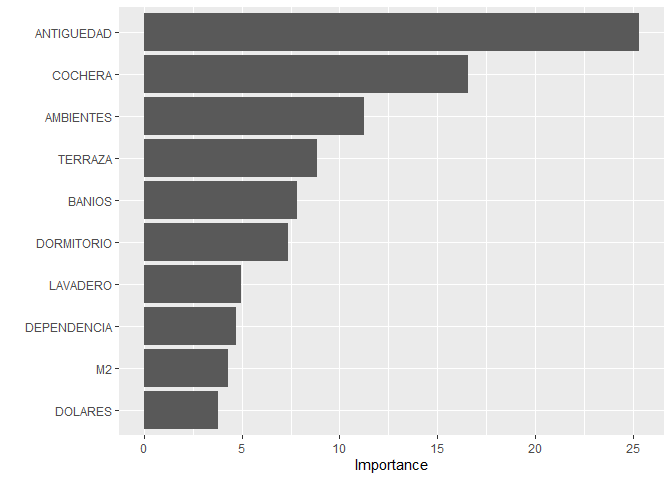

Parcial intersemanal
================

``` r
#Se cargan las librerías a usar en la resolución de la guía.

library(readxl)
library(ggplot2)
library(rpart)
library(rpart.plot)
library(caret)
library(randomForest)
library(vip)
library(ggbiplot)
```

``` r
#Se carga la base de datos a utilizar
data = read.csv('datos.csv')
data
```

    ##      M2 DOLARES AMBIENTES DORMITORIO ANTIGUEDAD A_ESTRENAR FRENTE_Y_CONTRA BAUL
    ## 1   130  240000         5          4        110         NA          FRENTE     
    ## 2    41   83000         2          1         40         NA         INTERNO     
    ## 3    90  180000         4          3         30         NA          FRENTE     
    ## 4   134  390000         4          3         80         NA    CONTRAFRENTE   SI
    ## 5    82  110000         4          3         50         NA          FRENTE     
    ## 6    55  100000         2          2         25         NA          FRENTE     
    ## 7    40   68000         2          1         40         NA          FRENTE     
    ## 8    46   85000         2          1         20         NA                     
    ## 9    53   75000         1          0          6         NA                     
    ## 10   91  155000         2          1          6         NA          FRENTE   SI
    ## 11   46   90000         2          1         16         NA          FRENTE   SI
    ## 12   80  135000         3          3         35         NA          FRENTE   SI
    ## 13  210  250000         3          3         70         NA          FRENTE     
    ## 14   70  116000         2          2          3         NA                     
    ## 15   48   92000         3          2         40         NA                     
    ## 16  104  170000         2          2         40         NA          FRENTE   SI
    ## 17   32   98000         2          1         30         NA          FRENTE   SI
    ## 18   44   85000         2          1         35         NA          FRENTE     
    ## 19   82  195000         3          3         40         NA          FRENTE     
    ## 20  102  210000         4          3         40         NA          FRENTE     
    ## 21   90  120000         2          2         45         NA    CONTRAFRENTE     
    ## 22   53   87500         4          3         50         NA    CONTRAFRENTE     
    ## 23   67  139000         4          3         30         NA          FRENTE     
    ## 24  106  160000         3          2         60         NA    CONTRAFRENTE     
    ## 25   45   81900         2          1         30         NA                     
    ## 26   76  162000         4          3         35         NA    CONTRAFRENTE     
    ## 27  155  350000         3          3         40         NA          FRENTE   SI
    ## 28  183  370000         4          3         30         NA          FRENTE     
    ## 29   35   65000         1          1         80         NA    CONTRAFRENTE     
    ## 30   61  139000         2          1          1         NA                     
    ## 31   89  110000         3          2         40         NA                     
    ## 32  102  139000         3          2         10         NA          FRENTE   SI
    ## 33   65  165000         3          2          3         NA          FRENTE   SI
    ## 34   70  120000         3          2          2         NA                   SI
    ## 35   54  118000         3          2         40         NA          FRENTE     
    ## 36  107  180000         2          2         35         NA          FRENTE     
    ## 37  109  135000         3          2         60         NA          FRENTE     
    ## 38  133  330000         3          3         86         NA                     
    ## 39  324  590000         5          4         60         NA          FRENTE   SI
    ## 40   60  118000         3          2         25         NA                   SI
    ## 41  110  180000         4          3         47         NA    CONTRAFRENTE     
    ## 42  122  330000         3          3          4         NA          FRENTE   SI
    ## 43   60   87400         3          2         46         NA                     
    ## 44   73  155000         3          2          6         NA          FRENTE   SI
    ## 45   60  140000         3          2         17         NA    CONTRAFRENTE   SI
    ## 46  107  250000         3          2         15         NA                   SI
    ## 47   40   93900         1          1         20         NA    CONTRAFRENTE     
    ## 48  183  250000         5          4         95         NA          FRENTE     
    ## 49   70  205000         3          2         21         NA          FRENTE     
    ## 50   73  165000         3          2         20         NA          FRENTE     
    ## 51   93  190000         4          3         80         NA    CONTRAFRENTE     
    ## 52  130  205000         2          2         21         NA                     
    ## 53  135  179000         3          3         50         NA          FRENTE     
    ## 54  170  220000         4          3         35         NA    CONTRAFRENTE     
    ## 55   26   49000         1          1         20         NA         LATERAL     
    ## 56   33   66000         2          1         50         NA         LATERAL     
    ## 57   73  125000         3          2         70         NA          FRENTE     
    ## 58   46   95900         2          1         48         NA    CONTRAFRENTE     
    ## 59   75  120000         4          2        100         NA          FRENTE     
    ## 60  135  125000         4          3         50         NA          FRENTE     
    ## 61   42   90000         2          1         30         NA    CONTRAFRENTE     
    ## 62   37   88000         2          1          8         NA    CONTRAFRENTE   SI
    ## 63   81  170000         3          2         15         NA          FRENTE   SI
    ## 64   66  180000         3          2          4         NA                     
    ## 65   76  175000         3          2          3         NA    CONTRAFRENTE   SI
    ## 66   89  175000         2          2         10         NA    CONTRAFRENTE     
    ## 67  110  249000         3          3         30         NA          FRENTE   SI
    ## 68  215  470000         3          3         25         NA    CONTRAFRENTE   SI
    ## 69  216  290000         3          3         65         NA          FRENTE   SI
    ## 70  160  195000         3          2          7         NA          FRENTE   SI
    ## 71   37   80000         2          1         40         NA    CONTRAFRENTE   SI
    ## 72   40   94000         1          1         30         NA    CONTRAFRENTE     
    ## 73   47   85500         2          2         50         NA         LATERAL     
    ## 74  150  220000         4          3         15         NA          FRENTE     
    ## 75   55   98000         3          2         40         NA          FRENTE   SI
    ## 76   27   45000         1          1         40         NA          FRENTE     
    ## 77   78  135000         4          3         55         NA    CONTRAFRENTE     
    ## 78   50  150000         2          1         25         NA          FRENTE     
    ## 79  265  260000         5          5         74         NA          FRENTE     
    ## 80   39   75000         2          1         40         NA         LATERAL     
    ## 81   65   76000         3          2         50         NA                     
    ## 82   55  115000         3          2         40         NA          FRENTE     
    ## 83   74  122000         2          1         30         NA    CONTRAFRENTE     
    ## 84   90  157000         4          3         15         NA          FRENTE     
    ## 85  178  360000         3          3         45         NA          FRENTE   SI
    ## 86   46   89000         2          1         25         NA          FRENTE     
    ## 87   70  140000         3          2          3         NA    CONTRAFRENTE     
    ## 88   75  150000         2          1          1         NA    CONTRAFRENTE     
    ## 89   90  275000         4          3          9         NA          FRENTE     
    ## 90  112  260000         2          2          3         NA          FRENTE   SI
    ## 91  130  275000         3          3          9         NA          FRENTE     
    ## 92   56   85000         4          3         60         NA    CONTRAFRENTE     
    ## 93   68  100000         4          3         60         NA    CONTRAFRENTE     
    ## 94   27   65000         1          0         70         NA    CONTRAFRENTE     
    ## 95   82  235000         3          3         55         NA          FRENTE     
    ## 96   85  216000         3          2         50         NA          FRENTE   SI
    ## 97   55   84000         3          2         35         NA    CONTRAFRENTE     
    ## 98   84  170000         3          3         35         NA    CONTRAFRENTE     
    ## 99   41   93000         3          2          2         NA                     
    ## 100  69  138000         3          2          5         NA          FRENTE     
    ## 101  95  195000         4          3         40         NA    CONTRAFRENTE   SI
    ## 102 112  225000         3          3         35         NA    CONTRAFRENTE   SI
    ## 103 213  370000         4          4         29         NA          FRENTE   SI
    ## 104  51  118000         3          2         35         NA    CONTRAFRENTE     
    ## 105 110  210000         4          3         35         NA          FRENTE   SI
    ## 106 115  220000         4          3         45         NA          FRENTE   SI
    ## 107  54   98000         2          1         35         NA          FRENTE     
    ## 108  36   72000         1          1         50         NA    CONTRAFRENTE     
    ## 109  39   92000         2          1         52         NA                     
    ## 110  55  125000         2          1         50         NA    CONTRAFRENTE     
    ## 111  80  120000         3          2         40         NA          FRENTE     
    ## 112  70  220000         4          3          1         NA                   SI
    ## 113  75  220000         4          3          2         NA          FRENTE     
    ## 114  38   90000         3          2         10         NA          FRENTE   SI
    ## 115 110  310000         2          2          3         NA          FRENTE     
    ## 116 178  319000         4          3          2         NA    CONTRAFRENTE   SI
    ## 117 180  295000         4          3          3         NA    CONTRAFRENTE     
    ## 118 136  162000         4          3         50         NA    CONTRAFRENTE     
    ## 119 180  290000         5          3        130         NA          FRENTE     
    ## 120  48   95000         2          1         10         NA    CONTRAFRENTE     
    ## 121  65  123000         3          2         70         NA          FRENTE     
    ## 122  77  155000         3          2         40         NA          FRENTE   SI
    ## 123  90  215000         3          3         28         NA          FRENTE     
    ## 124 120  250000         4          3         30         NA          FRENTE   SI
    ## 125 108  185000         3          3         35         NA    CONTRAFRENTE     
    ## 126 103  189000         4          3         38         NA                   SI
    ## 127  57  118000         3          2         40         NA                     
    ## 128  63  138000         3          2         40         NA    CONTRAFRENTE     
    ## 129 220  330000         5          5         30         NA          FRENTE   SI
    ## 130  66  149500         3          2         30         NA    CONTRAFRENTE   SI
    ## 131  93  174000         4          3         50         NA          FRENTE     
    ## 132 100  245000         4          3         40         NA          FRENTE   SI
    ## 133 115  225000         3          2         35         NA                   SI
    ## 134 220  320000         4          4         60         NA          FRENTE     
    ## 135 133  250000         3          3         40         NA          FRENTE   SI
    ## 136 180  325000         4          3         25         NA          FRENTE   SI
    ## 137 246  380000         3          3         32         NA          FRENTE     
    ## 138  44   77550         2          1         44         NA                     
    ## 139 139  192500         4          3         20         NA    CONTRAFRENTE   SI
    ## 140  54  122000         2          1          2         NA                     
    ## 141  89  188000         4          3         40         NA    CONTRAFRENTE     
    ## 142 110  210000         5          3         40         NA          FRENTE     
    ## 143 164  280000         6          4         31         NA                     
    ## 144  70  150000         3          2          4         NA          FRENTE     
    ## 145 103  192000         4          3         20         NA          FRENTE   SI
    ## 146  94  238000         4          3          1         NA          FRENTE     
    ## 147  95  280000         3          3          2         NA          FRENTE   SI
    ## 148  55  170000         2          1          5         NA    CONTRAFRENTE     
    ## 149 118  280000         4          3          6         NA          FRENTE     
    ## 150  80  147500         3          2          5         NA                     
    ## 151  18   60000         1          1         30         NA    CONTRAFRENTE     
    ## 152  60  145000         4          3         40         NA          FRENTE     
    ## 153  70  139000         3          2         40         NA          FRENTE     
    ## 154  36   70000         1          1         35         NA         LATERAL     
    ## 155  42   76000         2          1         40         NA          FRENTE     
    ## 156  38  120000         1          1          3         NA          FRENTE     
    ## 157  94  215000         3          3         30         NA    CONTRAFRENTE     
    ## 158  48   85000         2          1         40         NA         INTERNO     
    ## 159  48  112000         3          2         65         NA    CONTRAFRENTE     
    ## 160  78  160000         3          2         45         NA          FRENTE     
    ## 161  33   73000         1          1         35         NA          FRENTE     
    ## 162 100  160000         3          2         50         NA          FRENTE     
    ## 163  63  139000         3          2          4         NA          FRENTE     
    ## 164  70  136000         5          4         80         NA          FRENTE     
    ## 165  75  133000         3          2         65         NA          FRENTE   SI
    ## 166 107  130000         3          2         85         NA          FRENTE     
    ## 167 124  196000         4          3         70         NA          FRENTE     
    ## 168  83  160000         1          1         40         NA                     
    ## 169  72  100000         3          2         60         NA          FRENTE     
    ## 170  83  160000         2          1         40         NA                     
    ## 171  98  135000         2          1         80         NA                     
    ## 172 122  310000         4          3         80         NA          FRENTE   SI
    ## 173  44   73000         2          1          2         NA                     
    ## 174  54   84000         1          1          8         NA          FRENTE     
    ## 175  57   95000         3          2         30         NA          FRENTE   SI
    ## 176 110  250000         3          3         20         NA          FRENTE     
    ## 177  80  176000         4          3         80         NA          FRENTE     
    ## 178 171  342000         4          4         80         NA    CONTRAFRENTE     
    ## 179  67  119000         3          2         70         NA    CONTRAFRENTE     
    ## 180 172  200000         7          6         95         NA          FRENTE     
    ## 181  22   45000         1          1         35         NA    CONTRAFRENTE     
    ## 182 129  137000         3          2          5         NA    CONTRAFRENTE     
    ## 183  76  174800         2          1          1         NA                     
    ## 184 101  206400         2          1          2         NA          FRENTE     
    ## 185 113  237300         3          2          2         NA         LATERAL     
    ## 186 121  290400         4          3          2         NA          FRENTE   SI
    ## 187  37   85000         2          1         45         NA                   SI
    ## 188  48   91000         2          1         20         NA                     
    ## 189  83  220000         3          2         15         NA                     
    ## 190 104  245000         4          3          5         NA    CONTRAFRENTE   SI
    ## 191  68  160500         3          2         15         NA          FRENTE   SI
    ## 192  70  156000         3          2         12         NA                     
    ## 193  92  245000         3          2         45         NA          FRENTE     
    ## 194 123  129000         3          2         60         NA    CONTRAFRENTE     
    ## 195  35   98000         2          1         40         NA         LATERAL     
    ## 196  57   92000         2          1         50         NA    CONTRAFRENTE   SI
    ## 197 120  199000         4          3         90         NA          FRENTE     
    ## 198  49   85000         3          2         90         NA         INTERNO     
    ## 199  26   65000         1          0         30         NA    CONTRAFRENTE     
    ## 200 100  215000         4          3         90         NA         LATERAL     
    ## 201  39   99000         2          1          2         NA          FRENTE     
    ## 202  58  170000         2          1          7         NA                     
    ## 203 130  280000         4          3         30         NA          FRENTE   SI
    ## 204 138  280000         4          3         25         NA          FRENTE   SI
    ## 205  86  165000         4          3         35         NA          FRENTE   SI
    ## 206  85  168000         4          3         30         NA          FRENTE     
    ## 207  46   75000         2          1         45         NA          FRENTE     
    ## 208 172  230000         2          2          6         NA          FRENTE     
    ## 209  38   67000         2          1         60         NA          FRENTE     
    ## 210  46   89000         1          0         60         NA    CONTRAFRENTE     
    ## 211 112  175000         4          3         70         NA          FRENTE     
    ## 212  72  118000         4          3         80         NA    CONTRAFRENTE     
    ## 213  44  105000         3          2         70         NA          FRENTE     
    ## 214  59  109000         3          2         70         NA          FRENTE     
    ## 215  95  230000         3          2         80         NA          FRENTE     
    ## 216 113  155000         5          4         50         NA          FRENTE     
    ## 217  35   75000         1          0         60         NA    CONTRAFRENTE     
    ## 218  80  150000         4          2         50         NA          FRENTE     
    ## 219  84  107000         4          3         56         NA    CONTRAFRENTE   SI
    ## 220  48  120000         2          1         30         NA                     
    ## 221  90  185000         2          2         50         NA         INTERNO     
    ## 222  32   69900         2          1         40         NA         INTERNO     
    ## 223  33   72900         1          1         35         NA         LATERAL     
    ## 224 100  230000         4          3         30         NA    CONTRAFRENTE   SI
    ## 225  20   52000         1          0         15         NA    CONTRAFRENTE     
    ## 226  26   66000         1          1         37         NA         INTERNO     
    ## 227  31   80000         2          1         60         NA          FRENTE     
    ## 228  34   85000         3          2         60         NA          FRENTE   SI
    ## 229 140  400000         3          3         80         NA          FRENTE     
    ## 230 100  189000         2          2         10         NA          FRENTE     
    ## 231 124  290000         4          3         30         NA                   SI
    ## 232  63  110000         3          2         35         NA          FRENTE     
    ## 233 113  149000         5          3         99         NA    CONTRAFRENTE   SI
    ## 234 185  255000         5          4         30         NA          FRENTE     
    ## 235 195  370000         5          3         90         NA         LATERAL   SI
    ## 236 211  280000         4          3         70         NA          FRENTE   SI
    ## 237 316  580000         5          4         80         NA          FRENTE     
    ## 238  16   48000         1          1         20         NA         LATERAL     
    ## 239  72  112000         4          3         70         NA    CONTRAFRENTE     
    ## 240 102  140000         5          4        100         NA          FRENTE     
    ## 241 159  320000         5          4         70         NA          FRENTE     
    ## 242  60  138000         3          2         30         NA                     
    ## 243  61  128000         4          3         55         NA    CONTRAFRENTE     
    ## 244  42   65000         1          0         35         NA    CONTRAFRENTE     
    ## 245  80  163000         5          4         85         NA    CONTRAFRENTE     
    ## 246 121  231000         5          4         70         NA          FRENTE   SI
    ## 247  25   60000         1          1         50         NA    CONTRAFRENTE     
    ## 248 128  245000         5          2         90         NA          FRENTE   SI
    ## 249  34   92000         2          1          5         NA          FRENTE   SI
    ## 250  47   87000         2          1          2         NA          FRENTE     
    ## 251  55   92000         2          1          2         NA          FRENTE     
    ##     COCHERA BANIOS LAVADERO DEPENDENCIA        TERRAZA          BARRIOS
    ## 1                2                                          SAN NICOLAS
    ## 2                1       SI                                 SAN NICOLAS
    ## 3        SI      0                   SI                     SAN NICOLAS
    ## 4                2       SI          SI                     SAN NICOLAS
    ## 5                1       SI                    TERRAZA VILLA DEL PARQUE
    ## 6                0                              BALCON VILLA DEL PARQUE
    ## 7                1                             TERRAZA VILLA DEL PARQUE
    ## 8                0       SI                     BALCON VILLA DEL PARQUE
    ## 9                0                               PATIO VILLA DEL PARQUE
    ## 10       SI      0       SI          SI        TERRAZA VILLA DEL PARQUE
    ## 11       SI      0       SI          SI        TERRAZA VILLA DEL PARQUE
    ## 12               2       SI                            VILLA DEL PARQUE
    ## 13               2       SI                     BALCON VILLA DEL PARQUE
    ## 14               0                                     VILLA DEL PARQUE
    ## 15               0                                     VILLA DEL PARQUE
    ## 16               1       SI                    TERRAZA VILLA DEL PARQUE
    ## 17       SI      0       SI          SI        TERRAZA VILLA DEL PARQUE
    ## 18               0                                     VILLA DEL PARQUE
    ## 19               0                              BALCON VILLA DEL PARQUE
    ## 20       SI      1       SI                            VILLA DEL PARQUE
    ## 21               1       SI                    TERRAZA VILLA DEL PARQUE
    ## 22               1                                     VILLA DEL PARQUE
    ## 23               0       SI          SI        TERRAZA VILLA DEL PARQUE
    ## 24               1       SI                     BALCON VILLA DEL PARQUE
    ## 25               0       SI          SI                VILLA DEL PARQUE
    ## 26               1                              BALCON VILLA DEL PARQUE
    ## 27               2       SI          SI         BALCON VILLA DEL PARQUE
    ## 28       SI      0       SI          SI         BALCON VILLA DEL PARQUE
    ## 29               1       SI                      PATIO VILLA DEL PARQUE
    ## 30               1                              BALCON VILLA DEL PARQUE
    ## 31               0                             TERRAZA VILLA DEL PARQUE
    ## 32       SI      0       SI          SI        TERRAZA VILLA DEL PARQUE
    ## 33       SI      2       SI          SI        TERRAZA VILLA DEL PARQUE
    ## 34       SI      2       SI          SI                VILLA DEL PARQUE
    ## 35               0       SI          SI        TERRAZA VILLA DEL PARQUE
    ## 36       SI      3                   SI        TERRAZA VILLA DEL PARQUE
    ## 37               0       SI                    TERRAZA VILLA DEL PARQUE
    ## 38               3                                          SAN NICOLAS
    ## 39       SI      2       SI          SI        TERRAZA      SAN NICOLAS
    ## 40       SI      0       SI          SI         BALCON VILLA DEL PARQUE
    ## 41               1       SI          SI         BALCON VILLA DEL PARQUE
    ## 42       SI      2                              BALCON VILLA DEL PARQUE
    ## 43               0                      BALCON TERRAZA VILLA DEL PARQUE
    ## 44       SI      2       SI          SI        TERRAZA VILLA DEL PARQUE
    ## 45               0       SI          SI                VILLA DEL PARQUE
    ## 46       SI      2       SI          SI        TERRAZA VILLA DEL PARQUE
    ## 47               1                             TERRAZA      SAN NICOLAS
    ## 48               2                             TERRAZA      SAN NICOLAS
    ## 49               2       SI                    TERRAZA VILLA DEL PARQUE
    ## 50               2                               PATIO VILLA DEL PARQUE
    ## 51               0       SI          SI                VILLA DEL PARQUE
    ## 52               2       SI                      PATIO VILLA DEL PARQUE
    ## 53               2       SI          SI                VILLA DEL PARQUE
    ## 54       SI      2                   SI         BALCON VILLA DEL PARQUE
    ## 55               1                                          SAN NICOLAS
    ## 56               1       SI                                 SAN NICOLAS
    ## 57               2       SI          SI                     SAN NICOLAS
    ## 58       SI      0                                          SAN NICOLAS
    ## 59               1       SI                                 SAN NICOLAS
    ## 60               0       SI          SI        TERRAZA VILLA DEL PARQUE
    ## 61               0                                          SAN NICOLAS
    ## 62       SI      0       SI          SI        TERRAZA VILLA DEL PARQUE
    ## 63       SI      0       SI          SI        TERRAZA VILLA DEL PARQUE
    ## 64       SI      0       SI          SI         BALCON VILLA DEL PARQUE
    ## 65       SI      2       SI          SI                VILLA DEL PARQUE
    ## 66               1       SI                     BALCON VILLA DEL PARQUE
    ## 67               2       SI          SI         BALCON VILLA DEL PARQUE
    ## 68       SI      2       SI          SI        TERRAZA VILLA DEL PARQUE
    ## 69       SI      1                             TERRAZA VILLA DEL PARQUE
    ## 70       SI      2       SI          SI        TERRAZA VILLA DEL PARQUE
    ## 71       SI      0       SI          SI        TERRAZA VILLA DEL PARQUE
    ## 72               1                              BALCON VILLA DEL PARQUE
    ## 73               1                                     VILLA DEL PARQUE
    ## 74               0                               PATIO VILLA DEL PARQUE
    ## 75               0       SI          SI         BALCON VILLA DEL PARQUE
    ## 76               1                             TERRAZA      SAN NICOLAS
    ## 77               2       SI                    TERRAZA      SAN NICOLAS
    ## 78               1                                          SAN NICOLAS
    ## 79               2                                          SAN NICOLAS
    ## 80               0                                          SAN NICOLAS
    ## 81               0                                          SAN NICOLAS
    ## 82               1                              BALCON      SAN NICOLAS
    ## 83       SI      2                                          SAN NICOLAS
    ## 84               2                              BALCON      SAN NICOLAS
    ## 85               2       SI                     BALCON      SAN NICOLAS
    ## 86               0                                          SAN NICOLAS
    ## 87               2                              BALCON      SAN NICOLAS
    ## 88               0                                          SAN NICOLAS
    ## 89               2                             TERRAZA      SAN NICOLAS
    ## 90               2       SI                     BALCON      SAN NICOLAS
    ## 91               2                             TERRAZA      SAN NICOLAS
    ## 92               2                                          SAN NICOLAS
    ## 93               2                                          SAN NICOLAS
    ## 94               0                                          SAN NICOLAS
    ## 95               1                   SI                     SAN NICOLAS
    ## 96               1       SI          SI                     SAN NICOLAS
    ## 97               0                                     VILLA DEL PARQUE
    ## 98               0       SI                     BALCON VILLA DEL PARQUE
    ## 99               0       SI                    TERRAZA VILLA DEL PARQUE
    ## 100              0                               PATIO VILLA DEL PARQUE
    ## 101      SI      2       SI                    TERRAZA VILLA DEL PARQUE
    ## 102      SI      1       SI                    TERRAZA VILLA DEL PARQUE
    ## 103      SI      2       SI                     BALCON VILLA DEL PARQUE
    ## 104              0                              BALCON VILLA DEL PARQUE
    ## 105      SI      2       SI          SI        TERRAZA VILLA DEL PARQUE
    ## 106      SI      2       SI          SI        TERRAZA VILLA DEL PARQUE
    ## 107              2                                          SAN NICOLAS
    ## 108              1                                          SAN NICOLAS
    ## 109              0                                          SAN NICOLAS
    ## 110              2                   SI                     SAN NICOLAS
    ## 111              1       SI                     BALCON      SAN NICOLAS
    ## 112              2                              BALCON VILLA DEL PARQUE
    ## 113      SI      2                             TERRAZA VILLA DEL PARQUE
    ## 114      SI      0       SI          SI        TERRAZA VILLA DEL PARQUE
    ## 115      SI      3                             TERRAZA VILLA DEL PARQUE
    ## 116      SI      0       SI          SI        TERRAZA VILLA DEL PARQUE
    ## 117      SI      3       SI                    TERRAZA VILLA DEL PARQUE
    ## 118              2       SI                    TERRAZA      SAN NICOLAS
    ## 119              3                             TERRAZA      SAN NICOLAS
    ## 120              0                                          SAN NICOLAS
    ## 121              2       SI          SI        TERRAZA      SAN NICOLAS
    ## 122              1                             TERRAZA VILLA DEL PARQUE
    ## 123              0                              BALCON VILLA DEL PARQUE
    ## 124      SI      0       SI          SI        TERRAZA VILLA DEL PARQUE
    ## 125      SI      2       SI                     BALCON VILLA DEL PARQUE
    ## 126      SI      0       SI          SI        TERRAZA VILLA DEL PARQUE
    ## 127      SI      0       SI          SI                VILLA DEL PARQUE
    ## 128      SI      0                                     VILLA DEL PARQUE
    ## 129      SI      3       SI                     BALCON VILLA DEL PARQUE
    ## 130      SI      0       SI          SI         BALCON VILLA DEL PARQUE
    ## 131              0       SI                     BALCON VILLA DEL PARQUE
    ## 132              2       SI          SI                VILLA DEL PARQUE
    ## 133      SI      0       SI          SI        TERRAZA VILLA DEL PARQUE
    ## 134              0                              BALCON VILLA DEL PARQUE
    ## 135      SI      1       SI          SI         BALCON VILLA DEL PARQUE
    ## 136      SI      2                   SI        TERRAZA VILLA DEL PARQUE
    ## 137      SI      2                   SI         BALCON VILLA DEL PARQUE
    ## 138              0                                     VILLA DEL PARQUE
    ## 139      SI      0       SI          SI        TERRAZA VILLA DEL PARQUE
    ## 140              0                              BALCON VILLA DEL PARQUE
    ## 141              0                              BALCON VILLA DEL PARQUE
    ## 142      SI      2       SI                     BALCON VILLA DEL PARQUE
    ## 143      SI      3       SI          SI         BALCON VILLA DEL PARQUE
    ## 144              2       SI                    TERRAZA VILLA DEL PARQUE
    ## 145      SI      3       SI          SI        TERRAZA VILLA DEL PARQUE
    ## 146      SI      0       SI                     BALCON VILLA DEL PARQUE
    ## 147      SI      2       SI                     BALCON VILLA DEL PARQUE
    ## 148      SI      0       SI                    TERRAZA VILLA DEL PARQUE
    ## 149      SI      2                              BALCON VILLA DEL PARQUE
    ## 150      SI      0                             TERRAZA VILLA DEL PARQUE
    ## 151              0                                          SAN NICOLAS
    ## 152              1       SI             BALCON TERRAZA      SAN NICOLAS
    ## 153              1       SI                    TERRAZA      SAN NICOLAS
    ## 154              1                                          SAN NICOLAS
    ## 155              1       SI                                 SAN NICOLAS
    ## 156              1       SI                    TERRAZA      SAN NICOLAS
    ## 157              2       SI                                 SAN NICOLAS
    ## 158              1                                          SAN NICOLAS
    ## 159              1       SI                                 SAN NICOLAS
    ## 160              1       SI                    TERRAZA      SAN NICOLAS
    ## 161              1                                          SAN NICOLAS
    ## 162              2       SI                     BALCON      SAN NICOLAS
    ## 163      SI      2       SI          SI                VILLA DEL PARQUE
    ## 164              1                                          SAN NICOLAS
    ## 165              2       SI          SI        TERRAZA      SAN NICOLAS
    ## 166              1       SI          SI                     SAN NICOLAS
    ## 167              2                                          SAN NICOLAS
    ## 168              2                                          SAN NICOLAS
    ## 169              2       SI          SI        TERRAZA      SAN NICOLAS
    ## 170              2                                          SAN NICOLAS
    ## 171              0       SI                    TERRAZA      SAN NICOLAS
    ## 172              0       SI          SI BALCON TERRAZA      SAN NICOLAS
    ## 173              0                                     VILLA DEL PARQUE
    ## 174              1       SI                     BALCON VILLA DEL PARQUE
    ## 175      SI      0       SI          SI        TERRAZA VILLA DEL PARQUE
    ## 176              3       SI                     BALCON VILLA DEL PARQUE
    ## 177              1                             TERRAZA      SAN NICOLAS
    ## 178              2                                          SAN NICOLAS
    ## 179              2                                          SAN NICOLAS
    ## 180              0                                          SAN NICOLAS
    ## 181              1                                          SAN NICOLAS
    ## 182              2       SI          SI        TERRAZA VILLA DEL PARQUE
    ## 183              2                                     VILLA DEL PARQUE
    ## 184              0                              BALCON VILLA DEL PARQUE
    ## 185              0                                     VILLA DEL PARQUE
    ## 186      SI      2       SI          SI        TERRAZA VILLA DEL PARQUE
    ## 187              0       SI          SI        TERRAZA VILLA DEL PARQUE
    ## 188              0                                     VILLA DEL PARQUE
    ## 189              2                              BALCON VILLA DEL PARQUE
    ## 190      SI      2       SI          SI        TERRAZA VILLA DEL PARQUE
    ## 191      SI      0       SI          SI        TERRAZA VILLA DEL PARQUE
    ## 192      SI      1                             TERRAZA VILLA DEL PARQUE
    ## 193              2                                          SAN NICOLAS
    ## 194              1       SI                    TERRAZA      SAN NICOLAS
    ## 195              0                                          SAN NICOLAS
    ## 196              1                             TERRAZA      SAN NICOLAS
    ## 197              1                             TERRAZA      SAN NICOLAS
    ## 198              0                                          SAN NICOLAS
    ## 199              0                                          SAN NICOLAS
    ## 200              3                              BALCON      SAN NICOLAS
    ## 201              0       SI          SI                VILLA DEL PARQUE
    ## 202      SI      1       SI                     BALCON VILLA DEL PARQUE
    ## 203      SI      4       SI          SI BALCON TERRAZA VILLA DEL PARQUE
    ## 204      SI      2       SI          SI         BALCON VILLA DEL PARQUE
    ## 205      SI      2       SI          SI        TERRAZA VILLA DEL PARQUE
    ## 206              2       SI          SI         BALCON VILLA DEL PARQUE
    ## 207              1       SI                     BALCON VILLA DEL PARQUE
    ## 208      SI      2       SI                    TERRAZA VILLA DEL PARQUE
    ## 209              1                                          SAN NICOLAS
    ## 210              0                                          SAN NICOLAS
    ## 211              1       SI                    TERRAZA      SAN NICOLAS
    ## 212              1       SI          SI                     SAN NICOLAS
    ## 213              2                               PATIO      SAN NICOLAS
    ## 214              2                             TERRAZA      SAN NICOLAS
    ## 215              1       SI                                 SAN NICOLAS
    ## 216              2                             TERRAZA      SAN NICOLAS
    ## 217              0                                          SAN NICOLAS
    ## 218              1                                          SAN NICOLAS
    ## 219              2                   SI                     SAN NICOLAS
    ## 220              0                                          SAN NICOLAS
    ## 221              0                                          SAN NICOLAS
    ## 222              1                                          SAN NICOLAS
    ## 223              1                                          SAN NICOLAS
    ## 224      SI      0       SI          SI         BALCON      SAN NICOLAS
    ## 225              0                                          SAN NICOLAS
    ## 226              1                                          SAN NICOLAS
    ## 227              0                              BALCON      SAN NICOLAS
    ## 228              1                             TERRAZA      SAN NICOLAS
    ## 229              0       SI                                 SAN NICOLAS
    ## 230      SI      2                             TERRAZA VILLA DEL PARQUE
    ## 231      SI      3       SI          SI        TERRAZA VILLA DEL PARQUE
    ## 232              0       SI                                 SAN NICOLAS
    ## 233              2                                          SAN NICOLAS
    ## 234              2                                          SAN NICOLAS
    ## 235      SI      3       SI          SI                     SAN NICOLAS
    ## 236              2       SI          SI                     SAN NICOLAS
    ## 237              3       SI          SI        TERRAZA      SAN NICOLAS
    ## 238              1                                          SAN NICOLAS
    ## 239              2                                          SAN NICOLAS
    ## 240              2       SI          SI        TERRAZA      SAN NICOLAS
    ## 241              3                   SI                     SAN NICOLAS
    ## 242              0       SI          SI                     SAN NICOLAS
    ## 243              0                                          SAN NICOLAS
    ## 244              0                             TERRAZA      SAN NICOLAS
    ## 245              2       SI                      PATIO      SAN NICOLAS
    ## 246      SI      3       SI          SI         BALCON      SAN NICOLAS
    ## 247              1                                          SAN NICOLAS
    ## 248              2       SI                    TERRAZA      SAN NICOLAS
    ## 249              1                             TERRAZA VILLA DEL PARQUE
    ## 250              1                             TERRAZA VILLA DEL PARQUE
    ## 251              1                             TERRAZA VILLA DEL PARQUE

``` r
str(data)
```

    ## 'data.frame':    251 obs. of  14 variables:
    ##  $ M2             : int  130 41 90 134 82 55 40 46 53 91 ...
    ##  $ DOLARES        : int  240000 83000 180000 390000 110000 100000 68000 85000 75000 155000 ...
    ##  $ AMBIENTES      : int  5 2 4 4 4 2 2 2 1 2 ...
    ##  $ DORMITORIO     : int  4 1 3 3 3 2 1 1 0 1 ...
    ##  $ ANTIGUEDAD     : int  110 40 30 80 50 25 40 20 6 6 ...
    ##  $ A_ESTRENAR     : logi  NA NA NA NA NA NA ...
    ##  $ FRENTE_Y_CONTRA: chr  "FRENTE" "INTERNO" "FRENTE" "CONTRAFRENTE" ...
    ##  $ BAUL           : chr  "" "" "" "SI" ...
    ##  $ COCHERA        : chr  "" "" "SI" "" ...
    ##  $ BANIOS         : int  2 1 0 2 1 0 1 0 0 0 ...
    ##  $ LAVADERO       : chr  "" "SI" "" "SI" ...
    ##  $ DEPENDENCIA    : chr  "" "" "SI" "SI" ...
    ##  $ TERRAZA        : chr  "" "" "" "" ...
    ##  $ BARRIOS        : chr  "SAN NICOLAS" "SAN NICOLAS" "SAN NICOLAS" "SAN NICOLAS" ...

``` r
#La información cuenta con 251 filas y 14 columnas, algunas con datos numéricos y otras con datos categóricos. En particular la columna "A_ESTRENAR" no tiene valores.
dim(data)
```

    ## [1] 251  14

``` r
data = data[,-6]
data
```

    ##      M2 DOLARES AMBIENTES DORMITORIO ANTIGUEDAD FRENTE_Y_CONTRA BAUL COCHERA
    ## 1   130  240000         5          4        110          FRENTE             
    ## 2    41   83000         2          1         40         INTERNO             
    ## 3    90  180000         4          3         30          FRENTE           SI
    ## 4   134  390000         4          3         80    CONTRAFRENTE   SI        
    ## 5    82  110000         4          3         50          FRENTE             
    ## 6    55  100000         2          2         25          FRENTE             
    ## 7    40   68000         2          1         40          FRENTE             
    ## 8    46   85000         2          1         20                             
    ## 9    53   75000         1          0          6                             
    ## 10   91  155000         2          1          6          FRENTE   SI      SI
    ## 11   46   90000         2          1         16          FRENTE   SI      SI
    ## 12   80  135000         3          3         35          FRENTE   SI        
    ## 13  210  250000         3          3         70          FRENTE             
    ## 14   70  116000         2          2          3                             
    ## 15   48   92000         3          2         40                             
    ## 16  104  170000         2          2         40          FRENTE   SI        
    ## 17   32   98000         2          1         30          FRENTE   SI      SI
    ## 18   44   85000         2          1         35          FRENTE             
    ## 19   82  195000         3          3         40          FRENTE             
    ## 20  102  210000         4          3         40          FRENTE           SI
    ## 21   90  120000         2          2         45    CONTRAFRENTE             
    ## 22   53   87500         4          3         50    CONTRAFRENTE             
    ## 23   67  139000         4          3         30          FRENTE             
    ## 24  106  160000         3          2         60    CONTRAFRENTE             
    ## 25   45   81900         2          1         30                             
    ## 26   76  162000         4          3         35    CONTRAFRENTE             
    ## 27  155  350000         3          3         40          FRENTE   SI        
    ## 28  183  370000         4          3         30          FRENTE           SI
    ## 29   35   65000         1          1         80    CONTRAFRENTE             
    ## 30   61  139000         2          1          1                             
    ## 31   89  110000         3          2         40                             
    ## 32  102  139000         3          2         10          FRENTE   SI      SI
    ## 33   65  165000         3          2          3          FRENTE   SI      SI
    ## 34   70  120000         3          2          2                   SI      SI
    ## 35   54  118000         3          2         40          FRENTE             
    ## 36  107  180000         2          2         35          FRENTE           SI
    ## 37  109  135000         3          2         60          FRENTE             
    ## 38  133  330000         3          3         86                             
    ## 39  324  590000         5          4         60          FRENTE   SI      SI
    ## 40   60  118000         3          2         25                   SI      SI
    ## 41  110  180000         4          3         47    CONTRAFRENTE             
    ## 42  122  330000         3          3          4          FRENTE   SI      SI
    ## 43   60   87400         3          2         46                             
    ## 44   73  155000         3          2          6          FRENTE   SI      SI
    ## 45   60  140000         3          2         17    CONTRAFRENTE   SI        
    ## 46  107  250000         3          2         15                   SI      SI
    ## 47   40   93900         1          1         20    CONTRAFRENTE             
    ## 48  183  250000         5          4         95          FRENTE             
    ## 49   70  205000         3          2         21          FRENTE             
    ## 50   73  165000         3          2         20          FRENTE             
    ## 51   93  190000         4          3         80    CONTRAFRENTE             
    ## 52  130  205000         2          2         21                             
    ## 53  135  179000         3          3         50          FRENTE             
    ## 54  170  220000         4          3         35    CONTRAFRENTE           SI
    ## 55   26   49000         1          1         20         LATERAL             
    ## 56   33   66000         2          1         50         LATERAL             
    ## 57   73  125000         3          2         70          FRENTE             
    ## 58   46   95900         2          1         48    CONTRAFRENTE           SI
    ## 59   75  120000         4          2        100          FRENTE             
    ## 60  135  125000         4          3         50          FRENTE             
    ## 61   42   90000         2          1         30    CONTRAFRENTE             
    ## 62   37   88000         2          1          8    CONTRAFRENTE   SI      SI
    ## 63   81  170000         3          2         15          FRENTE   SI      SI
    ## 64   66  180000         3          2          4                           SI
    ## 65   76  175000         3          2          3    CONTRAFRENTE   SI      SI
    ## 66   89  175000         2          2         10    CONTRAFRENTE             
    ## 67  110  249000         3          3         30          FRENTE   SI        
    ## 68  215  470000         3          3         25    CONTRAFRENTE   SI      SI
    ## 69  216  290000         3          3         65          FRENTE   SI      SI
    ## 70  160  195000         3          2          7          FRENTE   SI      SI
    ## 71   37   80000         2          1         40    CONTRAFRENTE   SI      SI
    ## 72   40   94000         1          1         30    CONTRAFRENTE             
    ## 73   47   85500         2          2         50         LATERAL             
    ## 74  150  220000         4          3         15          FRENTE             
    ## 75   55   98000         3          2         40          FRENTE   SI        
    ## 76   27   45000         1          1         40          FRENTE             
    ## 77   78  135000         4          3         55    CONTRAFRENTE             
    ## 78   50  150000         2          1         25          FRENTE             
    ## 79  265  260000         5          5         74          FRENTE             
    ## 80   39   75000         2          1         40         LATERAL             
    ## 81   65   76000         3          2         50                             
    ## 82   55  115000         3          2         40          FRENTE             
    ## 83   74  122000         2          1         30    CONTRAFRENTE           SI
    ## 84   90  157000         4          3         15          FRENTE             
    ## 85  178  360000         3          3         45          FRENTE   SI        
    ## 86   46   89000         2          1         25          FRENTE             
    ## 87   70  140000         3          2          3    CONTRAFRENTE             
    ## 88   75  150000         2          1          1    CONTRAFRENTE             
    ## 89   90  275000         4          3          9          FRENTE             
    ## 90  112  260000         2          2          3          FRENTE   SI        
    ## 91  130  275000         3          3          9          FRENTE             
    ## 92   56   85000         4          3         60    CONTRAFRENTE             
    ## 93   68  100000         4          3         60    CONTRAFRENTE             
    ## 94   27   65000         1          0         70    CONTRAFRENTE             
    ## 95   82  235000         3          3         55          FRENTE             
    ## 96   85  216000         3          2         50          FRENTE   SI        
    ## 97   55   84000         3          2         35    CONTRAFRENTE             
    ## 98   84  170000         3          3         35    CONTRAFRENTE             
    ## 99   41   93000         3          2          2                             
    ## 100  69  138000         3          2          5          FRENTE             
    ## 101  95  195000         4          3         40    CONTRAFRENTE   SI      SI
    ## 102 112  225000         3          3         35    CONTRAFRENTE   SI      SI
    ## 103 213  370000         4          4         29          FRENTE   SI      SI
    ## 104  51  118000         3          2         35    CONTRAFRENTE             
    ## 105 110  210000         4          3         35          FRENTE   SI      SI
    ## 106 115  220000         4          3         45          FRENTE   SI      SI
    ## 107  54   98000         2          1         35          FRENTE             
    ## 108  36   72000         1          1         50    CONTRAFRENTE             
    ## 109  39   92000         2          1         52                             
    ## 110  55  125000         2          1         50    CONTRAFRENTE             
    ## 111  80  120000         3          2         40          FRENTE             
    ## 112  70  220000         4          3          1                   SI        
    ## 113  75  220000         4          3          2          FRENTE           SI
    ## 114  38   90000         3          2         10          FRENTE   SI      SI
    ## 115 110  310000         2          2          3          FRENTE           SI
    ## 116 178  319000         4          3          2    CONTRAFRENTE   SI      SI
    ## 117 180  295000         4          3          3    CONTRAFRENTE           SI
    ## 118 136  162000         4          3         50    CONTRAFRENTE             
    ## 119 180  290000         5          3        130          FRENTE             
    ## 120  48   95000         2          1         10    CONTRAFRENTE             
    ## 121  65  123000         3          2         70          FRENTE             
    ## 122  77  155000         3          2         40          FRENTE   SI        
    ## 123  90  215000         3          3         28          FRENTE             
    ## 124 120  250000         4          3         30          FRENTE   SI      SI
    ## 125 108  185000         3          3         35    CONTRAFRENTE           SI
    ## 126 103  189000         4          3         38                   SI      SI
    ## 127  57  118000         3          2         40                           SI
    ## 128  63  138000         3          2         40    CONTRAFRENTE           SI
    ## 129 220  330000         5          5         30          FRENTE   SI      SI
    ## 130  66  149500         3          2         30    CONTRAFRENTE   SI      SI
    ## 131  93  174000         4          3         50          FRENTE             
    ## 132 100  245000         4          3         40          FRENTE   SI        
    ## 133 115  225000         3          2         35                   SI      SI
    ## 134 220  320000         4          4         60          FRENTE             
    ## 135 133  250000         3          3         40          FRENTE   SI      SI
    ## 136 180  325000         4          3         25          FRENTE   SI      SI
    ## 137 246  380000         3          3         32          FRENTE           SI
    ## 138  44   77550         2          1         44                             
    ## 139 139  192500         4          3         20    CONTRAFRENTE   SI      SI
    ## 140  54  122000         2          1          2                             
    ## 141  89  188000         4          3         40    CONTRAFRENTE             
    ## 142 110  210000         5          3         40          FRENTE           SI
    ## 143 164  280000         6          4         31                           SI
    ## 144  70  150000         3          2          4          FRENTE             
    ## 145 103  192000         4          3         20          FRENTE   SI      SI
    ## 146  94  238000         4          3          1          FRENTE           SI
    ## 147  95  280000         3          3          2          FRENTE   SI      SI
    ## 148  55  170000         2          1          5    CONTRAFRENTE           SI
    ## 149 118  280000         4          3          6          FRENTE           SI
    ## 150  80  147500         3          2          5                           SI
    ## 151  18   60000         1          1         30    CONTRAFRENTE             
    ## 152  60  145000         4          3         40          FRENTE             
    ## 153  70  139000         3          2         40          FRENTE             
    ## 154  36   70000         1          1         35         LATERAL             
    ## 155  42   76000         2          1         40          FRENTE             
    ## 156  38  120000         1          1          3          FRENTE             
    ## 157  94  215000         3          3         30    CONTRAFRENTE             
    ## 158  48   85000         2          1         40         INTERNO             
    ## 159  48  112000         3          2         65    CONTRAFRENTE             
    ## 160  78  160000         3          2         45          FRENTE             
    ## 161  33   73000         1          1         35          FRENTE             
    ## 162 100  160000         3          2         50          FRENTE             
    ## 163  63  139000         3          2          4          FRENTE           SI
    ## 164  70  136000         5          4         80          FRENTE             
    ## 165  75  133000         3          2         65          FRENTE   SI        
    ## 166 107  130000         3          2         85          FRENTE             
    ## 167 124  196000         4          3         70          FRENTE             
    ## 168  83  160000         1          1         40                             
    ## 169  72  100000         3          2         60          FRENTE             
    ## 170  83  160000         2          1         40                             
    ## 171  98  135000         2          1         80                             
    ## 172 122  310000         4          3         80          FRENTE   SI        
    ## 173  44   73000         2          1          2                             
    ## 174  54   84000         1          1          8          FRENTE             
    ## 175  57   95000         3          2         30          FRENTE   SI      SI
    ## 176 110  250000         3          3         20          FRENTE             
    ## 177  80  176000         4          3         80          FRENTE             
    ## 178 171  342000         4          4         80    CONTRAFRENTE             
    ## 179  67  119000         3          2         70    CONTRAFRENTE             
    ## 180 172  200000         7          6         95          FRENTE             
    ## 181  22   45000         1          1         35    CONTRAFRENTE             
    ## 182 129  137000         3          2          5    CONTRAFRENTE             
    ## 183  76  174800         2          1          1                             
    ## 184 101  206400         2          1          2          FRENTE             
    ## 185 113  237300         3          2          2         LATERAL             
    ## 186 121  290400         4          3          2          FRENTE   SI      SI
    ## 187  37   85000         2          1         45                   SI        
    ## 188  48   91000         2          1         20                             
    ## 189  83  220000         3          2         15                             
    ## 190 104  245000         4          3          5    CONTRAFRENTE   SI      SI
    ## 191  68  160500         3          2         15          FRENTE   SI      SI
    ## 192  70  156000         3          2         12                           SI
    ## 193  92  245000         3          2         45          FRENTE             
    ## 194 123  129000         3          2         60    CONTRAFRENTE             
    ## 195  35   98000         2          1         40         LATERAL             
    ## 196  57   92000         2          1         50    CONTRAFRENTE   SI        
    ## 197 120  199000         4          3         90          FRENTE             
    ## 198  49   85000         3          2         90         INTERNO             
    ## 199  26   65000         1          0         30    CONTRAFRENTE             
    ## 200 100  215000         4          3         90         LATERAL             
    ## 201  39   99000         2          1          2          FRENTE             
    ## 202  58  170000         2          1          7                           SI
    ## 203 130  280000         4          3         30          FRENTE   SI      SI
    ## 204 138  280000         4          3         25          FRENTE   SI      SI
    ## 205  86  165000         4          3         35          FRENTE   SI      SI
    ## 206  85  168000         4          3         30          FRENTE             
    ## 207  46   75000         2          1         45          FRENTE             
    ## 208 172  230000         2          2          6          FRENTE           SI
    ## 209  38   67000         2          1         60          FRENTE             
    ## 210  46   89000         1          0         60    CONTRAFRENTE             
    ## 211 112  175000         4          3         70          FRENTE             
    ## 212  72  118000         4          3         80    CONTRAFRENTE             
    ## 213  44  105000         3          2         70          FRENTE             
    ## 214  59  109000         3          2         70          FRENTE             
    ## 215  95  230000         3          2         80          FRENTE             
    ## 216 113  155000         5          4         50          FRENTE             
    ## 217  35   75000         1          0         60    CONTRAFRENTE             
    ## 218  80  150000         4          2         50          FRENTE             
    ## 219  84  107000         4          3         56    CONTRAFRENTE   SI        
    ## 220  48  120000         2          1         30                             
    ## 221  90  185000         2          2         50         INTERNO             
    ## 222  32   69900         2          1         40         INTERNO             
    ## 223  33   72900         1          1         35         LATERAL             
    ## 224 100  230000         4          3         30    CONTRAFRENTE   SI      SI
    ## 225  20   52000         1          0         15    CONTRAFRENTE             
    ## 226  26   66000         1          1         37         INTERNO             
    ## 227  31   80000         2          1         60          FRENTE             
    ## 228  34   85000         3          2         60          FRENTE   SI        
    ## 229 140  400000         3          3         80          FRENTE             
    ## 230 100  189000         2          2         10          FRENTE           SI
    ## 231 124  290000         4          3         30                   SI      SI
    ## 232  63  110000         3          2         35          FRENTE             
    ## 233 113  149000         5          3         99    CONTRAFRENTE   SI        
    ## 234 185  255000         5          4         30          FRENTE             
    ## 235 195  370000         5          3         90         LATERAL   SI      SI
    ## 236 211  280000         4          3         70          FRENTE   SI        
    ## 237 316  580000         5          4         80          FRENTE             
    ## 238  16   48000         1          1         20         LATERAL             
    ## 239  72  112000         4          3         70    CONTRAFRENTE             
    ## 240 102  140000         5          4        100          FRENTE             
    ## 241 159  320000         5          4         70          FRENTE             
    ## 242  60  138000         3          2         30                             
    ## 243  61  128000         4          3         55    CONTRAFRENTE             
    ## 244  42   65000         1          0         35    CONTRAFRENTE             
    ## 245  80  163000         5          4         85    CONTRAFRENTE             
    ## 246 121  231000         5          4         70          FRENTE   SI      SI
    ## 247  25   60000         1          1         50    CONTRAFRENTE             
    ## 248 128  245000         5          2         90          FRENTE   SI        
    ## 249  34   92000         2          1          5          FRENTE   SI        
    ## 250  47   87000         2          1          2          FRENTE             
    ## 251  55   92000         2          1          2          FRENTE             
    ##     BANIOS LAVADERO DEPENDENCIA        TERRAZA          BARRIOS
    ## 1        2                                          SAN NICOLAS
    ## 2        1       SI                                 SAN NICOLAS
    ## 3        0                   SI                     SAN NICOLAS
    ## 4        2       SI          SI                     SAN NICOLAS
    ## 5        1       SI                    TERRAZA VILLA DEL PARQUE
    ## 6        0                              BALCON VILLA DEL PARQUE
    ## 7        1                             TERRAZA VILLA DEL PARQUE
    ## 8        0       SI                     BALCON VILLA DEL PARQUE
    ## 9        0                               PATIO VILLA DEL PARQUE
    ## 10       0       SI          SI        TERRAZA VILLA DEL PARQUE
    ## 11       0       SI          SI        TERRAZA VILLA DEL PARQUE
    ## 12       2       SI                            VILLA DEL PARQUE
    ## 13       2       SI                     BALCON VILLA DEL PARQUE
    ## 14       0                                     VILLA DEL PARQUE
    ## 15       0                                     VILLA DEL PARQUE
    ## 16       1       SI                    TERRAZA VILLA DEL PARQUE
    ## 17       0       SI          SI        TERRAZA VILLA DEL PARQUE
    ## 18       0                                     VILLA DEL PARQUE
    ## 19       0                              BALCON VILLA DEL PARQUE
    ## 20       1       SI                            VILLA DEL PARQUE
    ## 21       1       SI                    TERRAZA VILLA DEL PARQUE
    ## 22       1                                     VILLA DEL PARQUE
    ## 23       0       SI          SI        TERRAZA VILLA DEL PARQUE
    ## 24       1       SI                     BALCON VILLA DEL PARQUE
    ## 25       0       SI          SI                VILLA DEL PARQUE
    ## 26       1                              BALCON VILLA DEL PARQUE
    ## 27       2       SI          SI         BALCON VILLA DEL PARQUE
    ## 28       0       SI          SI         BALCON VILLA DEL PARQUE
    ## 29       1       SI                      PATIO VILLA DEL PARQUE
    ## 30       1                              BALCON VILLA DEL PARQUE
    ## 31       0                             TERRAZA VILLA DEL PARQUE
    ## 32       0       SI          SI        TERRAZA VILLA DEL PARQUE
    ## 33       2       SI          SI        TERRAZA VILLA DEL PARQUE
    ## 34       2       SI          SI                VILLA DEL PARQUE
    ## 35       0       SI          SI        TERRAZA VILLA DEL PARQUE
    ## 36       3                   SI        TERRAZA VILLA DEL PARQUE
    ## 37       0       SI                    TERRAZA VILLA DEL PARQUE
    ## 38       3                                          SAN NICOLAS
    ## 39       2       SI          SI        TERRAZA      SAN NICOLAS
    ## 40       0       SI          SI         BALCON VILLA DEL PARQUE
    ## 41       1       SI          SI         BALCON VILLA DEL PARQUE
    ## 42       2                              BALCON VILLA DEL PARQUE
    ## 43       0                      BALCON TERRAZA VILLA DEL PARQUE
    ## 44       2       SI          SI        TERRAZA VILLA DEL PARQUE
    ## 45       0       SI          SI                VILLA DEL PARQUE
    ## 46       2       SI          SI        TERRAZA VILLA DEL PARQUE
    ## 47       1                             TERRAZA      SAN NICOLAS
    ## 48       2                             TERRAZA      SAN NICOLAS
    ## 49       2       SI                    TERRAZA VILLA DEL PARQUE
    ## 50       2                               PATIO VILLA DEL PARQUE
    ## 51       0       SI          SI                VILLA DEL PARQUE
    ## 52       2       SI                      PATIO VILLA DEL PARQUE
    ## 53       2       SI          SI                VILLA DEL PARQUE
    ## 54       2                   SI         BALCON VILLA DEL PARQUE
    ## 55       1                                          SAN NICOLAS
    ## 56       1       SI                                 SAN NICOLAS
    ## 57       2       SI          SI                     SAN NICOLAS
    ## 58       0                                          SAN NICOLAS
    ## 59       1       SI                                 SAN NICOLAS
    ## 60       0       SI          SI        TERRAZA VILLA DEL PARQUE
    ## 61       0                                          SAN NICOLAS
    ## 62       0       SI          SI        TERRAZA VILLA DEL PARQUE
    ## 63       0       SI          SI        TERRAZA VILLA DEL PARQUE
    ## 64       0       SI          SI         BALCON VILLA DEL PARQUE
    ## 65       2       SI          SI                VILLA DEL PARQUE
    ## 66       1       SI                     BALCON VILLA DEL PARQUE
    ## 67       2       SI          SI         BALCON VILLA DEL PARQUE
    ## 68       2       SI          SI        TERRAZA VILLA DEL PARQUE
    ## 69       1                             TERRAZA VILLA DEL PARQUE
    ## 70       2       SI          SI        TERRAZA VILLA DEL PARQUE
    ## 71       0       SI          SI        TERRAZA VILLA DEL PARQUE
    ## 72       1                              BALCON VILLA DEL PARQUE
    ## 73       1                                     VILLA DEL PARQUE
    ## 74       0                               PATIO VILLA DEL PARQUE
    ## 75       0       SI          SI         BALCON VILLA DEL PARQUE
    ## 76       1                             TERRAZA      SAN NICOLAS
    ## 77       2       SI                    TERRAZA      SAN NICOLAS
    ## 78       1                                          SAN NICOLAS
    ## 79       2                                          SAN NICOLAS
    ## 80       0                                          SAN NICOLAS
    ## 81       0                                          SAN NICOLAS
    ## 82       1                              BALCON      SAN NICOLAS
    ## 83       2                                          SAN NICOLAS
    ## 84       2                              BALCON      SAN NICOLAS
    ## 85       2       SI                     BALCON      SAN NICOLAS
    ## 86       0                                          SAN NICOLAS
    ## 87       2                              BALCON      SAN NICOLAS
    ## 88       0                                          SAN NICOLAS
    ## 89       2                             TERRAZA      SAN NICOLAS
    ## 90       2       SI                     BALCON      SAN NICOLAS
    ## 91       2                             TERRAZA      SAN NICOLAS
    ## 92       2                                          SAN NICOLAS
    ## 93       2                                          SAN NICOLAS
    ## 94       0                                          SAN NICOLAS
    ## 95       1                   SI                     SAN NICOLAS
    ## 96       1       SI          SI                     SAN NICOLAS
    ## 97       0                                     VILLA DEL PARQUE
    ## 98       0       SI                     BALCON VILLA DEL PARQUE
    ## 99       0       SI                    TERRAZA VILLA DEL PARQUE
    ## 100      0                               PATIO VILLA DEL PARQUE
    ## 101      2       SI                    TERRAZA VILLA DEL PARQUE
    ## 102      1       SI                    TERRAZA VILLA DEL PARQUE
    ## 103      2       SI                     BALCON VILLA DEL PARQUE
    ## 104      0                              BALCON VILLA DEL PARQUE
    ## 105      2       SI          SI        TERRAZA VILLA DEL PARQUE
    ## 106      2       SI          SI        TERRAZA VILLA DEL PARQUE
    ## 107      2                                          SAN NICOLAS
    ## 108      1                                          SAN NICOLAS
    ## 109      0                                          SAN NICOLAS
    ## 110      2                   SI                     SAN NICOLAS
    ## 111      1       SI                     BALCON      SAN NICOLAS
    ## 112      2                              BALCON VILLA DEL PARQUE
    ## 113      2                             TERRAZA VILLA DEL PARQUE
    ## 114      0       SI          SI        TERRAZA VILLA DEL PARQUE
    ## 115      3                             TERRAZA VILLA DEL PARQUE
    ## 116      0       SI          SI        TERRAZA VILLA DEL PARQUE
    ## 117      3       SI                    TERRAZA VILLA DEL PARQUE
    ## 118      2       SI                    TERRAZA      SAN NICOLAS
    ## 119      3                             TERRAZA      SAN NICOLAS
    ## 120      0                                          SAN NICOLAS
    ## 121      2       SI          SI        TERRAZA      SAN NICOLAS
    ## 122      1                             TERRAZA VILLA DEL PARQUE
    ## 123      0                              BALCON VILLA DEL PARQUE
    ## 124      0       SI          SI        TERRAZA VILLA DEL PARQUE
    ## 125      2       SI                     BALCON VILLA DEL PARQUE
    ## 126      0       SI          SI        TERRAZA VILLA DEL PARQUE
    ## 127      0       SI          SI                VILLA DEL PARQUE
    ## 128      0                                     VILLA DEL PARQUE
    ## 129      3       SI                     BALCON VILLA DEL PARQUE
    ## 130      0       SI          SI         BALCON VILLA DEL PARQUE
    ## 131      0       SI                     BALCON VILLA DEL PARQUE
    ## 132      2       SI          SI                VILLA DEL PARQUE
    ## 133      0       SI          SI        TERRAZA VILLA DEL PARQUE
    ## 134      0                              BALCON VILLA DEL PARQUE
    ## 135      1       SI          SI         BALCON VILLA DEL PARQUE
    ## 136      2                   SI        TERRAZA VILLA DEL PARQUE
    ## 137      2                   SI         BALCON VILLA DEL PARQUE
    ## 138      0                                     VILLA DEL PARQUE
    ## 139      0       SI          SI        TERRAZA VILLA DEL PARQUE
    ## 140      0                              BALCON VILLA DEL PARQUE
    ## 141      0                              BALCON VILLA DEL PARQUE
    ## 142      2       SI                     BALCON VILLA DEL PARQUE
    ## 143      3       SI          SI         BALCON VILLA DEL PARQUE
    ## 144      2       SI                    TERRAZA VILLA DEL PARQUE
    ## 145      3       SI          SI        TERRAZA VILLA DEL PARQUE
    ## 146      0       SI                     BALCON VILLA DEL PARQUE
    ## 147      2       SI                     BALCON VILLA DEL PARQUE
    ## 148      0       SI                    TERRAZA VILLA DEL PARQUE
    ## 149      2                              BALCON VILLA DEL PARQUE
    ## 150      0                             TERRAZA VILLA DEL PARQUE
    ## 151      0                                          SAN NICOLAS
    ## 152      1       SI             BALCON TERRAZA      SAN NICOLAS
    ## 153      1       SI                    TERRAZA      SAN NICOLAS
    ## 154      1                                          SAN NICOLAS
    ## 155      1       SI                                 SAN NICOLAS
    ## 156      1       SI                    TERRAZA      SAN NICOLAS
    ## 157      2       SI                                 SAN NICOLAS
    ## 158      1                                          SAN NICOLAS
    ## 159      1       SI                                 SAN NICOLAS
    ## 160      1       SI                    TERRAZA      SAN NICOLAS
    ## 161      1                                          SAN NICOLAS
    ## 162      2       SI                     BALCON      SAN NICOLAS
    ## 163      2       SI          SI                VILLA DEL PARQUE
    ## 164      1                                          SAN NICOLAS
    ## 165      2       SI          SI        TERRAZA      SAN NICOLAS
    ## 166      1       SI          SI                     SAN NICOLAS
    ## 167      2                                          SAN NICOLAS
    ## 168      2                                          SAN NICOLAS
    ## 169      2       SI          SI        TERRAZA      SAN NICOLAS
    ## 170      2                                          SAN NICOLAS
    ## 171      0       SI                    TERRAZA      SAN NICOLAS
    ## 172      0       SI          SI BALCON TERRAZA      SAN NICOLAS
    ## 173      0                                     VILLA DEL PARQUE
    ## 174      1       SI                     BALCON VILLA DEL PARQUE
    ## 175      0       SI          SI        TERRAZA VILLA DEL PARQUE
    ## 176      3       SI                     BALCON VILLA DEL PARQUE
    ## 177      1                             TERRAZA      SAN NICOLAS
    ## 178      2                                          SAN NICOLAS
    ## 179      2                                          SAN NICOLAS
    ## 180      0                                          SAN NICOLAS
    ## 181      1                                          SAN NICOLAS
    ## 182      2       SI          SI        TERRAZA VILLA DEL PARQUE
    ## 183      2                                     VILLA DEL PARQUE
    ## 184      0                              BALCON VILLA DEL PARQUE
    ## 185      0                                     VILLA DEL PARQUE
    ## 186      2       SI          SI        TERRAZA VILLA DEL PARQUE
    ## 187      0       SI          SI        TERRAZA VILLA DEL PARQUE
    ## 188      0                                     VILLA DEL PARQUE
    ## 189      2                              BALCON VILLA DEL PARQUE
    ## 190      2       SI          SI        TERRAZA VILLA DEL PARQUE
    ## 191      0       SI          SI        TERRAZA VILLA DEL PARQUE
    ## 192      1                             TERRAZA VILLA DEL PARQUE
    ## 193      2                                          SAN NICOLAS
    ## 194      1       SI                    TERRAZA      SAN NICOLAS
    ## 195      0                                          SAN NICOLAS
    ## 196      1                             TERRAZA      SAN NICOLAS
    ## 197      1                             TERRAZA      SAN NICOLAS
    ## 198      0                                          SAN NICOLAS
    ## 199      0                                          SAN NICOLAS
    ## 200      3                              BALCON      SAN NICOLAS
    ## 201      0       SI          SI                VILLA DEL PARQUE
    ## 202      1       SI                     BALCON VILLA DEL PARQUE
    ## 203      4       SI          SI BALCON TERRAZA VILLA DEL PARQUE
    ## 204      2       SI          SI         BALCON VILLA DEL PARQUE
    ## 205      2       SI          SI        TERRAZA VILLA DEL PARQUE
    ## 206      2       SI          SI         BALCON VILLA DEL PARQUE
    ## 207      1       SI                     BALCON VILLA DEL PARQUE
    ## 208      2       SI                    TERRAZA VILLA DEL PARQUE
    ## 209      1                                          SAN NICOLAS
    ## 210      0                                          SAN NICOLAS
    ## 211      1       SI                    TERRAZA      SAN NICOLAS
    ## 212      1       SI          SI                     SAN NICOLAS
    ## 213      2                               PATIO      SAN NICOLAS
    ## 214      2                             TERRAZA      SAN NICOLAS
    ## 215      1       SI                                 SAN NICOLAS
    ## 216      2                             TERRAZA      SAN NICOLAS
    ## 217      0                                          SAN NICOLAS
    ## 218      1                                          SAN NICOLAS
    ## 219      2                   SI                     SAN NICOLAS
    ## 220      0                                          SAN NICOLAS
    ## 221      0                                          SAN NICOLAS
    ## 222      1                                          SAN NICOLAS
    ## 223      1                                          SAN NICOLAS
    ## 224      0       SI          SI         BALCON      SAN NICOLAS
    ## 225      0                                          SAN NICOLAS
    ## 226      1                                          SAN NICOLAS
    ## 227      0                              BALCON      SAN NICOLAS
    ## 228      1                             TERRAZA      SAN NICOLAS
    ## 229      0       SI                                 SAN NICOLAS
    ## 230      2                             TERRAZA VILLA DEL PARQUE
    ## 231      3       SI          SI        TERRAZA VILLA DEL PARQUE
    ## 232      0       SI                                 SAN NICOLAS
    ## 233      2                                          SAN NICOLAS
    ## 234      2                                          SAN NICOLAS
    ## 235      3       SI          SI                     SAN NICOLAS
    ## 236      2       SI          SI                     SAN NICOLAS
    ## 237      3       SI          SI        TERRAZA      SAN NICOLAS
    ## 238      1                                          SAN NICOLAS
    ## 239      2                                          SAN NICOLAS
    ## 240      2       SI          SI        TERRAZA      SAN NICOLAS
    ## 241      3                   SI                     SAN NICOLAS
    ## 242      0       SI          SI                     SAN NICOLAS
    ## 243      0                                          SAN NICOLAS
    ## 244      0                             TERRAZA      SAN NICOLAS
    ## 245      2       SI                      PATIO      SAN NICOLAS
    ## 246      3       SI          SI         BALCON      SAN NICOLAS
    ## 247      1                                          SAN NICOLAS
    ## 248      2       SI                    TERRAZA      SAN NICOLAS
    ## 249      1                             TERRAZA VILLA DEL PARQUE
    ## 250      1                             TERRAZA VILLA DEL PARQUE
    ## 251      1                             TERRAZA VILLA DEL PARQUE

``` r
apply(data,2,function(x) {sum(x == "")})
```

    ##              M2         DOLARES       AMBIENTES      DORMITORIO      ANTIGUEDAD 
    ##               0               0               0               0               0 
    ## FRENTE_Y_CONTRA            BAUL         COCHERA          BANIOS        LAVADERO 
    ##              38             182             179               0             123 
    ##     DEPENDENCIA         TERRAZA         BARRIOS 
    ##             170              97               0

``` r
for (i in 6:8)
  {df_unique = data.frame(unique(data[,c(i)]))
  print(df_unique)}
```

    ##   unique.data...c.i...
    ## 1               FRENTE
    ## 2              INTERNO
    ## 3         CONTRAFRENTE
    ## 4                     
    ## 5              LATERAL
    ##   unique.data...c.i...
    ## 1                     
    ## 2                   SI
    ##   unique.data...c.i...
    ## 1                     
    ## 2                   SI

``` r
for (i in 10:12)
  {df_unique = data.frame(unique(data[,c(i)]))
  print(df_unique)}
```

    ##   unique.data...c.i...
    ## 1                     
    ## 2                   SI
    ##   unique.data...c.i...
    ## 1                     
    ## 2                   SI
    ##   unique.data...c.i...
    ## 1                     
    ## 2              TERRAZA
    ## 3               BALCON
    ## 4                PATIO
    ## 5       BALCON TERRAZA

``` r
#for(i in 6:8)
#  print(unique(data[,c(i)]))
#for(i in 10:12)
#  print(unique(data[,c(i)]))
```

``` r
#En el caso de las columnas con información categórica, como "BAUL", "COCHERA", "LAVADERO", "DEPENDENCIA", "TERRAZA", se introduce el texto "NO" para representar el caso en el que no se encuentra la característica en la vivienda. Dada la cantidad de filas vacías, se presupone que no son NA. Para "FRENTE_Y_CONTRA" se reemplazan los valores vacíos como "NA", ya que todas las opciones de ubicación están contempladas.

data = data.frame(apply(data, 2, function(x) gsub("^$|^ $", "NO", x)))
data[,c(6)] = sub("NO", NA, data[,c(6)])
data[, c(1:5,9)] <- sapply(data[, c(1:5,9)], as.integer)
data
```

    ##      M2 DOLARES AMBIENTES DORMITORIO ANTIGUEDAD FRENTE_Y_CONTRA BAUL COCHERA
    ## 1   130  240000         5          4        110          FRENTE   NO      NO
    ## 2    41   83000         2          1         40            <NA>   NO      NO
    ## 3    90  180000         4          3         30          FRENTE   NO      SI
    ## 4   134  390000         4          3         80    CONTRAFRENTE   SI      NO
    ## 5    82  110000         4          3         50          FRENTE   NO      NO
    ## 6    55  100000         2          2         25          FRENTE   NO      NO
    ## 7    40   68000         2          1         40          FRENTE   NO      NO
    ## 8    46   85000         2          1         20            <NA>   NO      NO
    ## 9    53   75000         1          0          6            <NA>   NO      NO
    ## 10   91  155000         2          1          6          FRENTE   SI      SI
    ## 11   46   90000         2          1         16          FRENTE   SI      SI
    ## 12   80  135000         3          3         35          FRENTE   SI      NO
    ## 13  210  250000         3          3         70          FRENTE   NO      NO
    ## 14   70  116000         2          2          3            <NA>   NO      NO
    ## 15   48   92000         3          2         40            <NA>   NO      NO
    ## 16  104  170000         2          2         40          FRENTE   SI      NO
    ## 17   32   98000         2          1         30          FRENTE   SI      SI
    ## 18   44   85000         2          1         35          FRENTE   NO      NO
    ## 19   82  195000         3          3         40          FRENTE   NO      NO
    ## 20  102  210000         4          3         40          FRENTE   NO      SI
    ## 21   90  120000         2          2         45    CONTRAFRENTE   NO      NO
    ## 22   53   87500         4          3         50    CONTRAFRENTE   NO      NO
    ## 23   67  139000         4          3         30          FRENTE   NO      NO
    ## 24  106  160000         3          2         60    CONTRAFRENTE   NO      NO
    ## 25   45   81900         2          1         30            <NA>   NO      NO
    ## 26   76  162000         4          3         35    CONTRAFRENTE   NO      NO
    ## 27  155  350000         3          3         40          FRENTE   SI      NO
    ## 28  183  370000         4          3         30          FRENTE   NO      SI
    ## 29   35   65000         1          1         80    CONTRAFRENTE   NO      NO
    ## 30   61  139000         2          1          1            <NA>   NO      NO
    ## 31   89  110000         3          2         40            <NA>   NO      NO
    ## 32  102  139000         3          2         10          FRENTE   SI      SI
    ## 33   65  165000         3          2          3          FRENTE   SI      SI
    ## 34   70  120000         3          2          2            <NA>   SI      SI
    ## 35   54  118000         3          2         40          FRENTE   NO      NO
    ## 36  107  180000         2          2         35          FRENTE   NO      SI
    ## 37  109  135000         3          2         60          FRENTE   NO      NO
    ## 38  133  330000         3          3         86            <NA>   NO      NO
    ## 39  324  590000         5          4         60          FRENTE   SI      SI
    ## 40   60  118000         3          2         25            <NA>   SI      SI
    ## 41  110  180000         4          3         47    CONTRAFRENTE   NO      NO
    ## 42  122  330000         3          3          4          FRENTE   SI      SI
    ## 43   60   87400         3          2         46            <NA>   NO      NO
    ## 44   73  155000         3          2          6          FRENTE   SI      SI
    ## 45   60  140000         3          2         17    CONTRAFRENTE   SI      NO
    ## 46  107  250000         3          2         15            <NA>   SI      SI
    ## 47   40   93900         1          1         20    CONTRAFRENTE   NO      NO
    ## 48  183  250000         5          4         95          FRENTE   NO      NO
    ## 49   70  205000         3          2         21          FRENTE   NO      NO
    ## 50   73  165000         3          2         20          FRENTE   NO      NO
    ## 51   93  190000         4          3         80    CONTRAFRENTE   NO      NO
    ## 52  130  205000         2          2         21            <NA>   NO      NO
    ## 53  135  179000         3          3         50          FRENTE   NO      NO
    ## 54  170  220000         4          3         35    CONTRAFRENTE   NO      SI
    ## 55   26   49000         1          1         20         LATERAL   NO      NO
    ## 56   33   66000         2          1         50         LATERAL   NO      NO
    ## 57   73  125000         3          2         70          FRENTE   NO      NO
    ## 58   46   95900         2          1         48    CONTRAFRENTE   NO      SI
    ## 59   75  120000         4          2        100          FRENTE   NO      NO
    ## 60  135  125000         4          3         50          FRENTE   NO      NO
    ## 61   42   90000         2          1         30    CONTRAFRENTE   NO      NO
    ## 62   37   88000         2          1          8    CONTRAFRENTE   SI      SI
    ## 63   81  170000         3          2         15          FRENTE   SI      SI
    ## 64   66  180000         3          2          4            <NA>   NO      SI
    ## 65   76  175000         3          2          3    CONTRAFRENTE   SI      SI
    ## 66   89  175000         2          2         10    CONTRAFRENTE   NO      NO
    ## 67  110  249000         3          3         30          FRENTE   SI      NO
    ## 68  215  470000         3          3         25    CONTRAFRENTE   SI      SI
    ## 69  216  290000         3          3         65          FRENTE   SI      SI
    ## 70  160  195000         3          2          7          FRENTE   SI      SI
    ## 71   37   80000         2          1         40    CONTRAFRENTE   SI      SI
    ## 72   40   94000         1          1         30    CONTRAFRENTE   NO      NO
    ## 73   47   85500         2          2         50         LATERAL   NO      NO
    ## 74  150  220000         4          3         15          FRENTE   NO      NO
    ## 75   55   98000         3          2         40          FRENTE   SI      NO
    ## 76   27   45000         1          1         40          FRENTE   NO      NO
    ## 77   78  135000         4          3         55    CONTRAFRENTE   NO      NO
    ## 78   50  150000         2          1         25          FRENTE   NO      NO
    ## 79  265  260000         5          5         74          FRENTE   NO      NO
    ## 80   39   75000         2          1         40         LATERAL   NO      NO
    ## 81   65   76000         3          2         50            <NA>   NO      NO
    ## 82   55  115000         3          2         40          FRENTE   NO      NO
    ## 83   74  122000         2          1         30    CONTRAFRENTE   NO      SI
    ## 84   90  157000         4          3         15          FRENTE   NO      NO
    ## 85  178  360000         3          3         45          FRENTE   SI      NO
    ## 86   46   89000         2          1         25          FRENTE   NO      NO
    ## 87   70  140000         3          2          3    CONTRAFRENTE   NO      NO
    ## 88   75  150000         2          1          1    CONTRAFRENTE   NO      NO
    ## 89   90  275000         4          3          9          FRENTE   NO      NO
    ## 90  112  260000         2          2          3          FRENTE   SI      NO
    ## 91  130  275000         3          3          9          FRENTE   NO      NO
    ## 92   56   85000         4          3         60    CONTRAFRENTE   NO      NO
    ## 93   68  100000         4          3         60    CONTRAFRENTE   NO      NO
    ## 94   27   65000         1          0         70    CONTRAFRENTE   NO      NO
    ## 95   82  235000         3          3         55          FRENTE   NO      NO
    ## 96   85  216000         3          2         50          FRENTE   SI      NO
    ## 97   55   84000         3          2         35    CONTRAFRENTE   NO      NO
    ## 98   84  170000         3          3         35    CONTRAFRENTE   NO      NO
    ## 99   41   93000         3          2          2            <NA>   NO      NO
    ## 100  69  138000         3          2          5          FRENTE   NO      NO
    ## 101  95  195000         4          3         40    CONTRAFRENTE   SI      SI
    ## 102 112  225000         3          3         35    CONTRAFRENTE   SI      SI
    ## 103 213  370000         4          4         29          FRENTE   SI      SI
    ## 104  51  118000         3          2         35    CONTRAFRENTE   NO      NO
    ## 105 110  210000         4          3         35          FRENTE   SI      SI
    ## 106 115  220000         4          3         45          FRENTE   SI      SI
    ## 107  54   98000         2          1         35          FRENTE   NO      NO
    ## 108  36   72000         1          1         50    CONTRAFRENTE   NO      NO
    ## 109  39   92000         2          1         52            <NA>   NO      NO
    ## 110  55  125000         2          1         50    CONTRAFRENTE   NO      NO
    ## 111  80  120000         3          2         40          FRENTE   NO      NO
    ## 112  70  220000         4          3          1            <NA>   SI      NO
    ## 113  75  220000         4          3          2          FRENTE   NO      SI
    ## 114  38   90000         3          2         10          FRENTE   SI      SI
    ## 115 110  310000         2          2          3          FRENTE   NO      SI
    ## 116 178  319000         4          3          2    CONTRAFRENTE   SI      SI
    ## 117 180  295000         4          3          3    CONTRAFRENTE   NO      SI
    ## 118 136  162000         4          3         50    CONTRAFRENTE   NO      NO
    ## 119 180  290000         5          3        130          FRENTE   NO      NO
    ## 120  48   95000         2          1         10    CONTRAFRENTE   NO      NO
    ## 121  65  123000         3          2         70          FRENTE   NO      NO
    ## 122  77  155000         3          2         40          FRENTE   SI      NO
    ## 123  90  215000         3          3         28          FRENTE   NO      NO
    ## 124 120  250000         4          3         30          FRENTE   SI      SI
    ## 125 108  185000         3          3         35    CONTRAFRENTE   NO      SI
    ## 126 103  189000         4          3         38            <NA>   SI      SI
    ## 127  57  118000         3          2         40            <NA>   NO      SI
    ## 128  63  138000         3          2         40    CONTRAFRENTE   NO      SI
    ## 129 220  330000         5          5         30          FRENTE   SI      SI
    ## 130  66  149500         3          2         30    CONTRAFRENTE   SI      SI
    ## 131  93  174000         4          3         50          FRENTE   NO      NO
    ## 132 100  245000         4          3         40          FRENTE   SI      NO
    ## 133 115  225000         3          2         35            <NA>   SI      SI
    ## 134 220  320000         4          4         60          FRENTE   NO      NO
    ## 135 133  250000         3          3         40          FRENTE   SI      SI
    ## 136 180  325000         4          3         25          FRENTE   SI      SI
    ## 137 246  380000         3          3         32          FRENTE   NO      SI
    ## 138  44   77550         2          1         44            <NA>   NO      NO
    ## 139 139  192500         4          3         20    CONTRAFRENTE   SI      SI
    ## 140  54  122000         2          1          2            <NA>   NO      NO
    ## 141  89  188000         4          3         40    CONTRAFRENTE   NO      NO
    ## 142 110  210000         5          3         40          FRENTE   NO      SI
    ## 143 164  280000         6          4         31            <NA>   NO      SI
    ## 144  70  150000         3          2          4          FRENTE   NO      NO
    ## 145 103  192000         4          3         20          FRENTE   SI      SI
    ## 146  94  238000         4          3          1          FRENTE   NO      SI
    ## 147  95  280000         3          3          2          FRENTE   SI      SI
    ## 148  55  170000         2          1          5    CONTRAFRENTE   NO      SI
    ## 149 118  280000         4          3          6          FRENTE   NO      SI
    ## 150  80  147500         3          2          5            <NA>   NO      SI
    ## 151  18   60000         1          1         30    CONTRAFRENTE   NO      NO
    ## 152  60  145000         4          3         40          FRENTE   NO      NO
    ## 153  70  139000         3          2         40          FRENTE   NO      NO
    ## 154  36   70000         1          1         35         LATERAL   NO      NO
    ## 155  42   76000         2          1         40          FRENTE   NO      NO
    ## 156  38  120000         1          1          3          FRENTE   NO      NO
    ## 157  94  215000         3          3         30    CONTRAFRENTE   NO      NO
    ## 158  48   85000         2          1         40            <NA>   NO      NO
    ## 159  48  112000         3          2         65    CONTRAFRENTE   NO      NO
    ## 160  78  160000         3          2         45          FRENTE   NO      NO
    ## 161  33   73000         1          1         35          FRENTE   NO      NO
    ## 162 100  160000         3          2         50          FRENTE   NO      NO
    ## 163  63  139000         3          2          4          FRENTE   NO      SI
    ## 164  70  136000         5          4         80          FRENTE   NO      NO
    ## 165  75  133000         3          2         65          FRENTE   SI      NO
    ## 166 107  130000         3          2         85          FRENTE   NO      NO
    ## 167 124  196000         4          3         70          FRENTE   NO      NO
    ## 168  83  160000         1          1         40            <NA>   NO      NO
    ## 169  72  100000         3          2         60          FRENTE   NO      NO
    ## 170  83  160000         2          1         40            <NA>   NO      NO
    ## 171  98  135000         2          1         80            <NA>   NO      NO
    ## 172 122  310000         4          3         80          FRENTE   SI      NO
    ## 173  44   73000         2          1          2            <NA>   NO      NO
    ## 174  54   84000         1          1          8          FRENTE   NO      NO
    ## 175  57   95000         3          2         30          FRENTE   SI      SI
    ## 176 110  250000         3          3         20          FRENTE   NO      NO
    ## 177  80  176000         4          3         80          FRENTE   NO      NO
    ## 178 171  342000         4          4         80    CONTRAFRENTE   NO      NO
    ## 179  67  119000         3          2         70    CONTRAFRENTE   NO      NO
    ## 180 172  200000         7          6         95          FRENTE   NO      NO
    ## 181  22   45000         1          1         35    CONTRAFRENTE   NO      NO
    ## 182 129  137000         3          2          5    CONTRAFRENTE   NO      NO
    ## 183  76  174800         2          1          1            <NA>   NO      NO
    ## 184 101  206400         2          1          2          FRENTE   NO      NO
    ## 185 113  237300         3          2          2         LATERAL   NO      NO
    ## 186 121  290400         4          3          2          FRENTE   SI      SI
    ## 187  37   85000         2          1         45            <NA>   SI      NO
    ## 188  48   91000         2          1         20            <NA>   NO      NO
    ## 189  83  220000         3          2         15            <NA>   NO      NO
    ## 190 104  245000         4          3          5    CONTRAFRENTE   SI      SI
    ## 191  68  160500         3          2         15          FRENTE   SI      SI
    ## 192  70  156000         3          2         12            <NA>   NO      SI
    ## 193  92  245000         3          2         45          FRENTE   NO      NO
    ## 194 123  129000         3          2         60    CONTRAFRENTE   NO      NO
    ## 195  35   98000         2          1         40         LATERAL   NO      NO
    ## 196  57   92000         2          1         50    CONTRAFRENTE   SI      NO
    ## 197 120  199000         4          3         90          FRENTE   NO      NO
    ## 198  49   85000         3          2         90            <NA>   NO      NO
    ## 199  26   65000         1          0         30    CONTRAFRENTE   NO      NO
    ## 200 100  215000         4          3         90         LATERAL   NO      NO
    ## 201  39   99000         2          1          2          FRENTE   NO      NO
    ## 202  58  170000         2          1          7            <NA>   NO      SI
    ## 203 130  280000         4          3         30          FRENTE   SI      SI
    ## 204 138  280000         4          3         25          FRENTE   SI      SI
    ## 205  86  165000         4          3         35          FRENTE   SI      SI
    ## 206  85  168000         4          3         30          FRENTE   NO      NO
    ## 207  46   75000         2          1         45          FRENTE   NO      NO
    ## 208 172  230000         2          2          6          FRENTE   NO      SI
    ## 209  38   67000         2          1         60          FRENTE   NO      NO
    ## 210  46   89000         1          0         60    CONTRAFRENTE   NO      NO
    ## 211 112  175000         4          3         70          FRENTE   NO      NO
    ## 212  72  118000         4          3         80    CONTRAFRENTE   NO      NO
    ## 213  44  105000         3          2         70          FRENTE   NO      NO
    ## 214  59  109000         3          2         70          FRENTE   NO      NO
    ## 215  95  230000         3          2         80          FRENTE   NO      NO
    ## 216 113  155000         5          4         50          FRENTE   NO      NO
    ## 217  35   75000         1          0         60    CONTRAFRENTE   NO      NO
    ## 218  80  150000         4          2         50          FRENTE   NO      NO
    ## 219  84  107000         4          3         56    CONTRAFRENTE   SI      NO
    ## 220  48  120000         2          1         30            <NA>   NO      NO
    ## 221  90  185000         2          2         50            <NA>   NO      NO
    ## 222  32   69900         2          1         40            <NA>   NO      NO
    ## 223  33   72900         1          1         35         LATERAL   NO      NO
    ## 224 100  230000         4          3         30    CONTRAFRENTE   SI      SI
    ## 225  20   52000         1          0         15    CONTRAFRENTE   NO      NO
    ## 226  26   66000         1          1         37            <NA>   NO      NO
    ## 227  31   80000         2          1         60          FRENTE   NO      NO
    ## 228  34   85000         3          2         60          FRENTE   SI      NO
    ## 229 140  400000         3          3         80          FRENTE   NO      NO
    ## 230 100  189000         2          2         10          FRENTE   NO      SI
    ## 231 124  290000         4          3         30            <NA>   SI      SI
    ## 232  63  110000         3          2         35          FRENTE   NO      NO
    ## 233 113  149000         5          3         99    CONTRAFRENTE   SI      NO
    ## 234 185  255000         5          4         30          FRENTE   NO      NO
    ## 235 195  370000         5          3         90         LATERAL   SI      SI
    ## 236 211  280000         4          3         70          FRENTE   SI      NO
    ## 237 316  580000         5          4         80          FRENTE   NO      NO
    ## 238  16   48000         1          1         20         LATERAL   NO      NO
    ## 239  72  112000         4          3         70    CONTRAFRENTE   NO      NO
    ## 240 102  140000         5          4        100          FRENTE   NO      NO
    ## 241 159  320000         5          4         70          FRENTE   NO      NO
    ## 242  60  138000         3          2         30            <NA>   NO      NO
    ## 243  61  128000         4          3         55    CONTRAFRENTE   NO      NO
    ## 244  42   65000         1          0         35    CONTRAFRENTE   NO      NO
    ## 245  80  163000         5          4         85    CONTRAFRENTE   NO      NO
    ## 246 121  231000         5          4         70          FRENTE   SI      SI
    ## 247  25   60000         1          1         50    CONTRAFRENTE   NO      NO
    ## 248 128  245000         5          2         90          FRENTE   SI      NO
    ## 249  34   92000         2          1          5          FRENTE   SI      NO
    ## 250  47   87000         2          1          2          FRENTE   NO      NO
    ## 251  55   92000         2          1          2          FRENTE   NO      NO
    ##     BANIOS LAVADERO DEPENDENCIA        TERRAZA          BARRIOS
    ## 1        2       NO          NO             NO      SAN NICOLAS
    ## 2        1       SI          NO             NO      SAN NICOLAS
    ## 3        0       NO          SI             NO      SAN NICOLAS
    ## 4        2       SI          SI             NO      SAN NICOLAS
    ## 5        1       SI          NO        TERRAZA VILLA DEL PARQUE
    ## 6        0       NO          NO         BALCON VILLA DEL PARQUE
    ## 7        1       NO          NO        TERRAZA VILLA DEL PARQUE
    ## 8        0       SI          NO         BALCON VILLA DEL PARQUE
    ## 9        0       NO          NO          PATIO VILLA DEL PARQUE
    ## 10       0       SI          SI        TERRAZA VILLA DEL PARQUE
    ## 11       0       SI          SI        TERRAZA VILLA DEL PARQUE
    ## 12       2       SI          NO             NO VILLA DEL PARQUE
    ## 13       2       SI          NO         BALCON VILLA DEL PARQUE
    ## 14       0       NO          NO             NO VILLA DEL PARQUE
    ## 15       0       NO          NO             NO VILLA DEL PARQUE
    ## 16       1       SI          NO        TERRAZA VILLA DEL PARQUE
    ## 17       0       SI          SI        TERRAZA VILLA DEL PARQUE
    ## 18       0       NO          NO             NO VILLA DEL PARQUE
    ## 19       0       NO          NO         BALCON VILLA DEL PARQUE
    ## 20       1       SI          NO             NO VILLA DEL PARQUE
    ## 21       1       SI          NO        TERRAZA VILLA DEL PARQUE
    ## 22       1       NO          NO             NO VILLA DEL PARQUE
    ## 23       0       SI          SI        TERRAZA VILLA DEL PARQUE
    ## 24       1       SI          NO         BALCON VILLA DEL PARQUE
    ## 25       0       SI          SI             NO VILLA DEL PARQUE
    ## 26       1       NO          NO         BALCON VILLA DEL PARQUE
    ## 27       2       SI          SI         BALCON VILLA DEL PARQUE
    ## 28       0       SI          SI         BALCON VILLA DEL PARQUE
    ## 29       1       SI          NO          PATIO VILLA DEL PARQUE
    ## 30       1       NO          NO         BALCON VILLA DEL PARQUE
    ## 31       0       NO          NO        TERRAZA VILLA DEL PARQUE
    ## 32       0       SI          SI        TERRAZA VILLA DEL PARQUE
    ## 33       2       SI          SI        TERRAZA VILLA DEL PARQUE
    ## 34       2       SI          SI             NO VILLA DEL PARQUE
    ## 35       0       SI          SI        TERRAZA VILLA DEL PARQUE
    ## 36       3       NO          SI        TERRAZA VILLA DEL PARQUE
    ## 37       0       SI          NO        TERRAZA VILLA DEL PARQUE
    ## 38       3       NO          NO             NO      SAN NICOLAS
    ## 39       2       SI          SI        TERRAZA      SAN NICOLAS
    ## 40       0       SI          SI         BALCON VILLA DEL PARQUE
    ## 41       1       SI          SI         BALCON VILLA DEL PARQUE
    ## 42       2       NO          NO         BALCON VILLA DEL PARQUE
    ## 43       0       NO          NO BALCON TERRAZA VILLA DEL PARQUE
    ## 44       2       SI          SI        TERRAZA VILLA DEL PARQUE
    ## 45       0       SI          SI             NO VILLA DEL PARQUE
    ## 46       2       SI          SI        TERRAZA VILLA DEL PARQUE
    ## 47       1       NO          NO        TERRAZA      SAN NICOLAS
    ## 48       2       NO          NO        TERRAZA      SAN NICOLAS
    ## 49       2       SI          NO        TERRAZA VILLA DEL PARQUE
    ## 50       2       NO          NO          PATIO VILLA DEL PARQUE
    ## 51       0       SI          SI             NO VILLA DEL PARQUE
    ## 52       2       SI          NO          PATIO VILLA DEL PARQUE
    ## 53       2       SI          SI             NO VILLA DEL PARQUE
    ## 54       2       NO          SI         BALCON VILLA DEL PARQUE
    ## 55       1       NO          NO             NO      SAN NICOLAS
    ## 56       1       SI          NO             NO      SAN NICOLAS
    ## 57       2       SI          SI             NO      SAN NICOLAS
    ## 58       0       NO          NO             NO      SAN NICOLAS
    ## 59       1       SI          NO             NO      SAN NICOLAS
    ## 60       0       SI          SI        TERRAZA VILLA DEL PARQUE
    ## 61       0       NO          NO             NO      SAN NICOLAS
    ## 62       0       SI          SI        TERRAZA VILLA DEL PARQUE
    ## 63       0       SI          SI        TERRAZA VILLA DEL PARQUE
    ## 64       0       SI          SI         BALCON VILLA DEL PARQUE
    ## 65       2       SI          SI             NO VILLA DEL PARQUE
    ## 66       1       SI          NO         BALCON VILLA DEL PARQUE
    ## 67       2       SI          SI         BALCON VILLA DEL PARQUE
    ## 68       2       SI          SI        TERRAZA VILLA DEL PARQUE
    ## 69       1       NO          NO        TERRAZA VILLA DEL PARQUE
    ## 70       2       SI          SI        TERRAZA VILLA DEL PARQUE
    ## 71       0       SI          SI        TERRAZA VILLA DEL PARQUE
    ## 72       1       NO          NO         BALCON VILLA DEL PARQUE
    ## 73       1       NO          NO             NO VILLA DEL PARQUE
    ## 74       0       NO          NO          PATIO VILLA DEL PARQUE
    ## 75       0       SI          SI         BALCON VILLA DEL PARQUE
    ## 76       1       NO          NO        TERRAZA      SAN NICOLAS
    ## 77       2       SI          NO        TERRAZA      SAN NICOLAS
    ## 78       1       NO          NO             NO      SAN NICOLAS
    ## 79       2       NO          NO             NO      SAN NICOLAS
    ## 80       0       NO          NO             NO      SAN NICOLAS
    ## 81       0       NO          NO             NO      SAN NICOLAS
    ## 82       1       NO          NO         BALCON      SAN NICOLAS
    ## 83       2       NO          NO             NO      SAN NICOLAS
    ## 84       2       NO          NO         BALCON      SAN NICOLAS
    ## 85       2       SI          NO         BALCON      SAN NICOLAS
    ## 86       0       NO          NO             NO      SAN NICOLAS
    ## 87       2       NO          NO         BALCON      SAN NICOLAS
    ## 88       0       NO          NO             NO      SAN NICOLAS
    ## 89       2       NO          NO        TERRAZA      SAN NICOLAS
    ## 90       2       SI          NO         BALCON      SAN NICOLAS
    ## 91       2       NO          NO        TERRAZA      SAN NICOLAS
    ## 92       2       NO          NO             NO      SAN NICOLAS
    ## 93       2       NO          NO             NO      SAN NICOLAS
    ## 94       0       NO          NO             NO      SAN NICOLAS
    ## 95       1       NO          SI             NO      SAN NICOLAS
    ## 96       1       SI          SI             NO      SAN NICOLAS
    ## 97       0       NO          NO             NO VILLA DEL PARQUE
    ## 98       0       SI          NO         BALCON VILLA DEL PARQUE
    ## 99       0       SI          NO        TERRAZA VILLA DEL PARQUE
    ## 100      0       NO          NO          PATIO VILLA DEL PARQUE
    ## 101      2       SI          NO        TERRAZA VILLA DEL PARQUE
    ## 102      1       SI          NO        TERRAZA VILLA DEL PARQUE
    ## 103      2       SI          NO         BALCON VILLA DEL PARQUE
    ## 104      0       NO          NO         BALCON VILLA DEL PARQUE
    ## 105      2       SI          SI        TERRAZA VILLA DEL PARQUE
    ## 106      2       SI          SI        TERRAZA VILLA DEL PARQUE
    ## 107      2       NO          NO             NO      SAN NICOLAS
    ## 108      1       NO          NO             NO      SAN NICOLAS
    ## 109      0       NO          NO             NO      SAN NICOLAS
    ## 110      2       NO          SI             NO      SAN NICOLAS
    ## 111      1       SI          NO         BALCON      SAN NICOLAS
    ## 112      2       NO          NO         BALCON VILLA DEL PARQUE
    ## 113      2       NO          NO        TERRAZA VILLA DEL PARQUE
    ## 114      0       SI          SI        TERRAZA VILLA DEL PARQUE
    ## 115      3       NO          NO        TERRAZA VILLA DEL PARQUE
    ## 116      0       SI          SI        TERRAZA VILLA DEL PARQUE
    ## 117      3       SI          NO        TERRAZA VILLA DEL PARQUE
    ## 118      2       SI          NO        TERRAZA      SAN NICOLAS
    ## 119      3       NO          NO        TERRAZA      SAN NICOLAS
    ## 120      0       NO          NO             NO      SAN NICOLAS
    ## 121      2       SI          SI        TERRAZA      SAN NICOLAS
    ## 122      1       NO          NO        TERRAZA VILLA DEL PARQUE
    ## 123      0       NO          NO         BALCON VILLA DEL PARQUE
    ## 124      0       SI          SI        TERRAZA VILLA DEL PARQUE
    ## 125      2       SI          NO         BALCON VILLA DEL PARQUE
    ## 126      0       SI          SI        TERRAZA VILLA DEL PARQUE
    ## 127      0       SI          SI             NO VILLA DEL PARQUE
    ## 128      0       NO          NO             NO VILLA DEL PARQUE
    ## 129      3       SI          NO         BALCON VILLA DEL PARQUE
    ## 130      0       SI          SI         BALCON VILLA DEL PARQUE
    ## 131      0       SI          NO         BALCON VILLA DEL PARQUE
    ## 132      2       SI          SI             NO VILLA DEL PARQUE
    ## 133      0       SI          SI        TERRAZA VILLA DEL PARQUE
    ## 134      0       NO          NO         BALCON VILLA DEL PARQUE
    ## 135      1       SI          SI         BALCON VILLA DEL PARQUE
    ## 136      2       NO          SI        TERRAZA VILLA DEL PARQUE
    ## 137      2       NO          SI         BALCON VILLA DEL PARQUE
    ## 138      0       NO          NO             NO VILLA DEL PARQUE
    ## 139      0       SI          SI        TERRAZA VILLA DEL PARQUE
    ## 140      0       NO          NO         BALCON VILLA DEL PARQUE
    ## 141      0       NO          NO         BALCON VILLA DEL PARQUE
    ## 142      2       SI          NO         BALCON VILLA DEL PARQUE
    ## 143      3       SI          SI         BALCON VILLA DEL PARQUE
    ## 144      2       SI          NO        TERRAZA VILLA DEL PARQUE
    ## 145      3       SI          SI        TERRAZA VILLA DEL PARQUE
    ## 146      0       SI          NO         BALCON VILLA DEL PARQUE
    ## 147      2       SI          NO         BALCON VILLA DEL PARQUE
    ## 148      0       SI          NO        TERRAZA VILLA DEL PARQUE
    ## 149      2       NO          NO         BALCON VILLA DEL PARQUE
    ## 150      0       NO          NO        TERRAZA VILLA DEL PARQUE
    ## 151      0       NO          NO             NO      SAN NICOLAS
    ## 152      1       SI          NO BALCON TERRAZA      SAN NICOLAS
    ## 153      1       SI          NO        TERRAZA      SAN NICOLAS
    ## 154      1       NO          NO             NO      SAN NICOLAS
    ## 155      1       SI          NO             NO      SAN NICOLAS
    ## 156      1       SI          NO        TERRAZA      SAN NICOLAS
    ## 157      2       SI          NO             NO      SAN NICOLAS
    ## 158      1       NO          NO             NO      SAN NICOLAS
    ## 159      1       SI          NO             NO      SAN NICOLAS
    ## 160      1       SI          NO        TERRAZA      SAN NICOLAS
    ## 161      1       NO          NO             NO      SAN NICOLAS
    ## 162      2       SI          NO         BALCON      SAN NICOLAS
    ## 163      2       SI          SI             NO VILLA DEL PARQUE
    ## 164      1       NO          NO             NO      SAN NICOLAS
    ## 165      2       SI          SI        TERRAZA      SAN NICOLAS
    ## 166      1       SI          SI             NO      SAN NICOLAS
    ## 167      2       NO          NO             NO      SAN NICOLAS
    ## 168      2       NO          NO             NO      SAN NICOLAS
    ## 169      2       SI          SI        TERRAZA      SAN NICOLAS
    ## 170      2       NO          NO             NO      SAN NICOLAS
    ## 171      0       SI          NO        TERRAZA      SAN NICOLAS
    ## 172      0       SI          SI BALCON TERRAZA      SAN NICOLAS
    ## 173      0       NO          NO             NO VILLA DEL PARQUE
    ## 174      1       SI          NO         BALCON VILLA DEL PARQUE
    ## 175      0       SI          SI        TERRAZA VILLA DEL PARQUE
    ## 176      3       SI          NO         BALCON VILLA DEL PARQUE
    ## 177      1       NO          NO        TERRAZA      SAN NICOLAS
    ## 178      2       NO          NO             NO      SAN NICOLAS
    ## 179      2       NO          NO             NO      SAN NICOLAS
    ## 180      0       NO          NO             NO      SAN NICOLAS
    ## 181      1       NO          NO             NO      SAN NICOLAS
    ## 182      2       SI          SI        TERRAZA VILLA DEL PARQUE
    ## 183      2       NO          NO             NO VILLA DEL PARQUE
    ## 184      0       NO          NO         BALCON VILLA DEL PARQUE
    ## 185      0       NO          NO             NO VILLA DEL PARQUE
    ## 186      2       SI          SI        TERRAZA VILLA DEL PARQUE
    ## 187      0       SI          SI        TERRAZA VILLA DEL PARQUE
    ## 188      0       NO          NO             NO VILLA DEL PARQUE
    ## 189      2       NO          NO         BALCON VILLA DEL PARQUE
    ## 190      2       SI          SI        TERRAZA VILLA DEL PARQUE
    ## 191      0       SI          SI        TERRAZA VILLA DEL PARQUE
    ## 192      1       NO          NO        TERRAZA VILLA DEL PARQUE
    ## 193      2       NO          NO             NO      SAN NICOLAS
    ## 194      1       SI          NO        TERRAZA      SAN NICOLAS
    ## 195      0       NO          NO             NO      SAN NICOLAS
    ## 196      1       NO          NO        TERRAZA      SAN NICOLAS
    ## 197      1       NO          NO        TERRAZA      SAN NICOLAS
    ## 198      0       NO          NO             NO      SAN NICOLAS
    ## 199      0       NO          NO             NO      SAN NICOLAS
    ## 200      3       NO          NO         BALCON      SAN NICOLAS
    ## 201      0       SI          SI             NO VILLA DEL PARQUE
    ## 202      1       SI          NO         BALCON VILLA DEL PARQUE
    ## 203      4       SI          SI BALCON TERRAZA VILLA DEL PARQUE
    ## 204      2       SI          SI         BALCON VILLA DEL PARQUE
    ## 205      2       SI          SI        TERRAZA VILLA DEL PARQUE
    ## 206      2       SI          SI         BALCON VILLA DEL PARQUE
    ## 207      1       SI          NO         BALCON VILLA DEL PARQUE
    ## 208      2       SI          NO        TERRAZA VILLA DEL PARQUE
    ## 209      1       NO          NO             NO      SAN NICOLAS
    ## 210      0       NO          NO             NO      SAN NICOLAS
    ## 211      1       SI          NO        TERRAZA      SAN NICOLAS
    ## 212      1       SI          SI             NO      SAN NICOLAS
    ## 213      2       NO          NO          PATIO      SAN NICOLAS
    ## 214      2       NO          NO        TERRAZA      SAN NICOLAS
    ## 215      1       SI          NO             NO      SAN NICOLAS
    ## 216      2       NO          NO        TERRAZA      SAN NICOLAS
    ## 217      0       NO          NO             NO      SAN NICOLAS
    ## 218      1       NO          NO             NO      SAN NICOLAS
    ## 219      2       NO          SI             NO      SAN NICOLAS
    ## 220      0       NO          NO             NO      SAN NICOLAS
    ## 221      0       NO          NO             NO      SAN NICOLAS
    ## 222      1       NO          NO             NO      SAN NICOLAS
    ## 223      1       NO          NO             NO      SAN NICOLAS
    ## 224      0       SI          SI         BALCON      SAN NICOLAS
    ## 225      0       NO          NO             NO      SAN NICOLAS
    ## 226      1       NO          NO             NO      SAN NICOLAS
    ## 227      0       NO          NO         BALCON      SAN NICOLAS
    ## 228      1       NO          NO        TERRAZA      SAN NICOLAS
    ## 229      0       SI          NO             NO      SAN NICOLAS
    ## 230      2       NO          NO        TERRAZA VILLA DEL PARQUE
    ## 231      3       SI          SI        TERRAZA VILLA DEL PARQUE
    ## 232      0       SI          NO             NO      SAN NICOLAS
    ## 233      2       NO          NO             NO      SAN NICOLAS
    ## 234      2       NO          NO             NO      SAN NICOLAS
    ## 235      3       SI          SI             NO      SAN NICOLAS
    ## 236      2       SI          SI             NO      SAN NICOLAS
    ## 237      3       SI          SI        TERRAZA      SAN NICOLAS
    ## 238      1       NO          NO             NO      SAN NICOLAS
    ## 239      2       NO          NO             NO      SAN NICOLAS
    ## 240      2       SI          SI        TERRAZA      SAN NICOLAS
    ## 241      3       NO          SI             NO      SAN NICOLAS
    ## 242      0       SI          SI             NO      SAN NICOLAS
    ## 243      0       NO          NO             NO      SAN NICOLAS
    ## 244      0       NO          NO        TERRAZA      SAN NICOLAS
    ## 245      2       SI          NO          PATIO      SAN NICOLAS
    ## 246      3       SI          SI         BALCON      SAN NICOLAS
    ## 247      1       NO          NO             NO      SAN NICOLAS
    ## 248      2       SI          NO        TERRAZA      SAN NICOLAS
    ## 249      1       NO          NO        TERRAZA VILLA DEL PARQUE
    ## 250      1       NO          NO        TERRAZA VILLA DEL PARQUE
    ## 251      1       NO          NO        TERRAZA VILLA DEL PARQUE

``` r
#Para las variables numéricas, se comienza mostrando el resumen clásico de parámetros descriptivos.
summary(data[,c(1:5,9)])
```

    ##        M2            DOLARES         AMBIENTES       DORMITORIO   
    ##  Min.   : 16.00   Min.   : 45000   Min.   :1.000   Min.   :0.000  
    ##  1st Qu.: 53.00   1st Qu.: 96950   1st Qu.:2.000   1st Qu.:1.000  
    ##  Median : 78.00   Median :150000   Median :3.000   Median :2.000  
    ##  Mean   : 89.01   Mean   :168898   Mean   :2.984   Mean   :2.179  
    ##  3rd Qu.:110.00   3rd Qu.:220000   3rd Qu.:4.000   3rd Qu.:3.000  
    ##  Max.   :324.00   Max.   :590000   Max.   :7.000   Max.   :6.000  
    ##    ANTIGUEDAD         BANIOS     
    ##  Min.   :  1.00   Min.   :0.000  
    ##  1st Qu.: 20.00   1st Qu.:0.000  
    ##  Median : 35.00   Median :1.000  
    ##  Mean   : 38.36   Mean   :1.112  
    ##  3rd Qu.: 50.00   3rd Qu.:2.000  
    ##  Max.   :130.00   Max.   :4.000

``` r
#En particular, para la variable "AMBIENTES"
media_ambientes  = mean(data$AMBIENTES)
desvio_ambientes = sd(data$AMBIENTES)
rango_ambientes = max(data$AMBIENTES) - min(data$AMBIENTES)
mediana_ambientes = median(data$AMBIENTES)
cuartiles_ambientes = quantile(data$AMBIENTES,c(0.25,0.5,0.75))
distancia_intercuartil = quantile(data$AMBIENTES,0.75)-quantile(data$AMBIENTES,0.25)

print(paste("Media: ", media_ambientes))
```

    ## [1] "Media:  2.98406374501992"

``` r
print(paste("Mediana: ", mediana_ambientes))
```

    ## [1] "Mediana:  3"

``` r
print(paste("Desvío: ", desvio_ambientes))
```

    ## [1] "Desvío:  1.12060029444951"

``` r
print(paste("Rango: ", rango_ambientes))
```

    ## [1] "Rango:  6"

``` r
print(paste("Cuartiles: ", cuartiles_ambientes))
```

    ## [1] "Cuartiles:  2" "Cuartiles:  3" "Cuartiles:  4"

``` r
print(paste("Distancia intercuartil: ", distancia_intercuartil))
```

    ## [1] "Distancia intercuartil:  2"

``` r
#Para describir visualmente la variable discreta ambientes se pueden utilizar dos gráficos: el histograma, para observar la frecuencia absoluta o relativa de cada rango de valores, y el boxplot, que muestra gráficamente la mediana, los cuartiles y también posibles outliers.

ggplot(data = data, aes(AMBIENTES)) +
  geom_histogram(aes(y=(..count..)/sum(..count..)), binwidth = 1, color="black", fill="blue") +
  labs(title="Histograma de frec. rel. de ambientes",x="Ambientes", y = "Frecuencia relativa")
```

<!-- -->

``` r
ggplot(data=data, aes(x=AMBIENTES, y="")) + 
  geom_boxplot(col="grey",fill="blue")  + 
  labs(title="Boxplot")+
  scale_x_continuous(limits = c(1,8), breaks = seq(1, 8, by = 1))
```

<!-- -->

``` r
#Como la variable BARRIOS tiene sólo dos categorías, podría estudiarse si está asociada a AMBIENTE por medio de un boxplot o un histograma, observando cómo varía la distribución muestral de la variable numérica de acuerdo con el barrio correspondiente.


ggplot(data=data, aes(y=(..count..)/sum(..count..), x=data$AMBIENTES, group=data$BARRIOS, fill=data$BARRIOS)) +
  geom_histogram(binwidth=1, color= "black")+
  labs(title="Histograma de frec. rel. de ambientes por barrio",x="Ambientes", y = "Frecuencia relativa", fill="Barrio")
```

<!-- -->

``` r
ggplot(data=data, aes(x=data$BARRIOS, y=data$AMBIENTES)) + 
  geom_boxplot(col="grey",fill="blue")  + 
  labs(title="Boxplot", y="Ambientes")+
  stat_summary(fun=mean, geom="point", shape=4, size=4,col="red")
```

<!-- -->

``` r
#Para analizar la independencia entre dos variables categóricas como BARRIOS y DEPENDENCIA se puede utilizar un gráfico de mosaico, que grafica las probabilidades condicionales. Es una representación gráfica de la tabla de contingencia.

table_cat = table(data$BARRIOS, data$DEPENDENCIA)

table_cat
```

    ##                   
    ##                    NO SI
    ##   SAN NICOLAS      94 22
    ##   VILLA DEL PARQUE 76 59

``` r
mosaicplot(table_cat,main="Diag. mosaico para presencia de dependencia según barrio")
```

<!-- -->

``` r
#Las proporciones son significativamente diferentes lo que indica una dependencia entre ambas variables. Es mucho menos probable que una vivienda tenga dependencia de servicio estando ubicada en San Nicolás que en Villa del Parque.
```

``` r
data[,c(6:8,10:12)] <- lapply(data[,c(6:8,10:12)], factor)
data
```

    ##      M2 DOLARES AMBIENTES DORMITORIO ANTIGUEDAD FRENTE_Y_CONTRA BAUL COCHERA
    ## 1   130  240000         5          4        110          FRENTE   NO      NO
    ## 2    41   83000         2          1         40            <NA>   NO      NO
    ## 3    90  180000         4          3         30          FRENTE   NO      SI
    ## 4   134  390000         4          3         80    CONTRAFRENTE   SI      NO
    ## 5    82  110000         4          3         50          FRENTE   NO      NO
    ## 6    55  100000         2          2         25          FRENTE   NO      NO
    ## 7    40   68000         2          1         40          FRENTE   NO      NO
    ## 8    46   85000         2          1         20            <NA>   NO      NO
    ## 9    53   75000         1          0          6            <NA>   NO      NO
    ## 10   91  155000         2          1          6          FRENTE   SI      SI
    ## 11   46   90000         2          1         16          FRENTE   SI      SI
    ## 12   80  135000         3          3         35          FRENTE   SI      NO
    ## 13  210  250000         3          3         70          FRENTE   NO      NO
    ## 14   70  116000         2          2          3            <NA>   NO      NO
    ## 15   48   92000         3          2         40            <NA>   NO      NO
    ## 16  104  170000         2          2         40          FRENTE   SI      NO
    ## 17   32   98000         2          1         30          FRENTE   SI      SI
    ## 18   44   85000         2          1         35          FRENTE   NO      NO
    ## 19   82  195000         3          3         40          FRENTE   NO      NO
    ## 20  102  210000         4          3         40          FRENTE   NO      SI
    ## 21   90  120000         2          2         45    CONTRAFRENTE   NO      NO
    ## 22   53   87500         4          3         50    CONTRAFRENTE   NO      NO
    ## 23   67  139000         4          3         30          FRENTE   NO      NO
    ## 24  106  160000         3          2         60    CONTRAFRENTE   NO      NO
    ## 25   45   81900         2          1         30            <NA>   NO      NO
    ## 26   76  162000         4          3         35    CONTRAFRENTE   NO      NO
    ## 27  155  350000         3          3         40          FRENTE   SI      NO
    ## 28  183  370000         4          3         30          FRENTE   NO      SI
    ## 29   35   65000         1          1         80    CONTRAFRENTE   NO      NO
    ## 30   61  139000         2          1          1            <NA>   NO      NO
    ## 31   89  110000         3          2         40            <NA>   NO      NO
    ## 32  102  139000         3          2         10          FRENTE   SI      SI
    ## 33   65  165000         3          2          3          FRENTE   SI      SI
    ## 34   70  120000         3          2          2            <NA>   SI      SI
    ## 35   54  118000         3          2         40          FRENTE   NO      NO
    ## 36  107  180000         2          2         35          FRENTE   NO      SI
    ## 37  109  135000         3          2         60          FRENTE   NO      NO
    ## 38  133  330000         3          3         86            <NA>   NO      NO
    ## 39  324  590000         5          4         60          FRENTE   SI      SI
    ## 40   60  118000         3          2         25            <NA>   SI      SI
    ## 41  110  180000         4          3         47    CONTRAFRENTE   NO      NO
    ## 42  122  330000         3          3          4          FRENTE   SI      SI
    ## 43   60   87400         3          2         46            <NA>   NO      NO
    ## 44   73  155000         3          2          6          FRENTE   SI      SI
    ## 45   60  140000         3          2         17    CONTRAFRENTE   SI      NO
    ## 46  107  250000         3          2         15            <NA>   SI      SI
    ## 47   40   93900         1          1         20    CONTRAFRENTE   NO      NO
    ## 48  183  250000         5          4         95          FRENTE   NO      NO
    ## 49   70  205000         3          2         21          FRENTE   NO      NO
    ## 50   73  165000         3          2         20          FRENTE   NO      NO
    ## 51   93  190000         4          3         80    CONTRAFRENTE   NO      NO
    ## 52  130  205000         2          2         21            <NA>   NO      NO
    ## 53  135  179000         3          3         50          FRENTE   NO      NO
    ## 54  170  220000         4          3         35    CONTRAFRENTE   NO      SI
    ## 55   26   49000         1          1         20         LATERAL   NO      NO
    ## 56   33   66000         2          1         50         LATERAL   NO      NO
    ## 57   73  125000         3          2         70          FRENTE   NO      NO
    ## 58   46   95900         2          1         48    CONTRAFRENTE   NO      SI
    ## 59   75  120000         4          2        100          FRENTE   NO      NO
    ## 60  135  125000         4          3         50          FRENTE   NO      NO
    ## 61   42   90000         2          1         30    CONTRAFRENTE   NO      NO
    ## 62   37   88000         2          1          8    CONTRAFRENTE   SI      SI
    ## 63   81  170000         3          2         15          FRENTE   SI      SI
    ## 64   66  180000         3          2          4            <NA>   NO      SI
    ## 65   76  175000         3          2          3    CONTRAFRENTE   SI      SI
    ## 66   89  175000         2          2         10    CONTRAFRENTE   NO      NO
    ## 67  110  249000         3          3         30          FRENTE   SI      NO
    ## 68  215  470000         3          3         25    CONTRAFRENTE   SI      SI
    ## 69  216  290000         3          3         65          FRENTE   SI      SI
    ## 70  160  195000         3          2          7          FRENTE   SI      SI
    ## 71   37   80000         2          1         40    CONTRAFRENTE   SI      SI
    ## 72   40   94000         1          1         30    CONTRAFRENTE   NO      NO
    ## 73   47   85500         2          2         50         LATERAL   NO      NO
    ## 74  150  220000         4          3         15          FRENTE   NO      NO
    ## 75   55   98000         3          2         40          FRENTE   SI      NO
    ## 76   27   45000         1          1         40          FRENTE   NO      NO
    ## 77   78  135000         4          3         55    CONTRAFRENTE   NO      NO
    ## 78   50  150000         2          1         25          FRENTE   NO      NO
    ## 79  265  260000         5          5         74          FRENTE   NO      NO
    ## 80   39   75000         2          1         40         LATERAL   NO      NO
    ## 81   65   76000         3          2         50            <NA>   NO      NO
    ## 82   55  115000         3          2         40          FRENTE   NO      NO
    ## 83   74  122000         2          1         30    CONTRAFRENTE   NO      SI
    ## 84   90  157000         4          3         15          FRENTE   NO      NO
    ## 85  178  360000         3          3         45          FRENTE   SI      NO
    ## 86   46   89000         2          1         25          FRENTE   NO      NO
    ## 87   70  140000         3          2          3    CONTRAFRENTE   NO      NO
    ## 88   75  150000         2          1          1    CONTRAFRENTE   NO      NO
    ## 89   90  275000         4          3          9          FRENTE   NO      NO
    ## 90  112  260000         2          2          3          FRENTE   SI      NO
    ## 91  130  275000         3          3          9          FRENTE   NO      NO
    ## 92   56   85000         4          3         60    CONTRAFRENTE   NO      NO
    ## 93   68  100000         4          3         60    CONTRAFRENTE   NO      NO
    ## 94   27   65000         1          0         70    CONTRAFRENTE   NO      NO
    ## 95   82  235000         3          3         55          FRENTE   NO      NO
    ## 96   85  216000         3          2         50          FRENTE   SI      NO
    ## 97   55   84000         3          2         35    CONTRAFRENTE   NO      NO
    ## 98   84  170000         3          3         35    CONTRAFRENTE   NO      NO
    ## 99   41   93000         3          2          2            <NA>   NO      NO
    ## 100  69  138000         3          2          5          FRENTE   NO      NO
    ## 101  95  195000         4          3         40    CONTRAFRENTE   SI      SI
    ## 102 112  225000         3          3         35    CONTRAFRENTE   SI      SI
    ## 103 213  370000         4          4         29          FRENTE   SI      SI
    ## 104  51  118000         3          2         35    CONTRAFRENTE   NO      NO
    ## 105 110  210000         4          3         35          FRENTE   SI      SI
    ## 106 115  220000         4          3         45          FRENTE   SI      SI
    ## 107  54   98000         2          1         35          FRENTE   NO      NO
    ## 108  36   72000         1          1         50    CONTRAFRENTE   NO      NO
    ## 109  39   92000         2          1         52            <NA>   NO      NO
    ## 110  55  125000         2          1         50    CONTRAFRENTE   NO      NO
    ## 111  80  120000         3          2         40          FRENTE   NO      NO
    ## 112  70  220000         4          3          1            <NA>   SI      NO
    ## 113  75  220000         4          3          2          FRENTE   NO      SI
    ## 114  38   90000         3          2         10          FRENTE   SI      SI
    ## 115 110  310000         2          2          3          FRENTE   NO      SI
    ## 116 178  319000         4          3          2    CONTRAFRENTE   SI      SI
    ## 117 180  295000         4          3          3    CONTRAFRENTE   NO      SI
    ## 118 136  162000         4          3         50    CONTRAFRENTE   NO      NO
    ## 119 180  290000         5          3        130          FRENTE   NO      NO
    ## 120  48   95000         2          1         10    CONTRAFRENTE   NO      NO
    ## 121  65  123000         3          2         70          FRENTE   NO      NO
    ## 122  77  155000         3          2         40          FRENTE   SI      NO
    ## 123  90  215000         3          3         28          FRENTE   NO      NO
    ## 124 120  250000         4          3         30          FRENTE   SI      SI
    ## 125 108  185000         3          3         35    CONTRAFRENTE   NO      SI
    ## 126 103  189000         4          3         38            <NA>   SI      SI
    ## 127  57  118000         3          2         40            <NA>   NO      SI
    ## 128  63  138000         3          2         40    CONTRAFRENTE   NO      SI
    ## 129 220  330000         5          5         30          FRENTE   SI      SI
    ## 130  66  149500         3          2         30    CONTRAFRENTE   SI      SI
    ## 131  93  174000         4          3         50          FRENTE   NO      NO
    ## 132 100  245000         4          3         40          FRENTE   SI      NO
    ## 133 115  225000         3          2         35            <NA>   SI      SI
    ## 134 220  320000         4          4         60          FRENTE   NO      NO
    ## 135 133  250000         3          3         40          FRENTE   SI      SI
    ## 136 180  325000         4          3         25          FRENTE   SI      SI
    ## 137 246  380000         3          3         32          FRENTE   NO      SI
    ## 138  44   77550         2          1         44            <NA>   NO      NO
    ## 139 139  192500         4          3         20    CONTRAFRENTE   SI      SI
    ## 140  54  122000         2          1          2            <NA>   NO      NO
    ## 141  89  188000         4          3         40    CONTRAFRENTE   NO      NO
    ## 142 110  210000         5          3         40          FRENTE   NO      SI
    ## 143 164  280000         6          4         31            <NA>   NO      SI
    ## 144  70  150000         3          2          4          FRENTE   NO      NO
    ## 145 103  192000         4          3         20          FRENTE   SI      SI
    ## 146  94  238000         4          3          1          FRENTE   NO      SI
    ## 147  95  280000         3          3          2          FRENTE   SI      SI
    ## 148  55  170000         2          1          5    CONTRAFRENTE   NO      SI
    ## 149 118  280000         4          3          6          FRENTE   NO      SI
    ## 150  80  147500         3          2          5            <NA>   NO      SI
    ## 151  18   60000         1          1         30    CONTRAFRENTE   NO      NO
    ## 152  60  145000         4          3         40          FRENTE   NO      NO
    ## 153  70  139000         3          2         40          FRENTE   NO      NO
    ## 154  36   70000         1          1         35         LATERAL   NO      NO
    ## 155  42   76000         2          1         40          FRENTE   NO      NO
    ## 156  38  120000         1          1          3          FRENTE   NO      NO
    ## 157  94  215000         3          3         30    CONTRAFRENTE   NO      NO
    ## 158  48   85000         2          1         40            <NA>   NO      NO
    ## 159  48  112000         3          2         65    CONTRAFRENTE   NO      NO
    ## 160  78  160000         3          2         45          FRENTE   NO      NO
    ## 161  33   73000         1          1         35          FRENTE   NO      NO
    ## 162 100  160000         3          2         50          FRENTE   NO      NO
    ## 163  63  139000         3          2          4          FRENTE   NO      SI
    ## 164  70  136000         5          4         80          FRENTE   NO      NO
    ## 165  75  133000         3          2         65          FRENTE   SI      NO
    ## 166 107  130000         3          2         85          FRENTE   NO      NO
    ## 167 124  196000         4          3         70          FRENTE   NO      NO
    ## 168  83  160000         1          1         40            <NA>   NO      NO
    ## 169  72  100000         3          2         60          FRENTE   NO      NO
    ## 170  83  160000         2          1         40            <NA>   NO      NO
    ## 171  98  135000         2          1         80            <NA>   NO      NO
    ## 172 122  310000         4          3         80          FRENTE   SI      NO
    ## 173  44   73000         2          1          2            <NA>   NO      NO
    ## 174  54   84000         1          1          8          FRENTE   NO      NO
    ## 175  57   95000         3          2         30          FRENTE   SI      SI
    ## 176 110  250000         3          3         20          FRENTE   NO      NO
    ## 177  80  176000         4          3         80          FRENTE   NO      NO
    ## 178 171  342000         4          4         80    CONTRAFRENTE   NO      NO
    ## 179  67  119000         3          2         70    CONTRAFRENTE   NO      NO
    ## 180 172  200000         7          6         95          FRENTE   NO      NO
    ## 181  22   45000         1          1         35    CONTRAFRENTE   NO      NO
    ## 182 129  137000         3          2          5    CONTRAFRENTE   NO      NO
    ## 183  76  174800         2          1          1            <NA>   NO      NO
    ## 184 101  206400         2          1          2          FRENTE   NO      NO
    ## 185 113  237300         3          2          2         LATERAL   NO      NO
    ## 186 121  290400         4          3          2          FRENTE   SI      SI
    ## 187  37   85000         2          1         45            <NA>   SI      NO
    ## 188  48   91000         2          1         20            <NA>   NO      NO
    ## 189  83  220000         3          2         15            <NA>   NO      NO
    ## 190 104  245000         4          3          5    CONTRAFRENTE   SI      SI
    ## 191  68  160500         3          2         15          FRENTE   SI      SI
    ## 192  70  156000         3          2         12            <NA>   NO      SI
    ## 193  92  245000         3          2         45          FRENTE   NO      NO
    ## 194 123  129000         3          2         60    CONTRAFRENTE   NO      NO
    ## 195  35   98000         2          1         40         LATERAL   NO      NO
    ## 196  57   92000         2          1         50    CONTRAFRENTE   SI      NO
    ## 197 120  199000         4          3         90          FRENTE   NO      NO
    ## 198  49   85000         3          2         90            <NA>   NO      NO
    ## 199  26   65000         1          0         30    CONTRAFRENTE   NO      NO
    ## 200 100  215000         4          3         90         LATERAL   NO      NO
    ## 201  39   99000         2          1          2          FRENTE   NO      NO
    ## 202  58  170000         2          1          7            <NA>   NO      SI
    ## 203 130  280000         4          3         30          FRENTE   SI      SI
    ## 204 138  280000         4          3         25          FRENTE   SI      SI
    ## 205  86  165000         4          3         35          FRENTE   SI      SI
    ## 206  85  168000         4          3         30          FRENTE   NO      NO
    ## 207  46   75000         2          1         45          FRENTE   NO      NO
    ## 208 172  230000         2          2          6          FRENTE   NO      SI
    ## 209  38   67000         2          1         60          FRENTE   NO      NO
    ## 210  46   89000         1          0         60    CONTRAFRENTE   NO      NO
    ## 211 112  175000         4          3         70          FRENTE   NO      NO
    ## 212  72  118000         4          3         80    CONTRAFRENTE   NO      NO
    ## 213  44  105000         3          2         70          FRENTE   NO      NO
    ## 214  59  109000         3          2         70          FRENTE   NO      NO
    ## 215  95  230000         3          2         80          FRENTE   NO      NO
    ## 216 113  155000         5          4         50          FRENTE   NO      NO
    ## 217  35   75000         1          0         60    CONTRAFRENTE   NO      NO
    ## 218  80  150000         4          2         50          FRENTE   NO      NO
    ## 219  84  107000         4          3         56    CONTRAFRENTE   SI      NO
    ## 220  48  120000         2          1         30            <NA>   NO      NO
    ## 221  90  185000         2          2         50            <NA>   NO      NO
    ## 222  32   69900         2          1         40            <NA>   NO      NO
    ## 223  33   72900         1          1         35         LATERAL   NO      NO
    ## 224 100  230000         4          3         30    CONTRAFRENTE   SI      SI
    ## 225  20   52000         1          0         15    CONTRAFRENTE   NO      NO
    ## 226  26   66000         1          1         37            <NA>   NO      NO
    ## 227  31   80000         2          1         60          FRENTE   NO      NO
    ## 228  34   85000         3          2         60          FRENTE   SI      NO
    ## 229 140  400000         3          3         80          FRENTE   NO      NO
    ## 230 100  189000         2          2         10          FRENTE   NO      SI
    ## 231 124  290000         4          3         30            <NA>   SI      SI
    ## 232  63  110000         3          2         35          FRENTE   NO      NO
    ## 233 113  149000         5          3         99    CONTRAFRENTE   SI      NO
    ## 234 185  255000         5          4         30          FRENTE   NO      NO
    ## 235 195  370000         5          3         90         LATERAL   SI      SI
    ## 236 211  280000         4          3         70          FRENTE   SI      NO
    ## 237 316  580000         5          4         80          FRENTE   NO      NO
    ## 238  16   48000         1          1         20         LATERAL   NO      NO
    ## 239  72  112000         4          3         70    CONTRAFRENTE   NO      NO
    ## 240 102  140000         5          4        100          FRENTE   NO      NO
    ## 241 159  320000         5          4         70          FRENTE   NO      NO
    ## 242  60  138000         3          2         30            <NA>   NO      NO
    ## 243  61  128000         4          3         55    CONTRAFRENTE   NO      NO
    ## 244  42   65000         1          0         35    CONTRAFRENTE   NO      NO
    ## 245  80  163000         5          4         85    CONTRAFRENTE   NO      NO
    ## 246 121  231000         5          4         70          FRENTE   SI      SI
    ## 247  25   60000         1          1         50    CONTRAFRENTE   NO      NO
    ## 248 128  245000         5          2         90          FRENTE   SI      NO
    ## 249  34   92000         2          1          5          FRENTE   SI      NO
    ## 250  47   87000         2          1          2          FRENTE   NO      NO
    ## 251  55   92000         2          1          2          FRENTE   NO      NO
    ##     BANIOS LAVADERO DEPENDENCIA        TERRAZA          BARRIOS
    ## 1        2       NO          NO             NO      SAN NICOLAS
    ## 2        1       SI          NO             NO      SAN NICOLAS
    ## 3        0       NO          SI             NO      SAN NICOLAS
    ## 4        2       SI          SI             NO      SAN NICOLAS
    ## 5        1       SI          NO        TERRAZA VILLA DEL PARQUE
    ## 6        0       NO          NO         BALCON VILLA DEL PARQUE
    ## 7        1       NO          NO        TERRAZA VILLA DEL PARQUE
    ## 8        0       SI          NO         BALCON VILLA DEL PARQUE
    ## 9        0       NO          NO          PATIO VILLA DEL PARQUE
    ## 10       0       SI          SI        TERRAZA VILLA DEL PARQUE
    ## 11       0       SI          SI        TERRAZA VILLA DEL PARQUE
    ## 12       2       SI          NO             NO VILLA DEL PARQUE
    ## 13       2       SI          NO         BALCON VILLA DEL PARQUE
    ## 14       0       NO          NO             NO VILLA DEL PARQUE
    ## 15       0       NO          NO             NO VILLA DEL PARQUE
    ## 16       1       SI          NO        TERRAZA VILLA DEL PARQUE
    ## 17       0       SI          SI        TERRAZA VILLA DEL PARQUE
    ## 18       0       NO          NO             NO VILLA DEL PARQUE
    ## 19       0       NO          NO         BALCON VILLA DEL PARQUE
    ## 20       1       SI          NO             NO VILLA DEL PARQUE
    ## 21       1       SI          NO        TERRAZA VILLA DEL PARQUE
    ## 22       1       NO          NO             NO VILLA DEL PARQUE
    ## 23       0       SI          SI        TERRAZA VILLA DEL PARQUE
    ## 24       1       SI          NO         BALCON VILLA DEL PARQUE
    ## 25       0       SI          SI             NO VILLA DEL PARQUE
    ## 26       1       NO          NO         BALCON VILLA DEL PARQUE
    ## 27       2       SI          SI         BALCON VILLA DEL PARQUE
    ## 28       0       SI          SI         BALCON VILLA DEL PARQUE
    ## 29       1       SI          NO          PATIO VILLA DEL PARQUE
    ## 30       1       NO          NO         BALCON VILLA DEL PARQUE
    ## 31       0       NO          NO        TERRAZA VILLA DEL PARQUE
    ## 32       0       SI          SI        TERRAZA VILLA DEL PARQUE
    ## 33       2       SI          SI        TERRAZA VILLA DEL PARQUE
    ## 34       2       SI          SI             NO VILLA DEL PARQUE
    ## 35       0       SI          SI        TERRAZA VILLA DEL PARQUE
    ## 36       3       NO          SI        TERRAZA VILLA DEL PARQUE
    ## 37       0       SI          NO        TERRAZA VILLA DEL PARQUE
    ## 38       3       NO          NO             NO      SAN NICOLAS
    ## 39       2       SI          SI        TERRAZA      SAN NICOLAS
    ## 40       0       SI          SI         BALCON VILLA DEL PARQUE
    ## 41       1       SI          SI         BALCON VILLA DEL PARQUE
    ## 42       2       NO          NO         BALCON VILLA DEL PARQUE
    ## 43       0       NO          NO BALCON TERRAZA VILLA DEL PARQUE
    ## 44       2       SI          SI        TERRAZA VILLA DEL PARQUE
    ## 45       0       SI          SI             NO VILLA DEL PARQUE
    ## 46       2       SI          SI        TERRAZA VILLA DEL PARQUE
    ## 47       1       NO          NO        TERRAZA      SAN NICOLAS
    ## 48       2       NO          NO        TERRAZA      SAN NICOLAS
    ## 49       2       SI          NO        TERRAZA VILLA DEL PARQUE
    ## 50       2       NO          NO          PATIO VILLA DEL PARQUE
    ## 51       0       SI          SI             NO VILLA DEL PARQUE
    ## 52       2       SI          NO          PATIO VILLA DEL PARQUE
    ## 53       2       SI          SI             NO VILLA DEL PARQUE
    ## 54       2       NO          SI         BALCON VILLA DEL PARQUE
    ## 55       1       NO          NO             NO      SAN NICOLAS
    ## 56       1       SI          NO             NO      SAN NICOLAS
    ## 57       2       SI          SI             NO      SAN NICOLAS
    ## 58       0       NO          NO             NO      SAN NICOLAS
    ## 59       1       SI          NO             NO      SAN NICOLAS
    ## 60       0       SI          SI        TERRAZA VILLA DEL PARQUE
    ## 61       0       NO          NO             NO      SAN NICOLAS
    ## 62       0       SI          SI        TERRAZA VILLA DEL PARQUE
    ## 63       0       SI          SI        TERRAZA VILLA DEL PARQUE
    ## 64       0       SI          SI         BALCON VILLA DEL PARQUE
    ## 65       2       SI          SI             NO VILLA DEL PARQUE
    ## 66       1       SI          NO         BALCON VILLA DEL PARQUE
    ## 67       2       SI          SI         BALCON VILLA DEL PARQUE
    ## 68       2       SI          SI        TERRAZA VILLA DEL PARQUE
    ## 69       1       NO          NO        TERRAZA VILLA DEL PARQUE
    ## 70       2       SI          SI        TERRAZA VILLA DEL PARQUE
    ## 71       0       SI          SI        TERRAZA VILLA DEL PARQUE
    ## 72       1       NO          NO         BALCON VILLA DEL PARQUE
    ## 73       1       NO          NO             NO VILLA DEL PARQUE
    ## 74       0       NO          NO          PATIO VILLA DEL PARQUE
    ## 75       0       SI          SI         BALCON VILLA DEL PARQUE
    ## 76       1       NO          NO        TERRAZA      SAN NICOLAS
    ## 77       2       SI          NO        TERRAZA      SAN NICOLAS
    ## 78       1       NO          NO             NO      SAN NICOLAS
    ## 79       2       NO          NO             NO      SAN NICOLAS
    ## 80       0       NO          NO             NO      SAN NICOLAS
    ## 81       0       NO          NO             NO      SAN NICOLAS
    ## 82       1       NO          NO         BALCON      SAN NICOLAS
    ## 83       2       NO          NO             NO      SAN NICOLAS
    ## 84       2       NO          NO         BALCON      SAN NICOLAS
    ## 85       2       SI          NO         BALCON      SAN NICOLAS
    ## 86       0       NO          NO             NO      SAN NICOLAS
    ## 87       2       NO          NO         BALCON      SAN NICOLAS
    ## 88       0       NO          NO             NO      SAN NICOLAS
    ## 89       2       NO          NO        TERRAZA      SAN NICOLAS
    ## 90       2       SI          NO         BALCON      SAN NICOLAS
    ## 91       2       NO          NO        TERRAZA      SAN NICOLAS
    ## 92       2       NO          NO             NO      SAN NICOLAS
    ## 93       2       NO          NO             NO      SAN NICOLAS
    ## 94       0       NO          NO             NO      SAN NICOLAS
    ## 95       1       NO          SI             NO      SAN NICOLAS
    ## 96       1       SI          SI             NO      SAN NICOLAS
    ## 97       0       NO          NO             NO VILLA DEL PARQUE
    ## 98       0       SI          NO         BALCON VILLA DEL PARQUE
    ## 99       0       SI          NO        TERRAZA VILLA DEL PARQUE
    ## 100      0       NO          NO          PATIO VILLA DEL PARQUE
    ## 101      2       SI          NO        TERRAZA VILLA DEL PARQUE
    ## 102      1       SI          NO        TERRAZA VILLA DEL PARQUE
    ## 103      2       SI          NO         BALCON VILLA DEL PARQUE
    ## 104      0       NO          NO         BALCON VILLA DEL PARQUE
    ## 105      2       SI          SI        TERRAZA VILLA DEL PARQUE
    ## 106      2       SI          SI        TERRAZA VILLA DEL PARQUE
    ## 107      2       NO          NO             NO      SAN NICOLAS
    ## 108      1       NO          NO             NO      SAN NICOLAS
    ## 109      0       NO          NO             NO      SAN NICOLAS
    ## 110      2       NO          SI             NO      SAN NICOLAS
    ## 111      1       SI          NO         BALCON      SAN NICOLAS
    ## 112      2       NO          NO         BALCON VILLA DEL PARQUE
    ## 113      2       NO          NO        TERRAZA VILLA DEL PARQUE
    ## 114      0       SI          SI        TERRAZA VILLA DEL PARQUE
    ## 115      3       NO          NO        TERRAZA VILLA DEL PARQUE
    ## 116      0       SI          SI        TERRAZA VILLA DEL PARQUE
    ## 117      3       SI          NO        TERRAZA VILLA DEL PARQUE
    ## 118      2       SI          NO        TERRAZA      SAN NICOLAS
    ## 119      3       NO          NO        TERRAZA      SAN NICOLAS
    ## 120      0       NO          NO             NO      SAN NICOLAS
    ## 121      2       SI          SI        TERRAZA      SAN NICOLAS
    ## 122      1       NO          NO        TERRAZA VILLA DEL PARQUE
    ## 123      0       NO          NO         BALCON VILLA DEL PARQUE
    ## 124      0       SI          SI        TERRAZA VILLA DEL PARQUE
    ## 125      2       SI          NO         BALCON VILLA DEL PARQUE
    ## 126      0       SI          SI        TERRAZA VILLA DEL PARQUE
    ## 127      0       SI          SI             NO VILLA DEL PARQUE
    ## 128      0       NO          NO             NO VILLA DEL PARQUE
    ## 129      3       SI          NO         BALCON VILLA DEL PARQUE
    ## 130      0       SI          SI         BALCON VILLA DEL PARQUE
    ## 131      0       SI          NO         BALCON VILLA DEL PARQUE
    ## 132      2       SI          SI             NO VILLA DEL PARQUE
    ## 133      0       SI          SI        TERRAZA VILLA DEL PARQUE
    ## 134      0       NO          NO         BALCON VILLA DEL PARQUE
    ## 135      1       SI          SI         BALCON VILLA DEL PARQUE
    ## 136      2       NO          SI        TERRAZA VILLA DEL PARQUE
    ## 137      2       NO          SI         BALCON VILLA DEL PARQUE
    ## 138      0       NO          NO             NO VILLA DEL PARQUE
    ## 139      0       SI          SI        TERRAZA VILLA DEL PARQUE
    ## 140      0       NO          NO         BALCON VILLA DEL PARQUE
    ## 141      0       NO          NO         BALCON VILLA DEL PARQUE
    ## 142      2       SI          NO         BALCON VILLA DEL PARQUE
    ## 143      3       SI          SI         BALCON VILLA DEL PARQUE
    ## 144      2       SI          NO        TERRAZA VILLA DEL PARQUE
    ## 145      3       SI          SI        TERRAZA VILLA DEL PARQUE
    ## 146      0       SI          NO         BALCON VILLA DEL PARQUE
    ## 147      2       SI          NO         BALCON VILLA DEL PARQUE
    ## 148      0       SI          NO        TERRAZA VILLA DEL PARQUE
    ## 149      2       NO          NO         BALCON VILLA DEL PARQUE
    ## 150      0       NO          NO        TERRAZA VILLA DEL PARQUE
    ## 151      0       NO          NO             NO      SAN NICOLAS
    ## 152      1       SI          NO BALCON TERRAZA      SAN NICOLAS
    ## 153      1       SI          NO        TERRAZA      SAN NICOLAS
    ## 154      1       NO          NO             NO      SAN NICOLAS
    ## 155      1       SI          NO             NO      SAN NICOLAS
    ## 156      1       SI          NO        TERRAZA      SAN NICOLAS
    ## 157      2       SI          NO             NO      SAN NICOLAS
    ## 158      1       NO          NO             NO      SAN NICOLAS
    ## 159      1       SI          NO             NO      SAN NICOLAS
    ## 160      1       SI          NO        TERRAZA      SAN NICOLAS
    ## 161      1       NO          NO             NO      SAN NICOLAS
    ## 162      2       SI          NO         BALCON      SAN NICOLAS
    ## 163      2       SI          SI             NO VILLA DEL PARQUE
    ## 164      1       NO          NO             NO      SAN NICOLAS
    ## 165      2       SI          SI        TERRAZA      SAN NICOLAS
    ## 166      1       SI          SI             NO      SAN NICOLAS
    ## 167      2       NO          NO             NO      SAN NICOLAS
    ## 168      2       NO          NO             NO      SAN NICOLAS
    ## 169      2       SI          SI        TERRAZA      SAN NICOLAS
    ## 170      2       NO          NO             NO      SAN NICOLAS
    ## 171      0       SI          NO        TERRAZA      SAN NICOLAS
    ## 172      0       SI          SI BALCON TERRAZA      SAN NICOLAS
    ## 173      0       NO          NO             NO VILLA DEL PARQUE
    ## 174      1       SI          NO         BALCON VILLA DEL PARQUE
    ## 175      0       SI          SI        TERRAZA VILLA DEL PARQUE
    ## 176      3       SI          NO         BALCON VILLA DEL PARQUE
    ## 177      1       NO          NO        TERRAZA      SAN NICOLAS
    ## 178      2       NO          NO             NO      SAN NICOLAS
    ## 179      2       NO          NO             NO      SAN NICOLAS
    ## 180      0       NO          NO             NO      SAN NICOLAS
    ## 181      1       NO          NO             NO      SAN NICOLAS
    ## 182      2       SI          SI        TERRAZA VILLA DEL PARQUE
    ## 183      2       NO          NO             NO VILLA DEL PARQUE
    ## 184      0       NO          NO         BALCON VILLA DEL PARQUE
    ## 185      0       NO          NO             NO VILLA DEL PARQUE
    ## 186      2       SI          SI        TERRAZA VILLA DEL PARQUE
    ## 187      0       SI          SI        TERRAZA VILLA DEL PARQUE
    ## 188      0       NO          NO             NO VILLA DEL PARQUE
    ## 189      2       NO          NO         BALCON VILLA DEL PARQUE
    ## 190      2       SI          SI        TERRAZA VILLA DEL PARQUE
    ## 191      0       SI          SI        TERRAZA VILLA DEL PARQUE
    ## 192      1       NO          NO        TERRAZA VILLA DEL PARQUE
    ## 193      2       NO          NO             NO      SAN NICOLAS
    ## 194      1       SI          NO        TERRAZA      SAN NICOLAS
    ## 195      0       NO          NO             NO      SAN NICOLAS
    ## 196      1       NO          NO        TERRAZA      SAN NICOLAS
    ## 197      1       NO          NO        TERRAZA      SAN NICOLAS
    ## 198      0       NO          NO             NO      SAN NICOLAS
    ## 199      0       NO          NO             NO      SAN NICOLAS
    ## 200      3       NO          NO         BALCON      SAN NICOLAS
    ## 201      0       SI          SI             NO VILLA DEL PARQUE
    ## 202      1       SI          NO         BALCON VILLA DEL PARQUE
    ## 203      4       SI          SI BALCON TERRAZA VILLA DEL PARQUE
    ## 204      2       SI          SI         BALCON VILLA DEL PARQUE
    ## 205      2       SI          SI        TERRAZA VILLA DEL PARQUE
    ## 206      2       SI          SI         BALCON VILLA DEL PARQUE
    ## 207      1       SI          NO         BALCON VILLA DEL PARQUE
    ## 208      2       SI          NO        TERRAZA VILLA DEL PARQUE
    ## 209      1       NO          NO             NO      SAN NICOLAS
    ## 210      0       NO          NO             NO      SAN NICOLAS
    ## 211      1       SI          NO        TERRAZA      SAN NICOLAS
    ## 212      1       SI          SI             NO      SAN NICOLAS
    ## 213      2       NO          NO          PATIO      SAN NICOLAS
    ## 214      2       NO          NO        TERRAZA      SAN NICOLAS
    ## 215      1       SI          NO             NO      SAN NICOLAS
    ## 216      2       NO          NO        TERRAZA      SAN NICOLAS
    ## 217      0       NO          NO             NO      SAN NICOLAS
    ## 218      1       NO          NO             NO      SAN NICOLAS
    ## 219      2       NO          SI             NO      SAN NICOLAS
    ## 220      0       NO          NO             NO      SAN NICOLAS
    ## 221      0       NO          NO             NO      SAN NICOLAS
    ## 222      1       NO          NO             NO      SAN NICOLAS
    ## 223      1       NO          NO             NO      SAN NICOLAS
    ## 224      0       SI          SI         BALCON      SAN NICOLAS
    ## 225      0       NO          NO             NO      SAN NICOLAS
    ## 226      1       NO          NO             NO      SAN NICOLAS
    ## 227      0       NO          NO         BALCON      SAN NICOLAS
    ## 228      1       NO          NO        TERRAZA      SAN NICOLAS
    ## 229      0       SI          NO             NO      SAN NICOLAS
    ## 230      2       NO          NO        TERRAZA VILLA DEL PARQUE
    ## 231      3       SI          SI        TERRAZA VILLA DEL PARQUE
    ## 232      0       SI          NO             NO      SAN NICOLAS
    ## 233      2       NO          NO             NO      SAN NICOLAS
    ## 234      2       NO          NO             NO      SAN NICOLAS
    ## 235      3       SI          SI             NO      SAN NICOLAS
    ## 236      2       SI          SI             NO      SAN NICOLAS
    ## 237      3       SI          SI        TERRAZA      SAN NICOLAS
    ## 238      1       NO          NO             NO      SAN NICOLAS
    ## 239      2       NO          NO             NO      SAN NICOLAS
    ## 240      2       SI          SI        TERRAZA      SAN NICOLAS
    ## 241      3       NO          SI             NO      SAN NICOLAS
    ## 242      0       SI          SI             NO      SAN NICOLAS
    ## 243      0       NO          NO             NO      SAN NICOLAS
    ## 244      0       NO          NO        TERRAZA      SAN NICOLAS
    ## 245      2       SI          NO          PATIO      SAN NICOLAS
    ## 246      3       SI          SI         BALCON      SAN NICOLAS
    ## 247      1       NO          NO             NO      SAN NICOLAS
    ## 248      2       SI          NO        TERRAZA      SAN NICOLAS
    ## 249      1       NO          NO        TERRAZA VILLA DEL PARQUE
    ## 250      1       NO          NO        TERRAZA VILLA DEL PARQUE
    ## 251      1       NO          NO        TERRAZA VILLA DEL PARQUE

``` r
#Se eliminan las filas con valores NA de FRENTE_Y_CONTRA.
data <- data[complete.cases(data[,c(6)]),]
data
```

    ##      M2 DOLARES AMBIENTES DORMITORIO ANTIGUEDAD FRENTE_Y_CONTRA BAUL COCHERA
    ## 1   130  240000         5          4        110          FRENTE   NO      NO
    ## 3    90  180000         4          3         30          FRENTE   NO      SI
    ## 4   134  390000         4          3         80    CONTRAFRENTE   SI      NO
    ## 5    82  110000         4          3         50          FRENTE   NO      NO
    ## 6    55  100000         2          2         25          FRENTE   NO      NO
    ## 7    40   68000         2          1         40          FRENTE   NO      NO
    ## 10   91  155000         2          1          6          FRENTE   SI      SI
    ## 11   46   90000         2          1         16          FRENTE   SI      SI
    ## 12   80  135000         3          3         35          FRENTE   SI      NO
    ## 13  210  250000         3          3         70          FRENTE   NO      NO
    ## 16  104  170000         2          2         40          FRENTE   SI      NO
    ## 17   32   98000         2          1         30          FRENTE   SI      SI
    ## 18   44   85000         2          1         35          FRENTE   NO      NO
    ## 19   82  195000         3          3         40          FRENTE   NO      NO
    ## 20  102  210000         4          3         40          FRENTE   NO      SI
    ## 21   90  120000         2          2         45    CONTRAFRENTE   NO      NO
    ## 22   53   87500         4          3         50    CONTRAFRENTE   NO      NO
    ## 23   67  139000         4          3         30          FRENTE   NO      NO
    ## 24  106  160000         3          2         60    CONTRAFRENTE   NO      NO
    ## 26   76  162000         4          3         35    CONTRAFRENTE   NO      NO
    ## 27  155  350000         3          3         40          FRENTE   SI      NO
    ## 28  183  370000         4          3         30          FRENTE   NO      SI
    ## 29   35   65000         1          1         80    CONTRAFRENTE   NO      NO
    ## 32  102  139000         3          2         10          FRENTE   SI      SI
    ## 33   65  165000         3          2          3          FRENTE   SI      SI
    ## 35   54  118000         3          2         40          FRENTE   NO      NO
    ## 36  107  180000         2          2         35          FRENTE   NO      SI
    ## 37  109  135000         3          2         60          FRENTE   NO      NO
    ## 39  324  590000         5          4         60          FRENTE   SI      SI
    ## 41  110  180000         4          3         47    CONTRAFRENTE   NO      NO
    ## 42  122  330000         3          3          4          FRENTE   SI      SI
    ## 44   73  155000         3          2          6          FRENTE   SI      SI
    ## 45   60  140000         3          2         17    CONTRAFRENTE   SI      NO
    ## 47   40   93900         1          1         20    CONTRAFRENTE   NO      NO
    ## 48  183  250000         5          4         95          FRENTE   NO      NO
    ## 49   70  205000         3          2         21          FRENTE   NO      NO
    ## 50   73  165000         3          2         20          FRENTE   NO      NO
    ## 51   93  190000         4          3         80    CONTRAFRENTE   NO      NO
    ## 53  135  179000         3          3         50          FRENTE   NO      NO
    ## 54  170  220000         4          3         35    CONTRAFRENTE   NO      SI
    ## 55   26   49000         1          1         20         LATERAL   NO      NO
    ## 56   33   66000         2          1         50         LATERAL   NO      NO
    ## 57   73  125000         3          2         70          FRENTE   NO      NO
    ## 58   46   95900         2          1         48    CONTRAFRENTE   NO      SI
    ## 59   75  120000         4          2        100          FRENTE   NO      NO
    ## 60  135  125000         4          3         50          FRENTE   NO      NO
    ## 61   42   90000         2          1         30    CONTRAFRENTE   NO      NO
    ## 62   37   88000         2          1          8    CONTRAFRENTE   SI      SI
    ## 63   81  170000         3          2         15          FRENTE   SI      SI
    ## 65   76  175000         3          2          3    CONTRAFRENTE   SI      SI
    ## 66   89  175000         2          2         10    CONTRAFRENTE   NO      NO
    ## 67  110  249000         3          3         30          FRENTE   SI      NO
    ## 68  215  470000         3          3         25    CONTRAFRENTE   SI      SI
    ## 69  216  290000         3          3         65          FRENTE   SI      SI
    ## 70  160  195000         3          2          7          FRENTE   SI      SI
    ## 71   37   80000         2          1         40    CONTRAFRENTE   SI      SI
    ## 72   40   94000         1          1         30    CONTRAFRENTE   NO      NO
    ## 73   47   85500         2          2         50         LATERAL   NO      NO
    ## 74  150  220000         4          3         15          FRENTE   NO      NO
    ## 75   55   98000         3          2         40          FRENTE   SI      NO
    ## 76   27   45000         1          1         40          FRENTE   NO      NO
    ## 77   78  135000         4          3         55    CONTRAFRENTE   NO      NO
    ## 78   50  150000         2          1         25          FRENTE   NO      NO
    ## 79  265  260000         5          5         74          FRENTE   NO      NO
    ## 80   39   75000         2          1         40         LATERAL   NO      NO
    ## 82   55  115000         3          2         40          FRENTE   NO      NO
    ## 83   74  122000         2          1         30    CONTRAFRENTE   NO      SI
    ## 84   90  157000         4          3         15          FRENTE   NO      NO
    ## 85  178  360000         3          3         45          FRENTE   SI      NO
    ## 86   46   89000         2          1         25          FRENTE   NO      NO
    ## 87   70  140000         3          2          3    CONTRAFRENTE   NO      NO
    ## 88   75  150000         2          1          1    CONTRAFRENTE   NO      NO
    ## 89   90  275000         4          3          9          FRENTE   NO      NO
    ## 90  112  260000         2          2          3          FRENTE   SI      NO
    ## 91  130  275000         3          3          9          FRENTE   NO      NO
    ## 92   56   85000         4          3         60    CONTRAFRENTE   NO      NO
    ## 93   68  100000         4          3         60    CONTRAFRENTE   NO      NO
    ## 94   27   65000         1          0         70    CONTRAFRENTE   NO      NO
    ## 95   82  235000         3          3         55          FRENTE   NO      NO
    ## 96   85  216000         3          2         50          FRENTE   SI      NO
    ## 97   55   84000         3          2         35    CONTRAFRENTE   NO      NO
    ## 98   84  170000         3          3         35    CONTRAFRENTE   NO      NO
    ## 100  69  138000         3          2          5          FRENTE   NO      NO
    ## 101  95  195000         4          3         40    CONTRAFRENTE   SI      SI
    ## 102 112  225000         3          3         35    CONTRAFRENTE   SI      SI
    ## 103 213  370000         4          4         29          FRENTE   SI      SI
    ## 104  51  118000         3          2         35    CONTRAFRENTE   NO      NO
    ## 105 110  210000         4          3         35          FRENTE   SI      SI
    ## 106 115  220000         4          3         45          FRENTE   SI      SI
    ## 107  54   98000         2          1         35          FRENTE   NO      NO
    ## 108  36   72000         1          1         50    CONTRAFRENTE   NO      NO
    ## 110  55  125000         2          1         50    CONTRAFRENTE   NO      NO
    ## 111  80  120000         3          2         40          FRENTE   NO      NO
    ## 113  75  220000         4          3          2          FRENTE   NO      SI
    ## 114  38   90000         3          2         10          FRENTE   SI      SI
    ## 115 110  310000         2          2          3          FRENTE   NO      SI
    ## 116 178  319000         4          3          2    CONTRAFRENTE   SI      SI
    ## 117 180  295000         4          3          3    CONTRAFRENTE   NO      SI
    ## 118 136  162000         4          3         50    CONTRAFRENTE   NO      NO
    ## 119 180  290000         5          3        130          FRENTE   NO      NO
    ## 120  48   95000         2          1         10    CONTRAFRENTE   NO      NO
    ## 121  65  123000         3          2         70          FRENTE   NO      NO
    ## 122  77  155000         3          2         40          FRENTE   SI      NO
    ## 123  90  215000         3          3         28          FRENTE   NO      NO
    ## 124 120  250000         4          3         30          FRENTE   SI      SI
    ## 125 108  185000         3          3         35    CONTRAFRENTE   NO      SI
    ## 128  63  138000         3          2         40    CONTRAFRENTE   NO      SI
    ## 129 220  330000         5          5         30          FRENTE   SI      SI
    ## 130  66  149500         3          2         30    CONTRAFRENTE   SI      SI
    ## 131  93  174000         4          3         50          FRENTE   NO      NO
    ## 132 100  245000         4          3         40          FRENTE   SI      NO
    ## 134 220  320000         4          4         60          FRENTE   NO      NO
    ## 135 133  250000         3          3         40          FRENTE   SI      SI
    ## 136 180  325000         4          3         25          FRENTE   SI      SI
    ## 137 246  380000         3          3         32          FRENTE   NO      SI
    ## 139 139  192500         4          3         20    CONTRAFRENTE   SI      SI
    ## 141  89  188000         4          3         40    CONTRAFRENTE   NO      NO
    ## 142 110  210000         5          3         40          FRENTE   NO      SI
    ## 144  70  150000         3          2          4          FRENTE   NO      NO
    ## 145 103  192000         4          3         20          FRENTE   SI      SI
    ## 146  94  238000         4          3          1          FRENTE   NO      SI
    ## 147  95  280000         3          3          2          FRENTE   SI      SI
    ## 148  55  170000         2          1          5    CONTRAFRENTE   NO      SI
    ## 149 118  280000         4          3          6          FRENTE   NO      SI
    ## 151  18   60000         1          1         30    CONTRAFRENTE   NO      NO
    ## 152  60  145000         4          3         40          FRENTE   NO      NO
    ## 153  70  139000         3          2         40          FRENTE   NO      NO
    ## 154  36   70000         1          1         35         LATERAL   NO      NO
    ## 155  42   76000         2          1         40          FRENTE   NO      NO
    ## 156  38  120000         1          1          3          FRENTE   NO      NO
    ## 157  94  215000         3          3         30    CONTRAFRENTE   NO      NO
    ## 159  48  112000         3          2         65    CONTRAFRENTE   NO      NO
    ## 160  78  160000         3          2         45          FRENTE   NO      NO
    ## 161  33   73000         1          1         35          FRENTE   NO      NO
    ## 162 100  160000         3          2         50          FRENTE   NO      NO
    ## 163  63  139000         3          2          4          FRENTE   NO      SI
    ## 164  70  136000         5          4         80          FRENTE   NO      NO
    ## 165  75  133000         3          2         65          FRENTE   SI      NO
    ## 166 107  130000         3          2         85          FRENTE   NO      NO
    ## 167 124  196000         4          3         70          FRENTE   NO      NO
    ## 169  72  100000         3          2         60          FRENTE   NO      NO
    ## 172 122  310000         4          3         80          FRENTE   SI      NO
    ## 174  54   84000         1          1          8          FRENTE   NO      NO
    ## 175  57   95000         3          2         30          FRENTE   SI      SI
    ## 176 110  250000         3          3         20          FRENTE   NO      NO
    ## 177  80  176000         4          3         80          FRENTE   NO      NO
    ## 178 171  342000         4          4         80    CONTRAFRENTE   NO      NO
    ## 179  67  119000         3          2         70    CONTRAFRENTE   NO      NO
    ## 180 172  200000         7          6         95          FRENTE   NO      NO
    ## 181  22   45000         1          1         35    CONTRAFRENTE   NO      NO
    ## 182 129  137000         3          2          5    CONTRAFRENTE   NO      NO
    ## 184 101  206400         2          1          2          FRENTE   NO      NO
    ## 185 113  237300         3          2          2         LATERAL   NO      NO
    ## 186 121  290400         4          3          2          FRENTE   SI      SI
    ## 190 104  245000         4          3          5    CONTRAFRENTE   SI      SI
    ## 191  68  160500         3          2         15          FRENTE   SI      SI
    ## 193  92  245000         3          2         45          FRENTE   NO      NO
    ## 194 123  129000         3          2         60    CONTRAFRENTE   NO      NO
    ## 195  35   98000         2          1         40         LATERAL   NO      NO
    ## 196  57   92000         2          1         50    CONTRAFRENTE   SI      NO
    ## 197 120  199000         4          3         90          FRENTE   NO      NO
    ## 199  26   65000         1          0         30    CONTRAFRENTE   NO      NO
    ## 200 100  215000         4          3         90         LATERAL   NO      NO
    ## 201  39   99000         2          1          2          FRENTE   NO      NO
    ## 203 130  280000         4          3         30          FRENTE   SI      SI
    ## 204 138  280000         4          3         25          FRENTE   SI      SI
    ## 205  86  165000         4          3         35          FRENTE   SI      SI
    ## 206  85  168000         4          3         30          FRENTE   NO      NO
    ## 207  46   75000         2          1         45          FRENTE   NO      NO
    ## 208 172  230000         2          2          6          FRENTE   NO      SI
    ## 209  38   67000         2          1         60          FRENTE   NO      NO
    ## 210  46   89000         1          0         60    CONTRAFRENTE   NO      NO
    ## 211 112  175000         4          3         70          FRENTE   NO      NO
    ## 212  72  118000         4          3         80    CONTRAFRENTE   NO      NO
    ## 213  44  105000         3          2         70          FRENTE   NO      NO
    ## 214  59  109000         3          2         70          FRENTE   NO      NO
    ## 215  95  230000         3          2         80          FRENTE   NO      NO
    ## 216 113  155000         5          4         50          FRENTE   NO      NO
    ## 217  35   75000         1          0         60    CONTRAFRENTE   NO      NO
    ## 218  80  150000         4          2         50          FRENTE   NO      NO
    ## 219  84  107000         4          3         56    CONTRAFRENTE   SI      NO
    ## 223  33   72900         1          1         35         LATERAL   NO      NO
    ## 224 100  230000         4          3         30    CONTRAFRENTE   SI      SI
    ## 225  20   52000         1          0         15    CONTRAFRENTE   NO      NO
    ## 227  31   80000         2          1         60          FRENTE   NO      NO
    ## 228  34   85000         3          2         60          FRENTE   SI      NO
    ## 229 140  400000         3          3         80          FRENTE   NO      NO
    ## 230 100  189000         2          2         10          FRENTE   NO      SI
    ## 232  63  110000         3          2         35          FRENTE   NO      NO
    ## 233 113  149000         5          3         99    CONTRAFRENTE   SI      NO
    ## 234 185  255000         5          4         30          FRENTE   NO      NO
    ## 235 195  370000         5          3         90         LATERAL   SI      SI
    ## 236 211  280000         4          3         70          FRENTE   SI      NO
    ## 237 316  580000         5          4         80          FRENTE   NO      NO
    ## 238  16   48000         1          1         20         LATERAL   NO      NO
    ## 239  72  112000         4          3         70    CONTRAFRENTE   NO      NO
    ## 240 102  140000         5          4        100          FRENTE   NO      NO
    ## 241 159  320000         5          4         70          FRENTE   NO      NO
    ## 243  61  128000         4          3         55    CONTRAFRENTE   NO      NO
    ## 244  42   65000         1          0         35    CONTRAFRENTE   NO      NO
    ## 245  80  163000         5          4         85    CONTRAFRENTE   NO      NO
    ## 246 121  231000         5          4         70          FRENTE   SI      SI
    ## 247  25   60000         1          1         50    CONTRAFRENTE   NO      NO
    ## 248 128  245000         5          2         90          FRENTE   SI      NO
    ## 249  34   92000         2          1          5          FRENTE   SI      NO
    ## 250  47   87000         2          1          2          FRENTE   NO      NO
    ## 251  55   92000         2          1          2          FRENTE   NO      NO
    ##     BANIOS LAVADERO DEPENDENCIA        TERRAZA          BARRIOS
    ## 1        2       NO          NO             NO      SAN NICOLAS
    ## 3        0       NO          SI             NO      SAN NICOLAS
    ## 4        2       SI          SI             NO      SAN NICOLAS
    ## 5        1       SI          NO        TERRAZA VILLA DEL PARQUE
    ## 6        0       NO          NO         BALCON VILLA DEL PARQUE
    ## 7        1       NO          NO        TERRAZA VILLA DEL PARQUE
    ## 10       0       SI          SI        TERRAZA VILLA DEL PARQUE
    ## 11       0       SI          SI        TERRAZA VILLA DEL PARQUE
    ## 12       2       SI          NO             NO VILLA DEL PARQUE
    ## 13       2       SI          NO         BALCON VILLA DEL PARQUE
    ## 16       1       SI          NO        TERRAZA VILLA DEL PARQUE
    ## 17       0       SI          SI        TERRAZA VILLA DEL PARQUE
    ## 18       0       NO          NO             NO VILLA DEL PARQUE
    ## 19       0       NO          NO         BALCON VILLA DEL PARQUE
    ## 20       1       SI          NO             NO VILLA DEL PARQUE
    ## 21       1       SI          NO        TERRAZA VILLA DEL PARQUE
    ## 22       1       NO          NO             NO VILLA DEL PARQUE
    ## 23       0       SI          SI        TERRAZA VILLA DEL PARQUE
    ## 24       1       SI          NO         BALCON VILLA DEL PARQUE
    ## 26       1       NO          NO         BALCON VILLA DEL PARQUE
    ## 27       2       SI          SI         BALCON VILLA DEL PARQUE
    ## 28       0       SI          SI         BALCON VILLA DEL PARQUE
    ## 29       1       SI          NO          PATIO VILLA DEL PARQUE
    ## 32       0       SI          SI        TERRAZA VILLA DEL PARQUE
    ## 33       2       SI          SI        TERRAZA VILLA DEL PARQUE
    ## 35       0       SI          SI        TERRAZA VILLA DEL PARQUE
    ## 36       3       NO          SI        TERRAZA VILLA DEL PARQUE
    ## 37       0       SI          NO        TERRAZA VILLA DEL PARQUE
    ## 39       2       SI          SI        TERRAZA      SAN NICOLAS
    ## 41       1       SI          SI         BALCON VILLA DEL PARQUE
    ## 42       2       NO          NO         BALCON VILLA DEL PARQUE
    ## 44       2       SI          SI        TERRAZA VILLA DEL PARQUE
    ## 45       0       SI          SI             NO VILLA DEL PARQUE
    ## 47       1       NO          NO        TERRAZA      SAN NICOLAS
    ## 48       2       NO          NO        TERRAZA      SAN NICOLAS
    ## 49       2       SI          NO        TERRAZA VILLA DEL PARQUE
    ## 50       2       NO          NO          PATIO VILLA DEL PARQUE
    ## 51       0       SI          SI             NO VILLA DEL PARQUE
    ## 53       2       SI          SI             NO VILLA DEL PARQUE
    ## 54       2       NO          SI         BALCON VILLA DEL PARQUE
    ## 55       1       NO          NO             NO      SAN NICOLAS
    ## 56       1       SI          NO             NO      SAN NICOLAS
    ## 57       2       SI          SI             NO      SAN NICOLAS
    ## 58       0       NO          NO             NO      SAN NICOLAS
    ## 59       1       SI          NO             NO      SAN NICOLAS
    ## 60       0       SI          SI        TERRAZA VILLA DEL PARQUE
    ## 61       0       NO          NO             NO      SAN NICOLAS
    ## 62       0       SI          SI        TERRAZA VILLA DEL PARQUE
    ## 63       0       SI          SI        TERRAZA VILLA DEL PARQUE
    ## 65       2       SI          SI             NO VILLA DEL PARQUE
    ## 66       1       SI          NO         BALCON VILLA DEL PARQUE
    ## 67       2       SI          SI         BALCON VILLA DEL PARQUE
    ## 68       2       SI          SI        TERRAZA VILLA DEL PARQUE
    ## 69       1       NO          NO        TERRAZA VILLA DEL PARQUE
    ## 70       2       SI          SI        TERRAZA VILLA DEL PARQUE
    ## 71       0       SI          SI        TERRAZA VILLA DEL PARQUE
    ## 72       1       NO          NO         BALCON VILLA DEL PARQUE
    ## 73       1       NO          NO             NO VILLA DEL PARQUE
    ## 74       0       NO          NO          PATIO VILLA DEL PARQUE
    ## 75       0       SI          SI         BALCON VILLA DEL PARQUE
    ## 76       1       NO          NO        TERRAZA      SAN NICOLAS
    ## 77       2       SI          NO        TERRAZA      SAN NICOLAS
    ## 78       1       NO          NO             NO      SAN NICOLAS
    ## 79       2       NO          NO             NO      SAN NICOLAS
    ## 80       0       NO          NO             NO      SAN NICOLAS
    ## 82       1       NO          NO         BALCON      SAN NICOLAS
    ## 83       2       NO          NO             NO      SAN NICOLAS
    ## 84       2       NO          NO         BALCON      SAN NICOLAS
    ## 85       2       SI          NO         BALCON      SAN NICOLAS
    ## 86       0       NO          NO             NO      SAN NICOLAS
    ## 87       2       NO          NO         BALCON      SAN NICOLAS
    ## 88       0       NO          NO             NO      SAN NICOLAS
    ## 89       2       NO          NO        TERRAZA      SAN NICOLAS
    ## 90       2       SI          NO         BALCON      SAN NICOLAS
    ## 91       2       NO          NO        TERRAZA      SAN NICOLAS
    ## 92       2       NO          NO             NO      SAN NICOLAS
    ## 93       2       NO          NO             NO      SAN NICOLAS
    ## 94       0       NO          NO             NO      SAN NICOLAS
    ## 95       1       NO          SI             NO      SAN NICOLAS
    ## 96       1       SI          SI             NO      SAN NICOLAS
    ## 97       0       NO          NO             NO VILLA DEL PARQUE
    ## 98       0       SI          NO         BALCON VILLA DEL PARQUE
    ## 100      0       NO          NO          PATIO VILLA DEL PARQUE
    ## 101      2       SI          NO        TERRAZA VILLA DEL PARQUE
    ## 102      1       SI          NO        TERRAZA VILLA DEL PARQUE
    ## 103      2       SI          NO         BALCON VILLA DEL PARQUE
    ## 104      0       NO          NO         BALCON VILLA DEL PARQUE
    ## 105      2       SI          SI        TERRAZA VILLA DEL PARQUE
    ## 106      2       SI          SI        TERRAZA VILLA DEL PARQUE
    ## 107      2       NO          NO             NO      SAN NICOLAS
    ## 108      1       NO          NO             NO      SAN NICOLAS
    ## 110      2       NO          SI             NO      SAN NICOLAS
    ## 111      1       SI          NO         BALCON      SAN NICOLAS
    ## 113      2       NO          NO        TERRAZA VILLA DEL PARQUE
    ## 114      0       SI          SI        TERRAZA VILLA DEL PARQUE
    ## 115      3       NO          NO        TERRAZA VILLA DEL PARQUE
    ## 116      0       SI          SI        TERRAZA VILLA DEL PARQUE
    ## 117      3       SI          NO        TERRAZA VILLA DEL PARQUE
    ## 118      2       SI          NO        TERRAZA      SAN NICOLAS
    ## 119      3       NO          NO        TERRAZA      SAN NICOLAS
    ## 120      0       NO          NO             NO      SAN NICOLAS
    ## 121      2       SI          SI        TERRAZA      SAN NICOLAS
    ## 122      1       NO          NO        TERRAZA VILLA DEL PARQUE
    ## 123      0       NO          NO         BALCON VILLA DEL PARQUE
    ## 124      0       SI          SI        TERRAZA VILLA DEL PARQUE
    ## 125      2       SI          NO         BALCON VILLA DEL PARQUE
    ## 128      0       NO          NO             NO VILLA DEL PARQUE
    ## 129      3       SI          NO         BALCON VILLA DEL PARQUE
    ## 130      0       SI          SI         BALCON VILLA DEL PARQUE
    ## 131      0       SI          NO         BALCON VILLA DEL PARQUE
    ## 132      2       SI          SI             NO VILLA DEL PARQUE
    ## 134      0       NO          NO         BALCON VILLA DEL PARQUE
    ## 135      1       SI          SI         BALCON VILLA DEL PARQUE
    ## 136      2       NO          SI        TERRAZA VILLA DEL PARQUE
    ## 137      2       NO          SI         BALCON VILLA DEL PARQUE
    ## 139      0       SI          SI        TERRAZA VILLA DEL PARQUE
    ## 141      0       NO          NO         BALCON VILLA DEL PARQUE
    ## 142      2       SI          NO         BALCON VILLA DEL PARQUE
    ## 144      2       SI          NO        TERRAZA VILLA DEL PARQUE
    ## 145      3       SI          SI        TERRAZA VILLA DEL PARQUE
    ## 146      0       SI          NO         BALCON VILLA DEL PARQUE
    ## 147      2       SI          NO         BALCON VILLA DEL PARQUE
    ## 148      0       SI          NO        TERRAZA VILLA DEL PARQUE
    ## 149      2       NO          NO         BALCON VILLA DEL PARQUE
    ## 151      0       NO          NO             NO      SAN NICOLAS
    ## 152      1       SI          NO BALCON TERRAZA      SAN NICOLAS
    ## 153      1       SI          NO        TERRAZA      SAN NICOLAS
    ## 154      1       NO          NO             NO      SAN NICOLAS
    ## 155      1       SI          NO             NO      SAN NICOLAS
    ## 156      1       SI          NO        TERRAZA      SAN NICOLAS
    ## 157      2       SI          NO             NO      SAN NICOLAS
    ## 159      1       SI          NO             NO      SAN NICOLAS
    ## 160      1       SI          NO        TERRAZA      SAN NICOLAS
    ## 161      1       NO          NO             NO      SAN NICOLAS
    ## 162      2       SI          NO         BALCON      SAN NICOLAS
    ## 163      2       SI          SI             NO VILLA DEL PARQUE
    ## 164      1       NO          NO             NO      SAN NICOLAS
    ## 165      2       SI          SI        TERRAZA      SAN NICOLAS
    ## 166      1       SI          SI             NO      SAN NICOLAS
    ## 167      2       NO          NO             NO      SAN NICOLAS
    ## 169      2       SI          SI        TERRAZA      SAN NICOLAS
    ## 172      0       SI          SI BALCON TERRAZA      SAN NICOLAS
    ## 174      1       SI          NO         BALCON VILLA DEL PARQUE
    ## 175      0       SI          SI        TERRAZA VILLA DEL PARQUE
    ## 176      3       SI          NO         BALCON VILLA DEL PARQUE
    ## 177      1       NO          NO        TERRAZA      SAN NICOLAS
    ## 178      2       NO          NO             NO      SAN NICOLAS
    ## 179      2       NO          NO             NO      SAN NICOLAS
    ## 180      0       NO          NO             NO      SAN NICOLAS
    ## 181      1       NO          NO             NO      SAN NICOLAS
    ## 182      2       SI          SI        TERRAZA VILLA DEL PARQUE
    ## 184      0       NO          NO         BALCON VILLA DEL PARQUE
    ## 185      0       NO          NO             NO VILLA DEL PARQUE
    ## 186      2       SI          SI        TERRAZA VILLA DEL PARQUE
    ## 190      2       SI          SI        TERRAZA VILLA DEL PARQUE
    ## 191      0       SI          SI        TERRAZA VILLA DEL PARQUE
    ## 193      2       NO          NO             NO      SAN NICOLAS
    ## 194      1       SI          NO        TERRAZA      SAN NICOLAS
    ## 195      0       NO          NO             NO      SAN NICOLAS
    ## 196      1       NO          NO        TERRAZA      SAN NICOLAS
    ## 197      1       NO          NO        TERRAZA      SAN NICOLAS
    ## 199      0       NO          NO             NO      SAN NICOLAS
    ## 200      3       NO          NO         BALCON      SAN NICOLAS
    ## 201      0       SI          SI             NO VILLA DEL PARQUE
    ## 203      4       SI          SI BALCON TERRAZA VILLA DEL PARQUE
    ## 204      2       SI          SI         BALCON VILLA DEL PARQUE
    ## 205      2       SI          SI        TERRAZA VILLA DEL PARQUE
    ## 206      2       SI          SI         BALCON VILLA DEL PARQUE
    ## 207      1       SI          NO         BALCON VILLA DEL PARQUE
    ## 208      2       SI          NO        TERRAZA VILLA DEL PARQUE
    ## 209      1       NO          NO             NO      SAN NICOLAS
    ## 210      0       NO          NO             NO      SAN NICOLAS
    ## 211      1       SI          NO        TERRAZA      SAN NICOLAS
    ## 212      1       SI          SI             NO      SAN NICOLAS
    ## 213      2       NO          NO          PATIO      SAN NICOLAS
    ## 214      2       NO          NO        TERRAZA      SAN NICOLAS
    ## 215      1       SI          NO             NO      SAN NICOLAS
    ## 216      2       NO          NO        TERRAZA      SAN NICOLAS
    ## 217      0       NO          NO             NO      SAN NICOLAS
    ## 218      1       NO          NO             NO      SAN NICOLAS
    ## 219      2       NO          SI             NO      SAN NICOLAS
    ## 223      1       NO          NO             NO      SAN NICOLAS
    ## 224      0       SI          SI         BALCON      SAN NICOLAS
    ## 225      0       NO          NO             NO      SAN NICOLAS
    ## 227      0       NO          NO         BALCON      SAN NICOLAS
    ## 228      1       NO          NO        TERRAZA      SAN NICOLAS
    ## 229      0       SI          NO             NO      SAN NICOLAS
    ## 230      2       NO          NO        TERRAZA VILLA DEL PARQUE
    ## 232      0       SI          NO             NO      SAN NICOLAS
    ## 233      2       NO          NO             NO      SAN NICOLAS
    ## 234      2       NO          NO             NO      SAN NICOLAS
    ## 235      3       SI          SI             NO      SAN NICOLAS
    ## 236      2       SI          SI             NO      SAN NICOLAS
    ## 237      3       SI          SI        TERRAZA      SAN NICOLAS
    ## 238      1       NO          NO             NO      SAN NICOLAS
    ## 239      2       NO          NO             NO      SAN NICOLAS
    ## 240      2       SI          SI        TERRAZA      SAN NICOLAS
    ## 241      3       NO          SI             NO      SAN NICOLAS
    ## 243      0       NO          NO             NO      SAN NICOLAS
    ## 244      0       NO          NO        TERRAZA      SAN NICOLAS
    ## 245      2       SI          NO          PATIO      SAN NICOLAS
    ## 246      3       SI          SI         BALCON      SAN NICOLAS
    ## 247      1       NO          NO             NO      SAN NICOLAS
    ## 248      2       SI          NO        TERRAZA      SAN NICOLAS
    ## 249      1       NO          NO        TERRAZA VILLA DEL PARQUE
    ## 250      1       NO          NO        TERRAZA VILLA DEL PARQUE
    ## 251      1       NO          NO        TERRAZA VILLA DEL PARQUE

``` r
i <- sapply(data, is.factor)
data[i] <- lapply(data[i], as.integer)
data
```

    ##      M2 DOLARES AMBIENTES DORMITORIO ANTIGUEDAD FRENTE_Y_CONTRA BAUL COCHERA
    ## 1   130  240000         5          4        110               2    1       1
    ## 3    90  180000         4          3         30               2    1       2
    ## 4   134  390000         4          3         80               1    2       1
    ## 5    82  110000         4          3         50               2    1       1
    ## 6    55  100000         2          2         25               2    1       1
    ## 7    40   68000         2          1         40               2    1       1
    ## 10   91  155000         2          1          6               2    2       2
    ## 11   46   90000         2          1         16               2    2       2
    ## 12   80  135000         3          3         35               2    2       1
    ## 13  210  250000         3          3         70               2    1       1
    ## 16  104  170000         2          2         40               2    2       1
    ## 17   32   98000         2          1         30               2    2       2
    ## 18   44   85000         2          1         35               2    1       1
    ## 19   82  195000         3          3         40               2    1       1
    ## 20  102  210000         4          3         40               2    1       2
    ## 21   90  120000         2          2         45               1    1       1
    ## 22   53   87500         4          3         50               1    1       1
    ## 23   67  139000         4          3         30               2    1       1
    ## 24  106  160000         3          2         60               1    1       1
    ## 26   76  162000         4          3         35               1    1       1
    ## 27  155  350000         3          3         40               2    2       1
    ## 28  183  370000         4          3         30               2    1       2
    ## 29   35   65000         1          1         80               1    1       1
    ## 32  102  139000         3          2         10               2    2       2
    ## 33   65  165000         3          2          3               2    2       2
    ## 35   54  118000         3          2         40               2    1       1
    ## 36  107  180000         2          2         35               2    1       2
    ## 37  109  135000         3          2         60               2    1       1
    ## 39  324  590000         5          4         60               2    2       2
    ## 41  110  180000         4          3         47               1    1       1
    ## 42  122  330000         3          3          4               2    2       2
    ## 44   73  155000         3          2          6               2    2       2
    ## 45   60  140000         3          2         17               1    2       1
    ## 47   40   93900         1          1         20               1    1       1
    ## 48  183  250000         5          4         95               2    1       1
    ## 49   70  205000         3          2         21               2    1       1
    ## 50   73  165000         3          2         20               2    1       1
    ## 51   93  190000         4          3         80               1    1       1
    ## 53  135  179000         3          3         50               2    1       1
    ## 54  170  220000         4          3         35               1    1       2
    ## 55   26   49000         1          1         20               3    1       1
    ## 56   33   66000         2          1         50               3    1       1
    ## 57   73  125000         3          2         70               2    1       1
    ## 58   46   95900         2          1         48               1    1       2
    ## 59   75  120000         4          2        100               2    1       1
    ## 60  135  125000         4          3         50               2    1       1
    ## 61   42   90000         2          1         30               1    1       1
    ## 62   37   88000         2          1          8               1    2       2
    ## 63   81  170000         3          2         15               2    2       2
    ## 65   76  175000         3          2          3               1    2       2
    ## 66   89  175000         2          2         10               1    1       1
    ## 67  110  249000         3          3         30               2    2       1
    ## 68  215  470000         3          3         25               1    2       2
    ## 69  216  290000         3          3         65               2    2       2
    ## 70  160  195000         3          2          7               2    2       2
    ## 71   37   80000         2          1         40               1    2       2
    ## 72   40   94000         1          1         30               1    1       1
    ## 73   47   85500         2          2         50               3    1       1
    ## 74  150  220000         4          3         15               2    1       1
    ## 75   55   98000         3          2         40               2    2       1
    ## 76   27   45000         1          1         40               2    1       1
    ## 77   78  135000         4          3         55               1    1       1
    ## 78   50  150000         2          1         25               2    1       1
    ## 79  265  260000         5          5         74               2    1       1
    ## 80   39   75000         2          1         40               3    1       1
    ## 82   55  115000         3          2         40               2    1       1
    ## 83   74  122000         2          1         30               1    1       2
    ## 84   90  157000         4          3         15               2    1       1
    ## 85  178  360000         3          3         45               2    2       1
    ## 86   46   89000         2          1         25               2    1       1
    ## 87   70  140000         3          2          3               1    1       1
    ## 88   75  150000         2          1          1               1    1       1
    ## 89   90  275000         4          3          9               2    1       1
    ## 90  112  260000         2          2          3               2    2       1
    ## 91  130  275000         3          3          9               2    1       1
    ## 92   56   85000         4          3         60               1    1       1
    ## 93   68  100000         4          3         60               1    1       1
    ## 94   27   65000         1          0         70               1    1       1
    ## 95   82  235000         3          3         55               2    1       1
    ## 96   85  216000         3          2         50               2    2       1
    ## 97   55   84000         3          2         35               1    1       1
    ## 98   84  170000         3          3         35               1    1       1
    ## 100  69  138000         3          2          5               2    1       1
    ## 101  95  195000         4          3         40               1    2       2
    ## 102 112  225000         3          3         35               1    2       2
    ## 103 213  370000         4          4         29               2    2       2
    ## 104  51  118000         3          2         35               1    1       1
    ## 105 110  210000         4          3         35               2    2       2
    ## 106 115  220000         4          3         45               2    2       2
    ## 107  54   98000         2          1         35               2    1       1
    ## 108  36   72000         1          1         50               1    1       1
    ## 110  55  125000         2          1         50               1    1       1
    ## 111  80  120000         3          2         40               2    1       1
    ## 113  75  220000         4          3          2               2    1       2
    ## 114  38   90000         3          2         10               2    2       2
    ## 115 110  310000         2          2          3               2    1       2
    ## 116 178  319000         4          3          2               1    2       2
    ## 117 180  295000         4          3          3               1    1       2
    ## 118 136  162000         4          3         50               1    1       1
    ## 119 180  290000         5          3        130               2    1       1
    ## 120  48   95000         2          1         10               1    1       1
    ## 121  65  123000         3          2         70               2    1       1
    ## 122  77  155000         3          2         40               2    2       1
    ## 123  90  215000         3          3         28               2    1       1
    ## 124 120  250000         4          3         30               2    2       2
    ## 125 108  185000         3          3         35               1    1       2
    ## 128  63  138000         3          2         40               1    1       2
    ## 129 220  330000         5          5         30               2    2       2
    ## 130  66  149500         3          2         30               1    2       2
    ## 131  93  174000         4          3         50               2    1       1
    ## 132 100  245000         4          3         40               2    2       1
    ## 134 220  320000         4          4         60               2    1       1
    ## 135 133  250000         3          3         40               2    2       2
    ## 136 180  325000         4          3         25               2    2       2
    ## 137 246  380000         3          3         32               2    1       2
    ## 139 139  192500         4          3         20               1    2       2
    ## 141  89  188000         4          3         40               1    1       1
    ## 142 110  210000         5          3         40               2    1       2
    ## 144  70  150000         3          2          4               2    1       1
    ## 145 103  192000         4          3         20               2    2       2
    ## 146  94  238000         4          3          1               2    1       2
    ## 147  95  280000         3          3          2               2    2       2
    ## 148  55  170000         2          1          5               1    1       2
    ## 149 118  280000         4          3          6               2    1       2
    ## 151  18   60000         1          1         30               1    1       1
    ## 152  60  145000         4          3         40               2    1       1
    ## 153  70  139000         3          2         40               2    1       1
    ## 154  36   70000         1          1         35               3    1       1
    ## 155  42   76000         2          1         40               2    1       1
    ## 156  38  120000         1          1          3               2    1       1
    ## 157  94  215000         3          3         30               1    1       1
    ## 159  48  112000         3          2         65               1    1       1
    ## 160  78  160000         3          2         45               2    1       1
    ## 161  33   73000         1          1         35               2    1       1
    ## 162 100  160000         3          2         50               2    1       1
    ## 163  63  139000         3          2          4               2    1       2
    ## 164  70  136000         5          4         80               2    1       1
    ## 165  75  133000         3          2         65               2    2       1
    ## 166 107  130000         3          2         85               2    1       1
    ## 167 124  196000         4          3         70               2    1       1
    ## 169  72  100000         3          2         60               2    1       1
    ## 172 122  310000         4          3         80               2    2       1
    ## 174  54   84000         1          1          8               2    1       1
    ## 175  57   95000         3          2         30               2    2       2
    ## 176 110  250000         3          3         20               2    1       1
    ## 177  80  176000         4          3         80               2    1       1
    ## 178 171  342000         4          4         80               1    1       1
    ## 179  67  119000         3          2         70               1    1       1
    ## 180 172  200000         7          6         95               2    1       1
    ## 181  22   45000         1          1         35               1    1       1
    ## 182 129  137000         3          2          5               1    1       1
    ## 184 101  206400         2          1          2               2    1       1
    ## 185 113  237300         3          2          2               3    1       1
    ## 186 121  290400         4          3          2               2    2       2
    ## 190 104  245000         4          3          5               1    2       2
    ## 191  68  160500         3          2         15               2    2       2
    ## 193  92  245000         3          2         45               2    1       1
    ## 194 123  129000         3          2         60               1    1       1
    ## 195  35   98000         2          1         40               3    1       1
    ## 196  57   92000         2          1         50               1    2       1
    ## 197 120  199000         4          3         90               2    1       1
    ## 199  26   65000         1          0         30               1    1       1
    ## 200 100  215000         4          3         90               3    1       1
    ## 201  39   99000         2          1          2               2    1       1
    ## 203 130  280000         4          3         30               2    2       2
    ## 204 138  280000         4          3         25               2    2       2
    ## 205  86  165000         4          3         35               2    2       2
    ## 206  85  168000         4          3         30               2    1       1
    ## 207  46   75000         2          1         45               2    1       1
    ## 208 172  230000         2          2          6               2    1       2
    ## 209  38   67000         2          1         60               2    1       1
    ## 210  46   89000         1          0         60               1    1       1
    ## 211 112  175000         4          3         70               2    1       1
    ## 212  72  118000         4          3         80               1    1       1
    ## 213  44  105000         3          2         70               2    1       1
    ## 214  59  109000         3          2         70               2    1       1
    ## 215  95  230000         3          2         80               2    1       1
    ## 216 113  155000         5          4         50               2    1       1
    ## 217  35   75000         1          0         60               1    1       1
    ## 218  80  150000         4          2         50               2    1       1
    ## 219  84  107000         4          3         56               1    2       1
    ## 223  33   72900         1          1         35               3    1       1
    ## 224 100  230000         4          3         30               1    2       2
    ## 225  20   52000         1          0         15               1    1       1
    ## 227  31   80000         2          1         60               2    1       1
    ## 228  34   85000         3          2         60               2    2       1
    ## 229 140  400000         3          3         80               2    1       1
    ## 230 100  189000         2          2         10               2    1       2
    ## 232  63  110000         3          2         35               2    1       1
    ## 233 113  149000         5          3         99               1    2       1
    ## 234 185  255000         5          4         30               2    1       1
    ## 235 195  370000         5          3         90               3    2       2
    ## 236 211  280000         4          3         70               2    2       1
    ## 237 316  580000         5          4         80               2    1       1
    ## 238  16   48000         1          1         20               3    1       1
    ## 239  72  112000         4          3         70               1    1       1
    ## 240 102  140000         5          4        100               2    1       1
    ## 241 159  320000         5          4         70               2    1       1
    ## 243  61  128000         4          3         55               1    1       1
    ## 244  42   65000         1          0         35               1    1       1
    ## 245  80  163000         5          4         85               1    1       1
    ## 246 121  231000         5          4         70               2    2       2
    ## 247  25   60000         1          1         50               1    1       1
    ## 248 128  245000         5          2         90               2    2       1
    ## 249  34   92000         2          1          5               2    2       1
    ## 250  47   87000         2          1          2               2    1       1
    ## 251  55   92000         2          1          2               2    1       1
    ##     BANIOS LAVADERO DEPENDENCIA TERRAZA          BARRIOS
    ## 1        2        1           1       3      SAN NICOLAS
    ## 3        0        1           2       3      SAN NICOLAS
    ## 4        2        2           2       3      SAN NICOLAS
    ## 5        1        2           1       5 VILLA DEL PARQUE
    ## 6        0        1           1       1 VILLA DEL PARQUE
    ## 7        1        1           1       5 VILLA DEL PARQUE
    ## 10       0        2           2       5 VILLA DEL PARQUE
    ## 11       0        2           2       5 VILLA DEL PARQUE
    ## 12       2        2           1       3 VILLA DEL PARQUE
    ## 13       2        2           1       1 VILLA DEL PARQUE
    ## 16       1        2           1       5 VILLA DEL PARQUE
    ## 17       0        2           2       5 VILLA DEL PARQUE
    ## 18       0        1           1       3 VILLA DEL PARQUE
    ## 19       0        1           1       1 VILLA DEL PARQUE
    ## 20       1        2           1       3 VILLA DEL PARQUE
    ## 21       1        2           1       5 VILLA DEL PARQUE
    ## 22       1        1           1       3 VILLA DEL PARQUE
    ## 23       0        2           2       5 VILLA DEL PARQUE
    ## 24       1        2           1       1 VILLA DEL PARQUE
    ## 26       1        1           1       1 VILLA DEL PARQUE
    ## 27       2        2           2       1 VILLA DEL PARQUE
    ## 28       0        2           2       1 VILLA DEL PARQUE
    ## 29       1        2           1       4 VILLA DEL PARQUE
    ## 32       0        2           2       5 VILLA DEL PARQUE
    ## 33       2        2           2       5 VILLA DEL PARQUE
    ## 35       0        2           2       5 VILLA DEL PARQUE
    ## 36       3        1           2       5 VILLA DEL PARQUE
    ## 37       0        2           1       5 VILLA DEL PARQUE
    ## 39       2        2           2       5      SAN NICOLAS
    ## 41       1        2           2       1 VILLA DEL PARQUE
    ## 42       2        1           1       1 VILLA DEL PARQUE
    ## 44       2        2           2       5 VILLA DEL PARQUE
    ## 45       0        2           2       3 VILLA DEL PARQUE
    ## 47       1        1           1       5      SAN NICOLAS
    ## 48       2        1           1       5      SAN NICOLAS
    ## 49       2        2           1       5 VILLA DEL PARQUE
    ## 50       2        1           1       4 VILLA DEL PARQUE
    ## 51       0        2           2       3 VILLA DEL PARQUE
    ## 53       2        2           2       3 VILLA DEL PARQUE
    ## 54       2        1           2       1 VILLA DEL PARQUE
    ## 55       1        1           1       3      SAN NICOLAS
    ## 56       1        2           1       3      SAN NICOLAS
    ## 57       2        2           2       3      SAN NICOLAS
    ## 58       0        1           1       3      SAN NICOLAS
    ## 59       1        2           1       3      SAN NICOLAS
    ## 60       0        2           2       5 VILLA DEL PARQUE
    ## 61       0        1           1       3      SAN NICOLAS
    ## 62       0        2           2       5 VILLA DEL PARQUE
    ## 63       0        2           2       5 VILLA DEL PARQUE
    ## 65       2        2           2       3 VILLA DEL PARQUE
    ## 66       1        2           1       1 VILLA DEL PARQUE
    ## 67       2        2           2       1 VILLA DEL PARQUE
    ## 68       2        2           2       5 VILLA DEL PARQUE
    ## 69       1        1           1       5 VILLA DEL PARQUE
    ## 70       2        2           2       5 VILLA DEL PARQUE
    ## 71       0        2           2       5 VILLA DEL PARQUE
    ## 72       1        1           1       1 VILLA DEL PARQUE
    ## 73       1        1           1       3 VILLA DEL PARQUE
    ## 74       0        1           1       4 VILLA DEL PARQUE
    ## 75       0        2           2       1 VILLA DEL PARQUE
    ## 76       1        1           1       5      SAN NICOLAS
    ## 77       2        2           1       5      SAN NICOLAS
    ## 78       1        1           1       3      SAN NICOLAS
    ## 79       2        1           1       3      SAN NICOLAS
    ## 80       0        1           1       3      SAN NICOLAS
    ## 82       1        1           1       1      SAN NICOLAS
    ## 83       2        1           1       3      SAN NICOLAS
    ## 84       2        1           1       1      SAN NICOLAS
    ## 85       2        2           1       1      SAN NICOLAS
    ## 86       0        1           1       3      SAN NICOLAS
    ## 87       2        1           1       1      SAN NICOLAS
    ## 88       0        1           1       3      SAN NICOLAS
    ## 89       2        1           1       5      SAN NICOLAS
    ## 90       2        2           1       1      SAN NICOLAS
    ## 91       2        1           1       5      SAN NICOLAS
    ## 92       2        1           1       3      SAN NICOLAS
    ## 93       2        1           1       3      SAN NICOLAS
    ## 94       0        1           1       3      SAN NICOLAS
    ## 95       1        1           2       3      SAN NICOLAS
    ## 96       1        2           2       3      SAN NICOLAS
    ## 97       0        1           1       3 VILLA DEL PARQUE
    ## 98       0        2           1       1 VILLA DEL PARQUE
    ## 100      0        1           1       4 VILLA DEL PARQUE
    ## 101      2        2           1       5 VILLA DEL PARQUE
    ## 102      1        2           1       5 VILLA DEL PARQUE
    ## 103      2        2           1       1 VILLA DEL PARQUE
    ## 104      0        1           1       1 VILLA DEL PARQUE
    ## 105      2        2           2       5 VILLA DEL PARQUE
    ## 106      2        2           2       5 VILLA DEL PARQUE
    ## 107      2        1           1       3      SAN NICOLAS
    ## 108      1        1           1       3      SAN NICOLAS
    ## 110      2        1           2       3      SAN NICOLAS
    ## 111      1        2           1       1      SAN NICOLAS
    ## 113      2        1           1       5 VILLA DEL PARQUE
    ## 114      0        2           2       5 VILLA DEL PARQUE
    ## 115      3        1           1       5 VILLA DEL PARQUE
    ## 116      0        2           2       5 VILLA DEL PARQUE
    ## 117      3        2           1       5 VILLA DEL PARQUE
    ## 118      2        2           1       5      SAN NICOLAS
    ## 119      3        1           1       5      SAN NICOLAS
    ## 120      0        1           1       3      SAN NICOLAS
    ## 121      2        2           2       5      SAN NICOLAS
    ## 122      1        1           1       5 VILLA DEL PARQUE
    ## 123      0        1           1       1 VILLA DEL PARQUE
    ## 124      0        2           2       5 VILLA DEL PARQUE
    ## 125      2        2           1       1 VILLA DEL PARQUE
    ## 128      0        1           1       3 VILLA DEL PARQUE
    ## 129      3        2           1       1 VILLA DEL PARQUE
    ## 130      0        2           2       1 VILLA DEL PARQUE
    ## 131      0        2           1       1 VILLA DEL PARQUE
    ## 132      2        2           2       3 VILLA DEL PARQUE
    ## 134      0        1           1       1 VILLA DEL PARQUE
    ## 135      1        2           2       1 VILLA DEL PARQUE
    ## 136      2        1           2       5 VILLA DEL PARQUE
    ## 137      2        1           2       1 VILLA DEL PARQUE
    ## 139      0        2           2       5 VILLA DEL PARQUE
    ## 141      0        1           1       1 VILLA DEL PARQUE
    ## 142      2        2           1       1 VILLA DEL PARQUE
    ## 144      2        2           1       5 VILLA DEL PARQUE
    ## 145      3        2           2       5 VILLA DEL PARQUE
    ## 146      0        2           1       1 VILLA DEL PARQUE
    ## 147      2        2           1       1 VILLA DEL PARQUE
    ## 148      0        2           1       5 VILLA DEL PARQUE
    ## 149      2        1           1       1 VILLA DEL PARQUE
    ## 151      0        1           1       3      SAN NICOLAS
    ## 152      1        2           1       2      SAN NICOLAS
    ## 153      1        2           1       5      SAN NICOLAS
    ## 154      1        1           1       3      SAN NICOLAS
    ## 155      1        2           1       3      SAN NICOLAS
    ## 156      1        2           1       5      SAN NICOLAS
    ## 157      2        2           1       3      SAN NICOLAS
    ## 159      1        2           1       3      SAN NICOLAS
    ## 160      1        2           1       5      SAN NICOLAS
    ## 161      1        1           1       3      SAN NICOLAS
    ## 162      2        2           1       1      SAN NICOLAS
    ## 163      2        2           2       3 VILLA DEL PARQUE
    ## 164      1        1           1       3      SAN NICOLAS
    ## 165      2        2           2       5      SAN NICOLAS
    ## 166      1        2           2       3      SAN NICOLAS
    ## 167      2        1           1       3      SAN NICOLAS
    ## 169      2        2           2       5      SAN NICOLAS
    ## 172      0        2           2       2      SAN NICOLAS
    ## 174      1        2           1       1 VILLA DEL PARQUE
    ## 175      0        2           2       5 VILLA DEL PARQUE
    ## 176      3        2           1       1 VILLA DEL PARQUE
    ## 177      1        1           1       5      SAN NICOLAS
    ## 178      2        1           1       3      SAN NICOLAS
    ## 179      2        1           1       3      SAN NICOLAS
    ## 180      0        1           1       3      SAN NICOLAS
    ## 181      1        1           1       3      SAN NICOLAS
    ## 182      2        2           2       5 VILLA DEL PARQUE
    ## 184      0        1           1       1 VILLA DEL PARQUE
    ## 185      0        1           1       3 VILLA DEL PARQUE
    ## 186      2        2           2       5 VILLA DEL PARQUE
    ## 190      2        2           2       5 VILLA DEL PARQUE
    ## 191      0        2           2       5 VILLA DEL PARQUE
    ## 193      2        1           1       3      SAN NICOLAS
    ## 194      1        2           1       5      SAN NICOLAS
    ## 195      0        1           1       3      SAN NICOLAS
    ## 196      1        1           1       5      SAN NICOLAS
    ## 197      1        1           1       5      SAN NICOLAS
    ## 199      0        1           1       3      SAN NICOLAS
    ## 200      3        1           1       1      SAN NICOLAS
    ## 201      0        2           2       3 VILLA DEL PARQUE
    ## 203      4        2           2       2 VILLA DEL PARQUE
    ## 204      2        2           2       1 VILLA DEL PARQUE
    ## 205      2        2           2       5 VILLA DEL PARQUE
    ## 206      2        2           2       1 VILLA DEL PARQUE
    ## 207      1        2           1       1 VILLA DEL PARQUE
    ## 208      2        2           1       5 VILLA DEL PARQUE
    ## 209      1        1           1       3      SAN NICOLAS
    ## 210      0        1           1       3      SAN NICOLAS
    ## 211      1        2           1       5      SAN NICOLAS
    ## 212      1        2           2       3      SAN NICOLAS
    ## 213      2        1           1       4      SAN NICOLAS
    ## 214      2        1           1       5      SAN NICOLAS
    ## 215      1        2           1       3      SAN NICOLAS
    ## 216      2        1           1       5      SAN NICOLAS
    ## 217      0        1           1       3      SAN NICOLAS
    ## 218      1        1           1       3      SAN NICOLAS
    ## 219      2        1           2       3      SAN NICOLAS
    ## 223      1        1           1       3      SAN NICOLAS
    ## 224      0        2           2       1      SAN NICOLAS
    ## 225      0        1           1       3      SAN NICOLAS
    ## 227      0        1           1       1      SAN NICOLAS
    ## 228      1        1           1       5      SAN NICOLAS
    ## 229      0        2           1       3      SAN NICOLAS
    ## 230      2        1           1       5 VILLA DEL PARQUE
    ## 232      0        2           1       3      SAN NICOLAS
    ## 233      2        1           1       3      SAN NICOLAS
    ## 234      2        1           1       3      SAN NICOLAS
    ## 235      3        2           2       3      SAN NICOLAS
    ## 236      2        2           2       3      SAN NICOLAS
    ## 237      3        2           2       5      SAN NICOLAS
    ## 238      1        1           1       3      SAN NICOLAS
    ## 239      2        1           1       3      SAN NICOLAS
    ## 240      2        2           2       5      SAN NICOLAS
    ## 241      3        1           2       3      SAN NICOLAS
    ## 243      0        1           1       3      SAN NICOLAS
    ## 244      0        1           1       5      SAN NICOLAS
    ## 245      2        2           1       4      SAN NICOLAS
    ## 246      3        2           2       1      SAN NICOLAS
    ## 247      1        1           1       3      SAN NICOLAS
    ## 248      2        2           1       5      SAN NICOLAS
    ## 249      1        1           1       5 VILLA DEL PARQUE
    ## 250      1        1           1       5 VILLA DEL PARQUE
    ## 251      1        1           1       5 VILLA DEL PARQUE

``` r
data.pca = prcomp(data[,c(1:12)], scale=TRUE, center=TRUE)
data.pca
```

    ## Standard deviations (1, .., p=12):
    ##  [1] 1.9946618 1.4837762 1.0487314 1.0177550 0.9503870 0.8294187 0.7578742
    ##  [8] 0.7206939 0.6679083 0.6033108 0.3307746 0.2821857
    ## 
    ## Rotation (n x k) = (12 x 12):
    ##                          PC1         PC2         PC3          PC4          PC5
    ## M2              -0.428165853  0.13952796 -0.15587659  0.022378826 -0.115029220
    ## DOLARES         -0.424528384  0.06532076 -0.27177801  0.043590517 -0.080489074
    ## AMBIENTES       -0.398515920  0.23208804  0.19550189  0.067702530  0.009635383
    ## DORMITORIO      -0.418245973  0.25246437  0.02918932  0.104309237  0.001009528
    ## ANTIGUEDAD      -0.095819399  0.42016533  0.55909128 -0.054278699  0.175741234
    ## FRENTE_Y_CONTRA -0.065109224  0.04812880 -0.32728992 -0.745897013  0.532254393
    ## BAUL            -0.241399377 -0.42633719  0.08048238 -0.003735354  0.072909935
    ## COCHERA         -0.229767100 -0.43164260 -0.24258739  0.068869439 -0.254094166
    ## BANIOS          -0.265466023  0.14176250 -0.11787506 -0.304608713 -0.300918046
    ## LAVADERO        -0.219779551 -0.31686387  0.27408603  0.092225301  0.396723335
    ## DEPENDENCIA     -0.243742026 -0.38424788  0.26436396  0.016193578  0.263176645
    ## TERRAZA         -0.005695435 -0.20876362  0.46779526 -0.562596939 -0.528141536
    ##                         PC6          PC7         PC8          PC9        PC10
    ## M2               0.13593179 -0.215973225  0.41764208 -0.095939234  0.02977216
    ## DOLARES          0.08727366 -0.179204861  0.45291416 -0.040458911 -0.04527129
    ## AMBIENTES        0.22765779  0.072737127 -0.48390031  0.052289349 -0.12100568
    ## DORMITORIO       0.16994520 -0.008987699 -0.37627665  0.064453613 -0.18438706
    ## ANTIGUEDAD      -0.04584596  0.282273362  0.30556451  0.103727612  0.52045867
    ## FRENTE_Y_CONTRA  0.17337364  0.031744009 -0.08295607  0.035349326  0.08498433
    ## BAUL            -0.01593904  0.471106957  0.22662713  0.609056342 -0.31272796
    ## COCHERA          0.14709293  0.158817271 -0.24857613  0.015184404  0.72272610
    ## BANIOS          -0.81461872  0.157979612 -0.13150211 -0.066847326 -0.02708316
    ## LAVADERO        -0.33622931 -0.651410623 -0.09898667  0.210462610  0.13696349
    ## DEPENDENCIA     -0.02120724  0.273488504  0.05806222 -0.741832567 -0.14996322
    ## TERRAZA          0.24908272 -0.252843376  0.02892257  0.001573901 -0.09061098
    ##                         PC11         PC12
    ## M2              -0.672004106 -0.240725722
    ## DOLARES          0.690258162  0.090894916
    ## AMBIENTES        0.192645870 -0.631391711
    ## DORMITORIO      -0.155986177  0.718726501
    ## ANTIGUEDAD       0.052116917  0.091449012
    ## FRENTE_Y_CONTRA -0.015532596 -0.002764445
    ## BAUL            -0.074737139 -0.016309355
    ## COCHERA         -0.001068113  0.039015227
    ## BANIOS          -0.010098271 -0.032256045
    ## LAVADERO         0.003502674 -0.005107399
    ## DEPENDENCIA     -0.003551762  0.045791263
    ## TERRAZA          0.042883081  0.072414357

``` r
round(data.pca$rotation,2)
```

    ##                   PC1   PC2   PC3   PC4   PC5   PC6   PC7   PC8   PC9  PC10
    ## M2              -0.43  0.14 -0.16  0.02 -0.12  0.14 -0.22  0.42 -0.10  0.03
    ## DOLARES         -0.42  0.07 -0.27  0.04 -0.08  0.09 -0.18  0.45 -0.04 -0.05
    ## AMBIENTES       -0.40  0.23  0.20  0.07  0.01  0.23  0.07 -0.48  0.05 -0.12
    ## DORMITORIO      -0.42  0.25  0.03  0.10  0.00  0.17 -0.01 -0.38  0.06 -0.18
    ## ANTIGUEDAD      -0.10  0.42  0.56 -0.05  0.18 -0.05  0.28  0.31  0.10  0.52
    ## FRENTE_Y_CONTRA -0.07  0.05 -0.33 -0.75  0.53  0.17  0.03 -0.08  0.04  0.08
    ## BAUL            -0.24 -0.43  0.08  0.00  0.07 -0.02  0.47  0.23  0.61 -0.31
    ## COCHERA         -0.23 -0.43 -0.24  0.07 -0.25  0.15  0.16 -0.25  0.02  0.72
    ## BANIOS          -0.27  0.14 -0.12 -0.30 -0.30 -0.81  0.16 -0.13 -0.07 -0.03
    ## LAVADERO        -0.22 -0.32  0.27  0.09  0.40 -0.34 -0.65 -0.10  0.21  0.14
    ## DEPENDENCIA     -0.24 -0.38  0.26  0.02  0.26 -0.02  0.27  0.06 -0.74 -0.15
    ## TERRAZA         -0.01 -0.21  0.47 -0.56 -0.53  0.25 -0.25  0.03  0.00 -0.09
    ##                  PC11  PC12
    ## M2              -0.67 -0.24
    ## DOLARES          0.69  0.09
    ## AMBIENTES        0.19 -0.63
    ## DORMITORIO      -0.16  0.72
    ## ANTIGUEDAD       0.05  0.09
    ## FRENTE_Y_CONTRA -0.02  0.00
    ## BAUL            -0.07 -0.02
    ## COCHERA          0.00  0.04
    ## BANIOS          -0.01 -0.03
    ## LAVADERO         0.00 -0.01
    ## DEPENDENCIA      0.00  0.05
    ## TERRAZA          0.04  0.07

``` r
round(data.pca$center,2)
```

    ##              M2         DOLARES       AMBIENTES      DORMITORIO      ANTIGUEDAD 
    ##           93.11       174962.80            3.08            2.29           40.29 
    ## FRENTE_Y_CONTRA            BAUL         COCHERA          BANIOS        LAVADERO 
    ##            1.73            1.29            1.29            1.19            1.53 
    ##     DEPENDENCIA         TERRAZA 
    ##            1.33            3.29

``` r
summary(data.pca)
```

    ## Importance of components:
    ##                           PC1    PC2     PC3     PC4     PC5     PC6     PC7
    ## Standard deviation     1.9947 1.4838 1.04873 1.01775 0.95039 0.82942 0.75787
    ## Proportion of Variance 0.3316 0.1835 0.09165 0.08632 0.07527 0.05733 0.04786
    ## Cumulative Proportion  0.3316 0.5150 0.60668 0.69299 0.76826 0.82559 0.87346
    ##                            PC8     PC9    PC10    PC11    PC12
    ## Standard deviation     0.72069 0.66791 0.60331 0.33077 0.28219
    ## Proportion of Variance 0.04328 0.03718 0.03033 0.00912 0.00664
    ## Cumulative Proportion  0.91674 0.95391 0.98425 0.99336 1.00000

``` r
#loadings
carga1 = data.frame(cbind(X=1:length(data[,c(1:12)]),
                          primeracarga=data.frame(data.pca$rotation)[,1]))
carga2 = data.frame(cbind(X=1:length(data[,c(1:12)]),
                          segundacarga=data.frame(data.pca$rotation)[,2]))
round(cbind(carga1,carga2),2)
```

    ##     X primeracarga  X segundacarga
    ## 1   1        -0.43  1         0.14
    ## 2   2        -0.42  2         0.07
    ## 3   3        -0.40  3         0.23
    ## 4   4        -0.42  4         0.25
    ## 5   5        -0.10  5         0.42
    ## 6   6        -0.07  6         0.05
    ## 7   7        -0.24  7        -0.43
    ## 8   8        -0.23  8        -0.43
    ## 9   9        -0.27  9         0.14
    ## 10 10        -0.22 10        -0.32
    ## 11 11        -0.24 11        -0.38
    ## 12 12        -0.01 12        -0.21

``` r
ggplot(carga1, aes(X,primeracarga) ,
       fill=x ) + geom_bar ( stat="identity" ,
       position="dodge" ,
       fill ="royalblue" ,
       width =0.5 ) +
xlab( 'variables originales' ) + ylab('Primeracarga ' )
```

<!-- -->

``` r
ggplot(carga2,aes(X,segundacarga) ,
       fill =X ) + geom_bar(stat="identity",position="dodge",
       fill ="royalblue" ,
       width =0.5 ) +
xlab('variables originales') + ylab('Segundacarga')
```

<!-- -->

``` r
ggbiplot(data.pca, obs.scale=1 ,var.scale=1,alpha=0.5,
         groups=factor(data$BARRIOS)) +
scale_color_manual(name="Barrio", values=c("red","green"),labels=c("San Nicolás","Villa del Parque")) +  
theme(legend.direction ="horizontal", legend.position = "top")+
   xlim(-4,4)+
  ylim(-4,4)
```

<!-- -->

``` r
#A continuación, se crea un modelo de regresión múltiple con las variables numéricas y BARRIOS como predictoras para el precio del inmueble.
model = lm(data$DOLARES ~ data$M2 + data$AMBIENTES + data$DORMITORIO + data$ANTIGUEDAD + data$BANIOS + factor(data$BARRIOS))

summary(model)
```

    ## 
    ## Call:
    ## lm(formula = data$DOLARES ~ data$M2 + data$AMBIENTES + data$DORMITORIO + 
    ##     data$ANTIGUEDAD + data$BANIOS + factor(data$BARRIOS))
    ## 
    ## Residuals:
    ##     Min      1Q  Median      3Q     Max 
    ## -173706  -21132   -1862   19579  174181 
    ## 
    ## Coefficients:
    ##                                      Estimate Std. Error t value Pr(>|t|)    
    ## (Intercept)                          41946.30   10476.79   4.004 8.78e-05 ***
    ## data$M2                               1414.96      83.09  17.028  < 2e-16 ***
    ## data$AMBIENTES                       -1066.02    6267.73  -0.170 0.865119    
    ## data$DORMITORIO                      10039.00    7652.33   1.312 0.191062    
    ## data$ANTIGUEDAD                       -514.25     150.49  -3.417 0.000766 ***
    ## data$BANIOS                           4992.97    3650.57   1.368 0.172933    
    ## factor(data$BARRIOS)VILLA DEL PARQUE -7250.01    7572.20  -0.957 0.339496    
    ## ---
    ## Signif. codes:  0 '***' 0.001 '**' 0.01 '*' 0.05 '.' 0.1 ' ' 1
    ## 
    ## Residual standard error: 43780 on 200 degrees of freedom
    ## Multiple R-squared:  0.7874, Adjusted R-squared:  0.781 
    ## F-statistic: 123.5 on 6 and 200 DF,  p-value: < 2.2e-16

``` r
#De acuerdo a los resultados, se obtiene un buen ajuste para el modelo (de acuerdo con los valores de R2, F y p-value para la regresión), pero se identifican también variables que no son significativas: AMBIENTES, BARRIOS, DORMITORIO y BANIOS. En principio, se elimina la menos significativa para observar los cambios.

model = lm(data$DOLARES ~ data$M2 + data$DORMITORIO + data$ANTIGUEDAD + data$BANIOS + factor(data$BARRIOS))

summary(model)
```

    ## 
    ## Call:
    ## lm(formula = data$DOLARES ~ data$M2 + data$DORMITORIO + data$ANTIGUEDAD + 
    ##     data$BANIOS + factor(data$BARRIOS))
    ## 
    ## Residuals:
    ##     Min      1Q  Median      3Q     Max 
    ## -172870  -20554   -2051   19435  175214 
    ## 
    ## Coefficients:
    ##                                      Estimate Std. Error t value Pr(>|t|)    
    ## (Intercept)                          41173.59    9417.66   4.372 1.97e-05 ***
    ## data$M2                               1415.78      82.75  17.109  < 2e-16 ***
    ## data$DORMITORIO                       8986.76    4492.78   2.000 0.046817 *  
    ## data$ANTIGUEDAD                       -519.47     146.97  -3.534 0.000507 ***
    ## data$BANIOS                           5010.48    3640.29   1.376 0.170230    
    ## factor(data$BARRIOS)VILLA DEL PARQUE -7222.44    7552.15  -0.956 0.340048    
    ## ---
    ## Signif. codes:  0 '***' 0.001 '**' 0.01 '*' 0.05 '.' 0.1 ' ' 1
    ## 
    ## Residual standard error: 43670 on 201 degrees of freedom
    ## Multiple R-squared:  0.7874, Adjusted R-squared:  0.7821 
    ## F-statistic: 148.9 on 5 and 201 DF,  p-value: < 2.2e-16

``` r
#Al eliminar AMBIENTES el modelo mejora mínimamente y el análisis indica que BANIOS y BARRIOS siguen sin ser significativas. Si se elimina la variable categórica barrio:

model = lm(data$DOLARES ~ data$M2 + data$DORMITORIO + data$BANIOS + data$ANTIGUEDAD)

summary(model)
```

    ## 
    ## Call:
    ## lm(formula = data$DOLARES ~ data$M2 + data$DORMITORIO + data$BANIOS + 
    ##     data$ANTIGUEDAD)
    ## 
    ## Residuals:
    ##     Min      1Q  Median      3Q     Max 
    ## -168580  -21002   -1540   18557  177443 
    ## 
    ## Coefficients:
    ##                 Estimate Std. Error t value Pr(>|t|)    
    ## (Intercept)     36325.33    7935.04   4.578  8.2e-06 ***
    ## data$M2          1407.11      82.24  17.111  < 2e-16 ***
    ## data$DORMITORIO  8124.85    4400.52   1.846 0.066306 .  
    ## data$BANIOS      5624.85    3582.40   1.570 0.117949    
    ## data$ANTIGUEDAD  -439.24     120.65  -3.640 0.000346 ***
    ## ---
    ## Signif. codes:  0 '***' 0.001 '**' 0.01 '*' 0.05 '.' 0.1 ' ' 1
    ## 
    ## Residual standard error: 43660 on 202 degrees of freedom
    ## Multiple R-squared:  0.7864, Adjusted R-squared:  0.7822 
    ## F-statistic:   186 on 4 and 202 DF,  p-value: < 2.2e-16

``` r
#Remover BARRIOS de las variables predictoras sí mejoró sensiblemente el ajuste, tal como se ve en el valor de R2 ajustado. Si se elimina también BANIOS que sigue sin ser significativa:

model = lm(data$DOLARES ~ data$M2 + data$DORMITORIO + data$ANTIGUEDAD)

summary(model)
```

    ## 
    ## Call:
    ## lm(formula = data$DOLARES ~ data$M2 + data$DORMITORIO + data$ANTIGUEDAD)
    ## 
    ## Residuals:
    ##     Min      1Q  Median      3Q     Max 
    ## -171688  -19831   -2643   17457  168481 
    ## 
    ## Coefficients:
    ##                 Estimate Std. Error t value Pr(>|t|)    
    ## (Intercept)      37833.3     7905.1   4.786 3.27e-06 ***
    ## data$M2           1432.7       80.9  17.710  < 2e-16 ***
    ## data$DORMITORIO   9243.4     4358.1   2.121 0.035139 *  
    ## data$ANTIGUEDAD   -432.8      121.0  -3.576 0.000436 ***
    ## ---
    ## Signif. codes:  0 '***' 0.001 '**' 0.01 '*' 0.05 '.' 0.1 ' ' 1
    ## 
    ## Residual standard error: 43820 on 203 degrees of freedom
    ## Multiple R-squared:  0.7838, Adjusted R-squared:  0.7806 
    ## F-statistic: 245.3 on 3 and 203 DF,  p-value: < 2.2e-16

``` r
#El ajuste de la regresión múltiple se mantiene en el mismo orden del modelo anterior, pero utilizando sólo tres variables predictoras para el precio de la vivienda: M2, DORMITORIO y ANTIGUEDAD.
```

``` r
#A partir de las variables numéricas del dataset, se crea un árbol de decisión para clasificar un inmueble según BARRIOS.

data_num = data[,c(1:5,9,13)]
sample = sample.int(n = nrow(data_num), size = floor(.7*nrow(data_num)), replace = F)
train <- data[sample, ]
test  <- data[-sample, ]

modelo_arbol = rpart( factor(BARRIOS)~. ,train,
                 control=rpart.control(maxdepth=30,
                                       minsplit=1,
                                       minbucket=1,
                                       cp=-1),
                #parms=list(split="information") )
                 parms=list(split="gini")              )
tree_scores = predict(modelo_arbol,test, type="class")
rpart.plot(modelo_arbol,yesno=2)
```

<!-- -->

``` r
summary(modelo_arbol)
```

    ## Call:
    ## rpart(formula = factor(BARRIOS) ~ ., data = train, parms = list(split = "gini"), 
    ##     control = rpart.control(maxdepth = 30, minsplit = 1, minbucket = 1, 
    ##         cp = -1))
    ##   n= 144 
    ## 
    ##             CP nsplit  rel error    xerror       xstd
    ## 1  0.486111111      0 1.00000000 1.2361111 0.08097717
    ## 2  0.041666667      1 0.51388889 0.5833333 0.07575495
    ## 3  0.027777778      3 0.43055556 0.5833333 0.07575495
    ## 4  0.020833333      8 0.25000000 0.5277778 0.07345663
    ## 5  0.013888889     10 0.20833333 0.4861111 0.07148806
    ## 6  0.011111111     15 0.13888889 0.4444444 0.06928995
    ## 7  0.010416667     20 0.08333333 0.4444444 0.06928995
    ## 8  0.006944444     24 0.04166667 0.4722222 0.07078187
    ## 9 -1.000000000     30 0.00000000 0.4722222 0.07078187
    ## 
    ## Variable importance
    ##              M2      ANTIGUEDAD         DOLARES       AMBIENTES      DORMITORIO 
    ##              19              19              18               8               7 
    ##         COCHERA     DEPENDENCIA            BAUL         TERRAZA          BANIOS 
    ##               6               6               5               4               4 
    ## FRENTE_Y_CONTRA        LAVADERO 
    ##               3               2 
    ## 
    ## Node number 1: 144 observations,    complexity param=0.4861111
    ##   predicted class=SAN NICOLAS       expected loss=0.5  P(node) =1
    ##     class counts:    72    72
    ##    probabilities: 0.500 0.500 
    ##   left son=2 (51 obs) right son=3 (93 obs)
    ##   Primary splits:
    ##       ANTIGUEDAD < 47.5   to the right, improve=18.595830, (0 missing)
    ##       COCHERA    < 1.5    to the left,  improve=15.576920, (0 missing)
    ##       TERRAZA    < 3.5    to the left,  improve= 6.271381, (0 missing)
    ##       LAVADERO   < 1.5    to the left,  improve= 5.664831, (0 missing)
    ##       AMBIENTES  < 4.5    to the right, improve= 5.373134, (0 missing)
    ##   Surrogate splits:
    ##       AMBIENTES  < 4.5    to the right, agree=0.701, adj=0.157, (0 split)
    ##       DORMITORIO < 3.5    to the right, agree=0.701, adj=0.157, (0 split)
    ##       M2         < 198    to the right, agree=0.674, adj=0.078, (0 split)
    ##       DOLARES    < 380000 to the right, agree=0.674, adj=0.078, (0 split)
    ##       BANIOS     < 2.5    to the right, agree=0.653, adj=0.020, (0 split)
    ## 
    ## Node number 2: 51 observations,    complexity param=0.02083333
    ##   predicted class=SAN NICOLAS       expected loss=0.1568627  P(node) =0.3541667
    ##     class counts:    43     8
    ##    probabilities: 0.843 0.157 
    ##   left son=4 (39 obs) right son=5 (12 obs)
    ##   Primary splits:
    ##       BANIOS     < 0.5    to the right, improve=2.1184010, (0 missing)
    ##       ANTIGUEDAD < 52.5   to the right, improve=1.5481110, (0 missing)
    ##       M2         < 81     to the left,  improve=1.0771530, (0 missing)
    ##       DORMITORIO < 2.5    to the left,  improve=0.9604155, (0 missing)
    ##       TERRAZA    < 1.5    to the right, improve=0.6554135, (0 missing)
    ##   Surrogate splits:
    ##       M2         < 32     to the right, agree=0.804, adj=0.167, (0 split)
    ##       AMBIENTES  < 1.5    to the right, agree=0.804, adj=0.167, (0 split)
    ##       DORMITORIO < 0.5    to the right, agree=0.804, adj=0.167, (0 split)
    ##       TERRAZA    < 2.5    to the right, agree=0.804, adj=0.167, (0 split)
    ##       DOLARES    < 82500  to the right, agree=0.784, adj=0.083, (0 split)
    ## 
    ## Node number 3: 93 observations,    complexity param=0.04166667
    ##   predicted class=VILLA DEL PARQUE  expected loss=0.311828  P(node) =0.6458333
    ##     class counts:    29    64
    ##    probabilities: 0.312 0.688 
    ##   left son=6 (56 obs) right son=7 (37 obs)
    ##   Primary splits:
    ##       COCHERA     < 1.5    to the left,  improve=8.165909, (0 missing)
    ##       M2          < 43     to the left,  improve=6.460418, (0 missing)
    ##       AMBIENTES   < 1.5    to the left,  improve=6.397349, (0 missing)
    ##       DEPENDENCIA < 1.5    to the left,  improve=6.065618, (0 missing)
    ##       DOLARES     < 74000  to the left,  improve=5.552214, (0 missing)
    ##   Surrogate splits:
    ##       BAUL        < 1.5    to the left,  agree=0.796, adj=0.486, (0 split)
    ##       DEPENDENCIA < 1.5    to the left,  agree=0.774, adj=0.432, (0 split)
    ##       M2          < 90.5   to the left,  agree=0.753, adj=0.378, (0 split)
    ##       DOLARES     < 152500 to the left,  agree=0.731, adj=0.324, (0 split)
    ##       AMBIENTES   < 3.5    to the left,  agree=0.699, adj=0.243, (0 split)
    ## 
    ## Node number 4: 39 observations,    complexity param=0.01041667
    ##   predicted class=SAN NICOLAS       expected loss=0.07692308  P(node) =0.2708333
    ##     class counts:    36     3
    ##    probabilities: 0.923 0.077 
    ##   left son=8 (28 obs) right son=9 (11 obs)
    ##   Primary splits:
    ##       ANTIGUEDAD < 52.5   to the right, improve=1.1748250, (0 missing)
    ##       DORMITORIO < 2.5    to the left,  improve=0.3566434, (0 missing)
    ##       DOLARES    < 114000 to the right, improve=0.3371628, (0 missing)
    ##       BANIOS     < 1.5    to the right, improve=0.1898901, (0 missing)
    ##       M2         < 54     to the right, improve=0.1737557, (0 missing)
    ##   Surrogate splits:
    ##       AMBIENTES  < 2.5    to the right, agree=0.769, adj=0.182, (0 split)
    ##       DORMITORIO < 1.5    to the right, agree=0.769, adj=0.182, (0 split)
    ## 
    ## Node number 5: 12 observations,    complexity param=0.02083333
    ##   predicted class=SAN NICOLAS       expected loss=0.4166667  P(node) =0.08333333
    ##     class counts:     7     5
    ##    probabilities: 0.583 0.417 
    ##   left son=10 (5 obs) right son=11 (7 obs)
    ##   Primary splits:
    ##       M2         < 77     to the left,  improve=2.976190, (0 missing)
    ##       DOLARES    < 110450 to the left,  improve=2.083333, (0 missing)
    ##       AMBIENTES  < 2.5    to the left,  improve=2.083333, (0 missing)
    ##       DORMITORIO < 1.5    to the left,  improve=2.083333, (0 missing)
    ##       TERRAZA    < 4      to the left,  improve=1.633333, (0 missing)
    ##   Surrogate splits:
    ##       DOLARES         < 110450 to the left,  agree=0.917, adj=0.8, (0 split)
    ##       AMBIENTES       < 2.5    to the left,  agree=0.917, adj=0.8, (0 split)
    ##       DORMITORIO      < 1.5    to the left,  agree=0.917, adj=0.8, (0 split)
    ##       LAVADERO        < 1.5    to the left,  agree=0.917, adj=0.8, (0 split)
    ##       FRENTE_Y_CONTRA < 1.5    to the left,  agree=0.833, adj=0.6, (0 split)
    ## 
    ## Node number 6: 56 observations,    complexity param=0.04166667
    ##   predicted class=VILLA DEL PARQUE  expected loss=0.4821429  P(node) =0.3888889
    ##     class counts:    27    29
    ##    probabilities: 0.482 0.518 
    ##   left son=12 (48 obs) right son=13 (8 obs)
    ##   Primary splits:
    ##       DEPENDENCIA < 1.5    to the left,  improve=4.339286, (0 missing)
    ##       M2          < 43     to the left,  improve=4.139895, (0 missing)
    ##       AMBIENTES   < 1.5    to the left,  improve=3.091558, (0 missing)
    ##       DOLARES     < 66500  to the left,  improve=2.944678, (0 missing)
    ##       DORMITORIO  < 1.5    to the left,  improve=2.860119, (0 missing)
    ## 
    ## Node number 7: 37 observations,    complexity param=0.006944444
    ##   predicted class=VILLA DEL PARQUE  expected loss=0.05405405  P(node) =0.2569444
    ##     class counts:     2    35
    ##    probabilities: 0.054 0.946 
    ##   left son=14 (12 obs) right son=15 (25 obs)
    ##   Primary splits:
    ##       TERRAZA    < 4      to the left,  improve=0.4504505, (0 missing)
    ##       ANTIGUEDAD < 29.5   to the right, improve=0.3171171, (0 missing)
    ##       BANIOS     < 0.5    to the left,  improve=0.3171171, (0 missing)
    ##       AMBIENTES  < 3.5    to the right, improve=0.2543720, (0 missing)
    ##       LAVADERO   < 1.5    to the left,  improve=0.2462838, (0 missing)
    ##   Surrogate splits:
    ##       DOLARES    < 327500 to the right, agree=0.757, adj=0.250, (0 split)
    ##       BAUL       < 1.5    to the left,  agree=0.757, adj=0.250, (0 split)
    ##       M2         < 181.5  to the right, agree=0.730, adj=0.167, (0 split)
    ##       ANTIGUEDAD < 2.5    to the left,  agree=0.703, adj=0.083, (0 split)
    ##       LAVADERO   < 1.5    to the left,  agree=0.703, adj=0.083, (0 split)
    ## 
    ## Node number 8: 28 observations
    ##   predicted class=SAN NICOLAS       expected loss=0  P(node) =0.1944444
    ##     class counts:    28     0
    ##    probabilities: 1.000 0.000 
    ## 
    ## Node number 9: 11 observations,    complexity param=0.01041667
    ##   predicted class=SAN NICOLAS       expected loss=0.2727273  P(node) =0.07638889
    ##     class counts:     8     3
    ##    probabilities: 0.727 0.273 
    ##   left son=18 (6 obs) right son=19 (5 obs)
    ##   Primary splits:
    ##       DORMITORIO < 2.5    to the left,  improve=1.9636360, (0 missing)
    ##       DOLARES    < 117500 to the right, improve=0.6493506, (0 missing)
    ##       AMBIENTES  < 2.5    to the left,  improve=0.6136364, (0 missing)
    ##       BAUL       < 1.5    to the right, improve=0.3636364, (0 missing)
    ##       M2         < 54     to the right, improve=0.2525253, (0 missing)
    ##   Surrogate splits:
    ##       M2        < 106.5  to the left,  agree=0.818, adj=0.6, (0 split)
    ##       AMBIENTES < 3.5    to the left,  agree=0.818, adj=0.6, (0 split)
    ##       TERRAZA   < 4      to the left,  agree=0.727, adj=0.4, (0 split)
    ##       DOLARES   < 152500 to the left,  agree=0.636, adj=0.2, (0 split)
    ##       BAUL      < 1.5    to the right, agree=0.636, adj=0.2, (0 split)
    ## 
    ## Node number 10: 5 observations
    ##   predicted class=SAN NICOLAS       expected loss=0  P(node) =0.03472222
    ##     class counts:     5     0
    ##    probabilities: 1.000 0.000 
    ## 
    ## Node number 11: 7 observations,    complexity param=0.01388889
    ##   predicted class=VILLA DEL PARQUE  expected loss=0.2857143  P(node) =0.04861111
    ##     class counts:     2     5
    ##    probabilities: 0.286 0.714 
    ##   left son=22 (3 obs) right son=23 (4 obs)
    ##   Primary splits:
    ##       DOLARES    < 250000 to the right, improve=1.5238100, (0 missing)
    ##       ANTIGUEDAD < 70     to the right, improve=1.5238100, (0 missing)
    ##       BAUL       < 1.5    to the right, improve=1.1904760, (0 missing)
    ##       M2         < 115.5  to the right, improve=0.8571429, (0 missing)
    ##       TERRAZA    < 1.5    to the right, improve=0.4571429, (0 missing)
    ##   Surrogate splits:
    ##       M2         < 115.5  to the right, agree=0.857, adj=0.667, (0 split)
    ##       ANTIGUEDAD < 55     to the right, agree=0.714, adj=0.333, (0 split)
    ##       TERRAZA    < 2.5    to the left,  agree=0.714, adj=0.333, (0 split)
    ## 
    ## Node number 12: 48 observations,    complexity param=0.02777778
    ##   predicted class=SAN NICOLAS       expected loss=0.4375  P(node) =0.3333333
    ##     class counts:    27    21
    ##    probabilities: 0.562 0.437 
    ##   left son=24 (6 obs) right son=25 (42 obs)
    ##   Primary splits:
    ##       M2         < 33.5   to the left,  improve=2.625000, (0 missing)
    ##       DOLARES    < 66500  to the left,  improve=2.136628, (0 missing)
    ##       AMBIENTES  < 1.5    to the left,  improve=1.865786, (0 missing)
    ##       TERRAZA    < 3.5    to the left,  improve=1.687500, (0 missing)
    ##       DORMITORIO < 0.5    to the left,  improve=1.225000, (0 missing)
    ##   Surrogate splits:
    ##       DOLARES    < 74000  to the left,  agree=0.958, adj=0.667, (0 split)
    ##       AMBIENTES  < 1.5    to the left,  agree=0.896, adj=0.167, (0 split)
    ##       DORMITORIO < 0.5    to the left,  agree=0.896, adj=0.167, (0 split)
    ## 
    ## Node number 13: 8 observations
    ##   predicted class=VILLA DEL PARQUE  expected loss=0  P(node) =0.05555556
    ##     class counts:     0     8
    ##    probabilities: 0.000 1.000 
    ## 
    ## Node number 14: 12 observations,    complexity param=0.006944444
    ##   predicted class=VILLA DEL PARQUE  expected loss=0.1666667  P(node) =0.08333333
    ##     class counts:     2    10
    ##    probabilities: 0.167 0.833 
    ##   left son=28 (5 obs) right son=29 (7 obs)
    ##   Primary splits:
    ##       BANIOS      < 0.5    to the left,  improve=0.9333333, (0 missing)
    ##       DEPENDENCIA < 1.5    to the right, improve=0.9333333, (0 missing)
    ##       M2          < 101    to the left,  improve=0.6666667, (0 missing)
    ##       DOLARES     < 234000 to the left,  improve=0.6666667, (0 missing)
    ##       ANTIGUEDAD  < 29.5   to the right, improve=0.6666667, (0 missing)
    ##   Surrogate splits:
    ##       M2              < 94.5   to the left,  agree=0.750, adj=0.4, (0 split)
    ##       ANTIGUEDAD      < 29.5   to the right, agree=0.750, adj=0.4, (0 split)
    ##       DOLARES         < 182500 to the left,  agree=0.667, adj=0.2, (0 split)
    ##       AMBIENTES       < 3.5    to the right, agree=0.667, adj=0.2, (0 split)
    ##       FRENTE_Y_CONTRA < 1.5    to the left,  agree=0.667, adj=0.2, (0 split)
    ## 
    ## Node number 15: 25 observations
    ##   predicted class=VILLA DEL PARQUE  expected loss=0  P(node) =0.1736111
    ##     class counts:     0    25
    ##    probabilities: 0.000 1.000 
    ## 
    ## Node number 18: 6 observations
    ##   predicted class=SAN NICOLAS       expected loss=0  P(node) =0.04166667
    ##     class counts:     6     0
    ##    probabilities: 1.000 0.000 
    ## 
    ## Node number 19: 5 observations,    complexity param=0.01041667
    ##   predicted class=VILLA DEL PARQUE  expected loss=0.4  P(node) =0.03472222
    ##     class counts:     2     3
    ##    probabilities: 0.400 0.600 
    ##   left son=38 (3 obs) right son=39 (2 obs)
    ##   Primary splits:
    ##       M2        < 97.5   to the right, improve=1.066667, (0 missing)
    ##       DOLARES   < 132500 to the right, improve=1.066667, (0 missing)
    ##       BANIOS    < 1.5    to the right, improve=1.066667, (0 missing)
    ##       TERRAZA   < 4      to the right, improve=1.066667, (0 missing)
    ##       AMBIENTES < 4.5    to the right, improve=0.900000, (0 missing)
    ##   Surrogate splits:
    ##       DOLARES < 132500 to the right, agree=1, adj=1, (0 split)
    ##       BANIOS  < 1.5    to the right, agree=1, adj=1, (0 split)
    ## 
    ## Node number 22: 3 observations,    complexity param=0.01388889
    ##   predicted class=SAN NICOLAS       expected loss=0.3333333  P(node) =0.02083333
    ##     class counts:     2     1
    ##    probabilities: 0.667 0.333 
    ##   left son=44 (2 obs) right son=45 (1 obs)
    ##   Primary splits:
    ##       M2         < 180    to the left,  improve=1.333333, (0 missing)
    ##       DORMITORIO < 3.5    to the left,  improve=1.333333, (0 missing)
    ##       ANTIGUEDAD < 70     to the right, improve=1.333333, (0 missing)
    ##       LAVADERO   < 1.5    to the right, improve=1.333333, (0 missing)
    ##       TERRAZA    < 1.5    to the right, improve=1.333333, (0 missing)
    ## 
    ## Node number 23: 4 observations
    ##   predicted class=VILLA DEL PARQUE  expected loss=0  P(node) =0.02777778
    ##     class counts:     0     4
    ##    probabilities: 0.000 1.000 
    ## 
    ## Node number 24: 6 observations
    ##   predicted class=SAN NICOLAS       expected loss=0  P(node) =0.04166667
    ##     class counts:     6     0
    ##    probabilities: 1.000 0.000 
    ## 
    ## Node number 25: 42 observations,    complexity param=0.02777778
    ##   predicted class=SAN NICOLAS       expected loss=0.5  P(node) =0.2916667
    ##     class counts:    21    21
    ##    probabilities: 0.500 0.500 
    ##   left son=50 (4 obs) right son=51 (38 obs)
    ##   Primary splits:
    ##       DOLARES    < 246150 to the right, improve=2.2105260, (0 missing)
    ##       TERRAZA    < 3.5    to the left,  improve=1.2962960, (0 missing)
    ##       M2         < 164    to the right, improve=1.0500000, (0 missing)
    ##       AMBIENTES  < 3.5    to the right, improve=1.0216220, (0 missing)
    ##       ANTIGUEDAD < 8.5    to the right, improve=0.6363636, (0 missing)
    ##   Surrogate splits:
    ##       M2 < 164    to the right, agree=0.952, adj=0.5, (0 split)
    ## 
    ## Node number 28: 5 observations,    complexity param=0.006944444
    ##   predicted class=VILLA DEL PARQUE  expected loss=0.4  P(node) =0.03472222
    ##     class counts:     2     3
    ##    probabilities: 0.400 0.600 
    ##   left son=56 (3 obs) right son=57 (2 obs)
    ##   Primary splits:
    ##       DOLARES     < 234000 to the left,  improve=1.066667, (0 missing)
    ##       DEPENDENCIA < 1.5    to the right, improve=1.066667, (0 missing)
    ##       BAUL        < 1.5    to the right, improve=0.900000, (0 missing)
    ##       M2          < 76.5   to the right, improve=0.400000, (0 missing)
    ##       AMBIENTES   < 3.5    to the right, improve=0.400000, (0 missing)
    ##   Surrogate splits:
    ##       M2              < 92     to the left,  agree=0.8, adj=0.5, (0 split)
    ##       FRENTE_Y_CONTRA < 1.5    to the left,  agree=0.8, adj=0.5, (0 split)
    ##       LAVADERO        < 1.5    to the left,  agree=0.8, adj=0.5, (0 split)
    ##       TERRAZA         < 2      to the right, agree=0.8, adj=0.5, (0 split)
    ## 
    ## Node number 29: 7 observations
    ##   predicted class=VILLA DEL PARQUE  expected loss=0  P(node) =0.04861111
    ##     class counts:     0     7
    ##    probabilities: 0.000 1.000 
    ## 
    ## Node number 38: 3 observations,    complexity param=0.01041667
    ##   predicted class=SAN NICOLAS       expected loss=0.3333333  P(node) =0.02083333
    ##     class counts:     2     1
    ##    probabilities: 0.667 0.333 
    ##   left son=76 (2 obs) right son=77 (1 obs)
    ##   Primary splits:
    ##       DOLARES     < 170500 to the left,  improve=1.3333330, (0 missing)
    ##       AMBIENTES   < 3.5    to the right, improve=1.3333330, (0 missing)
    ##       DEPENDENCIA < 1.5    to the left,  improve=1.3333330, (0 missing)
    ##       TERRAZA     < 4      to the right, improve=1.3333330, (0 missing)
    ##       M2          < 124    to the left,  improve=0.3333333, (0 missing)
    ## 
    ## Node number 39: 2 observations
    ##   predicted class=VILLA DEL PARQUE  expected loss=0  P(node) =0.01388889
    ##     class counts:     0     2
    ##    probabilities: 0.000 1.000 
    ## 
    ## Node number 44: 2 observations
    ##   predicted class=SAN NICOLAS       expected loss=0  P(node) =0.01388889
    ##     class counts:     2     0
    ##    probabilities: 1.000 0.000 
    ## 
    ## Node number 45: 1 observations
    ##   predicted class=VILLA DEL PARQUE  expected loss=0  P(node) =0.006944444
    ##     class counts:     0     1
    ##    probabilities: 0.000 1.000 
    ## 
    ## Node number 50: 4 observations
    ##   predicted class=SAN NICOLAS       expected loss=0  P(node) =0.02777778
    ##     class counts:     4     0
    ##    probabilities: 1.000 0.000 
    ## 
    ## Node number 51: 38 observations,    complexity param=0.02777778
    ##   predicted class=VILLA DEL PARQUE  expected loss=0.4473684  P(node) =0.2638889
    ##     class counts:    17    21
    ##    probabilities: 0.447 0.553 
    ##   left son=102 (30 obs) right son=103 (8 obs)
    ##   Primary splits:
    ##       DOLARES    < 161000 to the left,  improve=2.1061400, (0 missing)
    ##       BAUL       < 1.5    to the left,  improve=1.3037590, (0 missing)
    ##       TERRAZA    < 3.5    to the left,  improve=1.1585210, (0 missing)
    ##       M2         < 50.5   to the left,  improve=1.1546910, (0 missing)
    ##       ANTIGUEDAD < 42.5   to the left,  improve=0.8450292, (0 missing)
    ##   Surrogate splits:
    ##       M2         < 81     to the left,  agree=0.895, adj=0.500, (0 split)
    ##       DORMITORIO < 2.5    to the left,  agree=0.816, adj=0.125, (0 split)
    ##       BANIOS     < 1.5    to the left,  agree=0.816, adj=0.125, (0 split)
    ## 
    ## Node number 56: 3 observations,    complexity param=0.006944444
    ##   predicted class=SAN NICOLAS       expected loss=0.3333333  P(node) =0.02083333
    ##     class counts:     2     1
    ##    probabilities: 0.667 0.333 
    ##   left son=112 (2 obs) right son=113 (1 obs)
    ##   Primary splits:
    ##       M2         < 76.5   to the right, improve=1.333333, (0 missing)
    ##       DOLARES    < 159000 to the right, improve=1.333333, (0 missing)
    ##       AMBIENTES  < 3.5    to the right, improve=1.333333, (0 missing)
    ##       DORMITORIO < 2.5    to the right, improve=1.333333, (0 missing)
    ##       ANTIGUEDAD < 35     to the left,  improve=1.333333, (0 missing)
    ## 
    ## Node number 57: 2 observations
    ##   predicted class=VILLA DEL PARQUE  expected loss=0  P(node) =0.01388889
    ##     class counts:     0     2
    ##    probabilities: 0.000 1.000 
    ## 
    ## Node number 76: 2 observations
    ##   predicted class=SAN NICOLAS       expected loss=0  P(node) =0.01388889
    ##     class counts:     2     0
    ##    probabilities: 1.000 0.000 
    ## 
    ## Node number 77: 1 observations
    ##   predicted class=VILLA DEL PARQUE  expected loss=0  P(node) =0.006944444
    ##     class counts:     0     1
    ##    probabilities: 0.000 1.000 
    ## 
    ## Node number 102: 30 observations,    complexity param=0.02777778
    ##   predicted class=SAN NICOLAS       expected loss=0.4666667  P(node) =0.2083333
    ##     class counts:    16    14
    ##    probabilities: 0.533 0.467 
    ##   left son=204 (27 obs) right son=205 (3 obs)
    ##   Primary splits:
    ##       BAUL       < 1.5    to the left,  improve=1.8962960, (0 missing)
    ##       DOLARES    < 88000  to the right, improve=1.7515150, (0 missing)
    ##       ANTIGUEDAD < 42.5   to the left,  improve=1.2190480, (0 missing)
    ##       TERRAZA    < 3.5    to the left,  improve=1.0003190, (0 missing)
    ##       AMBIENTES  < 3.5    to the right, improve=0.9333333, (0 missing)
    ## 
    ## Node number 103: 8 observations,    complexity param=0.006944444
    ##   predicted class=VILLA DEL PARQUE  expected loss=0.125  P(node) =0.05555556
    ##     class counts:     1     7
    ##    probabilities: 0.125 0.875 
    ##   left son=206 (2 obs) right son=207 (6 obs)
    ##   Primary splits:
    ##       ANTIGUEDAD      < 29     to the right, improve=0.7500000, (0 missing)
    ##       FRENTE_Y_CONTRA < 1.5    to the left,  improve=0.7500000, (0 missing)
    ##       M2              < 92     to the right, improve=0.4166667, (0 missing)
    ##       BANIOS          < 1.5    to the right, improve=0.4166667, (0 missing)
    ##       LAVADERO        < 1.5    to the right, improve=0.4166667, (0 missing)
    ## 
    ## Node number 112: 2 observations
    ##   predicted class=SAN NICOLAS       expected loss=0  P(node) =0.01388889
    ##     class counts:     2     0
    ##    probabilities: 1.000 0.000 
    ## 
    ## Node number 113: 1 observations
    ##   predicted class=VILLA DEL PARQUE  expected loss=0  P(node) =0.006944444
    ##     class counts:     0     1
    ##    probabilities: 0.000 1.000 
    ## 
    ## Node number 204: 27 observations,    complexity param=0.02777778
    ##   predicted class=SAN NICOLAS       expected loss=0.4074074  P(node) =0.1875
    ##     class counts:    16    11
    ##    probabilities: 0.593 0.407 
    ##   left son=408 (19 obs) right son=409 (8 obs)
    ##   Primary splits:
    ##       DOLARES    < 88000  to the right, improve=2.668616, (0 missing)
    ##       ANTIGUEDAD < 42.5   to the left,  improve=1.517037, (0 missing)
    ##       M2         < 39     to the left,  improve=0.717037, (0 missing)
    ##       AMBIENTES  < 3.5    to the right, improve=0.717037, (0 missing)
    ##       DORMITORIO < 2.5    to the right, improve=0.717037, (0 missing)
    ## 
    ## Node number 205: 3 observations
    ##   predicted class=VILLA DEL PARQUE  expected loss=0  P(node) =0.02083333
    ##     class counts:     0     3
    ##    probabilities: 0.000 1.000 
    ## 
    ## Node number 206: 2 observations,    complexity param=0.006944444
    ##   predicted class=SAN NICOLAS       expected loss=0.5  P(node) =0.01388889
    ##     class counts:     1     1
    ##    probabilities: 0.500 0.500 
    ##   left son=412 (1 obs) right son=413 (1 obs)
    ##   Primary splits:
    ##       M2              < 88     to the right, improve=1, (0 missing)
    ##       DOLARES         < 205000 to the right, improve=1, (0 missing)
    ##       ANTIGUEDAD      < 35     to the left,  improve=1, (0 missing)
    ##       FRENTE_Y_CONTRA < 1.5    to the left,  improve=1, (0 missing)
    ##       BANIOS          < 1      to the right, improve=1, (0 missing)
    ## 
    ## Node number 207: 6 observations
    ##   predicted class=VILLA DEL PARQUE  expected loss=0  P(node) =0.04166667
    ##     class counts:     0     6
    ##    probabilities: 0.000 1.000 
    ## 
    ## Node number 408: 19 observations,    complexity param=0.01388889
    ##   predicted class=SAN NICOLAS       expected loss=0.2631579  P(node) =0.1319444
    ##     class counts:    14     5
    ##    probabilities: 0.737 0.263 
    ##   left son=816 (18 obs) right son=817 (1 obs)
    ##   Primary splits:
    ##       ANTIGUEDAD      < 42.5   to the left,  improve=1.1461990, (0 missing)
    ##       TERRAZA         < 3.5    to the left,  improve=0.9838057, (0 missing)
    ##       DOLARES         < 138500 to the right, improve=0.9398496, (0 missing)
    ##       FRENTE_Y_CONTRA < 1.5    to the right, improve=0.6065163, (0 missing)
    ##       M2              < 50.5   to the left,  improve=0.5275120, (0 missing)
    ## 
    ## Node number 409: 8 observations,    complexity param=0.01388889
    ##   predicted class=VILLA DEL PARQUE  expected loss=0.25  P(node) =0.05555556
    ##     class counts:     2     6
    ##    probabilities: 0.250 0.750 
    ##   left son=818 (3 obs) right son=819 (5 obs)
    ##   Primary splits:
    ##       M2         < 43     to the left,  improve=1.6666670, (0 missing)
    ##       DOLARES    < 66500  to the left,  improve=1.2857140, (0 missing)
    ##       DORMITORIO < 0.5    to the left,  improve=1.2857140, (0 missing)
    ##       AMBIENTES  < 1.5    to the left,  improve=0.3333333, (0 missing)
    ##       ANTIGUEDAD < 21.5   to the right, improve=0.3333333, (0 missing)
    ##   Surrogate splits:
    ##       DOLARES    < 71500  to the left,  agree=0.875, adj=0.667, (0 split)
    ##       ANTIGUEDAD < 37.5   to the right, agree=0.750, adj=0.333, (0 split)
    ##       TERRAZA    < 4      to the right, agree=0.750, adj=0.333, (0 split)
    ## 
    ## Node number 412: 1 observations
    ##   predicted class=SAN NICOLAS       expected loss=0  P(node) =0.006944444
    ##     class counts:     1     0
    ##    probabilities: 1.000 0.000 
    ## 
    ## Node number 413: 1 observations
    ##   predicted class=VILLA DEL PARQUE  expected loss=0  P(node) =0.006944444
    ##     class counts:     0     1
    ##    probabilities: 0.000 1.000 
    ## 
    ## Node number 816: 18 observations,    complexity param=0.01111111
    ##   predicted class=SAN NICOLAS       expected loss=0.2222222  P(node) =0.125
    ##     class counts:    14     4
    ##    probabilities: 0.778 0.222 
    ##   left son=1632 (14 obs) right son=1633 (4 obs)
    ##   Primary splits:
    ##       ANTIGUEDAD < 7.5    to the right, improve=0.7936508, (0 missing)
    ##       DOLARES    < 138500 to the right, improve=0.6837607, (0 missing)
    ##       LAVADERO   < 1.5    to the right, improve=0.6837607, (0 missing)
    ##       M2         < 69.5   to the right, improve=0.5079365, (0 missing)
    ##       TERRAZA    < 1.5    to the right, improve=0.4376068, (0 missing)
    ##   Surrogate splits:
    ##       TERRAZA < 3.5    to the left,  agree=0.833, adj=0.25, (0 split)
    ## 
    ## Node number 817: 1 observations
    ##   predicted class=VILLA DEL PARQUE  expected loss=0  P(node) =0.006944444
    ##     class counts:     0     1
    ##    probabilities: 0.000 1.000 
    ## 
    ## Node number 818: 3 observations,    complexity param=0.01388889
    ##   predicted class=SAN NICOLAS       expected loss=0.3333333  P(node) =0.02083333
    ##     class counts:     2     1
    ##    probabilities: 0.667 0.333 
    ##   left son=1636 (2 obs) right son=1637 (1 obs)
    ##   Primary splits:
    ##       M2         < 41     to the right, improve=1.3333330, (0 missing)
    ##       DOLARES    < 66500  to the left,  improve=0.3333333, (0 missing)
    ##       AMBIENTES  < 1.5    to the left,  improve=0.3333333, (0 missing)
    ##       DORMITORIO < 0.5    to the left,  improve=0.3333333, (0 missing)
    ##       ANTIGUEDAD < 37.5   to the left,  improve=0.3333333, (0 missing)
    ## 
    ## Node number 819: 5 observations
    ##   predicted class=VILLA DEL PARQUE  expected loss=0  P(node) =0.03472222
    ##     class counts:     0     5
    ##    probabilities: 0.000 1.000 
    ## 
    ## Node number 1632: 14 observations,    complexity param=0.01111111
    ##   predicted class=SAN NICOLAS       expected loss=0.1428571  P(node) =0.09722222
    ##     class counts:    12     2
    ##    probabilities: 0.857 0.143 
    ##   left son=3264 (9 obs) right son=3265 (5 obs)
    ##   Primary splits:
    ##       FRENTE_Y_CONTRA < 1.5    to the right, improve=1.0285710, (0 missing)
    ##       TERRAZA         < 1.5    to the right, improve=1.0285710, (0 missing)
    ##       AMBIENTES       < 1.5    to the right, improve=0.5952381, (0 missing)
    ##       M2              < 53     to the right, improve=0.4285714, (0 missing)
    ##       DOLARES         < 119000 to the right, improve=0.3174603, (0 missing)
    ##   Surrogate splits:
    ##       DOLARES    < 96500  to the right, agree=0.857, adj=0.6, (0 split)
    ##       M2         < 44     to the right, agree=0.786, adj=0.4, (0 split)
    ##       AMBIENTES  < 1.5    to the right, agree=0.786, adj=0.4, (0 split)
    ##       DORMITORIO < 1.5    to the right, agree=0.714, adj=0.2, (0 split)
    ##       ANTIGUEDAD < 22.5   to the right, agree=0.714, adj=0.2, (0 split)
    ## 
    ## Node number 1633: 4 observations,    complexity param=0.01111111
    ##   predicted class=SAN NICOLAS       expected loss=0.5  P(node) =0.02777778
    ##     class counts:     2     2
    ##    probabilities: 0.500 0.500 
    ##   left son=3266 (1 obs) right son=3267 (3 obs)
    ##   Primary splits:
    ##       M2         < 46.5   to the left,  improve=0.6666667, (0 missing)
    ##       DOLARES    < 106000 to the right, improve=0.6666667, (0 missing)
    ##       AMBIENTES  < 1.5    to the left,  improve=0.6666667, (0 missing)
    ##       DORMITORIO < 1.5    to the left,  improve=0.6666667, (0 missing)
    ##       ANTIGUEDAD < 1.5    to the left,  improve=0.6666667, (0 missing)
    ## 
    ## Node number 1636: 2 observations
    ##   predicted class=SAN NICOLAS       expected loss=0  P(node) =0.01388889
    ##     class counts:     2     0
    ##    probabilities: 1.000 0.000 
    ## 
    ## Node number 1637: 1 observations
    ##   predicted class=VILLA DEL PARQUE  expected loss=0  P(node) =0.006944444
    ##     class counts:     0     1
    ##    probabilities: 0.000 1.000 
    ## 
    ## Node number 3264: 9 observations
    ##   predicted class=SAN NICOLAS       expected loss=0  P(node) =0.0625
    ##     class counts:     9     0
    ##    probabilities: 1.000 0.000 
    ## 
    ## Node number 3265: 5 observations,    complexity param=0.01111111
    ##   predicted class=SAN NICOLAS       expected loss=0.4  P(node) =0.03472222
    ##     class counts:     3     2
    ##    probabilities: 0.600 0.400 
    ##   left son=6530 (3 obs) right son=6531 (2 obs)
    ##   Primary splits:
    ##       TERRAZA    < 2      to the right, improve=2.400000, (0 missing)
    ##       DOLARES    < 93950  to the left,  improve=1.066667, (0 missing)
    ##       ANTIGUEDAD < 25     to the left,  improve=1.066667, (0 missing)
    ##       M2         < 49.5   to the left,  improve=0.900000, (0 missing)
    ##       AMBIENTES  < 2.5    to the left,  improve=0.900000, (0 missing)
    ##   Surrogate splits:
    ##       DOLARES    < 93950  to the left,  agree=0.8, adj=0.5, (0 split)
    ##       ANTIGUEDAD < 25     to the left,  agree=0.8, adj=0.5, (0 split)
    ## 
    ## Node number 3266: 1 observations
    ##   predicted class=SAN NICOLAS       expected loss=0  P(node) =0.006944444
    ##     class counts:     1     0
    ##    probabilities: 1.000 0.000 
    ## 
    ## Node number 3267: 3 observations,    complexity param=0.01111111
    ##   predicted class=VILLA DEL PARQUE  expected loss=0.3333333  P(node) =0.02083333
    ##     class counts:     1     2
    ##    probabilities: 0.333 0.667 
    ##   left son=6534 (1 obs) right son=6535 (2 obs)
    ##   Primary splits:
    ##       M2              < 72     to the right, improve=1.333333, (0 missing)
    ##       DOLARES         < 144000 to the right, improve=1.333333, (0 missing)
    ##       ANTIGUEDAD      < 1.5    to the left,  improve=1.333333, (0 missing)
    ##       FRENTE_Y_CONTRA < 1.5    to the left,  improve=1.333333, (0 missing)
    ##       TERRAZA         < 3.5    to the left,  improve=1.333333, (0 missing)
    ## 
    ## Node number 6530: 3 observations
    ##   predicted class=SAN NICOLAS       expected loss=0  P(node) =0.02083333
    ##     class counts:     3     0
    ##    probabilities: 1.000 0.000 
    ## 
    ## Node number 6531: 2 observations
    ##   predicted class=VILLA DEL PARQUE  expected loss=0  P(node) =0.01388889
    ##     class counts:     0     2
    ##    probabilities: 0.000 1.000 
    ## 
    ## Node number 6534: 1 observations
    ##   predicted class=SAN NICOLAS       expected loss=0  P(node) =0.006944444
    ##     class counts:     1     0
    ##    probabilities: 1.000 0.000 
    ## 
    ## Node number 6535: 2 observations
    ##   predicted class=VILLA DEL PARQUE  expected loss=0  P(node) =0.01388889
    ##     class counts:     0     2
    ##    probabilities: 0.000 1.000

``` r
tabla <- table(factor(test$BARRIOS),tree_scores)
confusionMatrix(tabla)
```

    ## Confusion Matrix and Statistics
    ## 
    ##                   tree_scores
    ##                    SAN NICOLAS VILLA DEL PARQUE
    ##   SAN NICOLAS               24                6
    ##   VILLA DEL PARQUE           9               24
    ##                                           
    ##                Accuracy : 0.7619          
    ##                  95% CI : (0.6379, 0.8602)
    ##     No Information Rate : 0.5238          
    ##     P-Value [Acc > NIR] : 8.787e-05       
    ##                                           
    ##                   Kappa : 0.5249          
    ##                                           
    ##  Mcnemar's Test P-Value : 0.6056          
    ##                                           
    ##             Sensitivity : 0.7273          
    ##             Specificity : 0.8000          
    ##          Pos Pred Value : 0.8000          
    ##          Neg Pred Value : 0.7273          
    ##              Prevalence : 0.5238          
    ##          Detection Rate : 0.3810          
    ##    Detection Prevalence : 0.4762          
    ##       Balanced Accuracy : 0.7636          
    ##                                           
    ##        'Positive' Class : SAN NICOLAS     
    ## 

``` r
printcp(modelo_arbol)
```

    ## 
    ## Classification tree:
    ## rpart(formula = factor(BARRIOS) ~ ., data = train, parms = list(split = "gini"), 
    ##     control = rpart.control(maxdepth = 30, minsplit = 1, minbucket = 1, 
    ##         cp = -1))
    ## 
    ## Variables actually used in tree construction:
    ##  [1] ANTIGUEDAD      BANIOS          BAUL            COCHERA        
    ##  [5] DEPENDENCIA     DOLARES         DORMITORIO      FRENTE_Y_CONTRA
    ##  [9] M2              TERRAZA        
    ## 
    ## Root node error: 72/144 = 0.5
    ## 
    ## n= 144 
    ## 
    ##           CP nsplit rel error  xerror     xstd
    ## 1  0.4861111      0  1.000000 1.23611 0.080977
    ## 2  0.0416667      1  0.513889 0.58333 0.075755
    ## 3  0.0277778      3  0.430556 0.58333 0.075755
    ## 4  0.0208333      8  0.250000 0.52778 0.073457
    ## 5  0.0138889     10  0.208333 0.48611 0.071488
    ## 6  0.0111111     15  0.138889 0.44444 0.069290
    ## 7  0.0104167     20  0.083333 0.44444 0.069290
    ## 8  0.0069444     24  0.041667 0.47222 0.070782
    ## 9 -1.0000000     30  0.000000 0.47222 0.070782

``` r
plotcp(modelo_arbol)
```

<!-- -->

``` r
#Se obtiene el árbol óptimo "podando" a partir del valor de complejidad que da el menor error de clasificación.
arbol_optimo <- prune(modelo_arbol,cp=modelo_arbol$cptable[which.min(modelo_arbol$cptable[,4]),1])
rpart.plot(arbol_optimo)
```

<!-- -->

``` r
summary(arbol_optimo)
```

    ## Call:
    ## rpart(formula = factor(BARRIOS) ~ ., data = train, parms = list(split = "gini"), 
    ##     control = rpart.control(maxdepth = 30, minsplit = 1, minbucket = 1, 
    ##         cp = -1))
    ##   n= 144 
    ## 
    ##           CP nsplit rel error    xerror       xstd
    ## 1 0.48611111      0 1.0000000 1.2361111 0.08097717
    ## 2 0.04166667      1 0.5138889 0.5833333 0.07575495
    ## 3 0.02777778      3 0.4305556 0.5833333 0.07575495
    ## 4 0.02083333      8 0.2500000 0.5277778 0.07345663
    ## 5 0.01388889     10 0.2083333 0.4861111 0.07148806
    ## 6 0.01111111     15 0.1388889 0.4444444 0.06928995
    ## 
    ## Variable importance
    ##      ANTIGUEDAD         DOLARES              M2         COCHERA       AMBIENTES 
    ##              20              18              18               8               8 
    ##     DEPENDENCIA      DORMITORIO            BAUL          BANIOS        LAVADERO 
    ##               8               6               6               3               2 
    ## FRENTE_Y_CONTRA         TERRAZA 
    ##               2               1 
    ## 
    ## Node number 1: 144 observations,    complexity param=0.4861111
    ##   predicted class=SAN NICOLAS       expected loss=0.5  P(node) =1
    ##     class counts:    72    72
    ##    probabilities: 0.500 0.500 
    ##   left son=2 (51 obs) right son=3 (93 obs)
    ##   Primary splits:
    ##       ANTIGUEDAD < 47.5   to the right, improve=18.595830, (0 missing)
    ##       COCHERA    < 1.5    to the left,  improve=15.576920, (0 missing)
    ##       TERRAZA    < 3.5    to the left,  improve= 6.271381, (0 missing)
    ##       LAVADERO   < 1.5    to the left,  improve= 5.664831, (0 missing)
    ##       AMBIENTES  < 4.5    to the right, improve= 5.373134, (0 missing)
    ##   Surrogate splits:
    ##       AMBIENTES  < 4.5    to the right, agree=0.701, adj=0.157, (0 split)
    ##       DORMITORIO < 3.5    to the right, agree=0.701, adj=0.157, (0 split)
    ##       M2         < 198    to the right, agree=0.674, adj=0.078, (0 split)
    ##       DOLARES    < 380000 to the right, agree=0.674, adj=0.078, (0 split)
    ##       BANIOS     < 2.5    to the right, agree=0.653, adj=0.020, (0 split)
    ## 
    ## Node number 2: 51 observations,    complexity param=0.02083333
    ##   predicted class=SAN NICOLAS       expected loss=0.1568627  P(node) =0.3541667
    ##     class counts:    43     8
    ##    probabilities: 0.843 0.157 
    ##   left son=4 (39 obs) right son=5 (12 obs)
    ##   Primary splits:
    ##       BANIOS     < 0.5    to the right, improve=2.1184010, (0 missing)
    ##       ANTIGUEDAD < 52.5   to the right, improve=1.5481110, (0 missing)
    ##       M2         < 81     to the left,  improve=1.0771530, (0 missing)
    ##       DORMITORIO < 2.5    to the left,  improve=0.9604155, (0 missing)
    ##       TERRAZA    < 1.5    to the right, improve=0.6554135, (0 missing)
    ##   Surrogate splits:
    ##       M2         < 32     to the right, agree=0.804, adj=0.167, (0 split)
    ##       AMBIENTES  < 1.5    to the right, agree=0.804, adj=0.167, (0 split)
    ##       DORMITORIO < 0.5    to the right, agree=0.804, adj=0.167, (0 split)
    ##       TERRAZA    < 2.5    to the right, agree=0.804, adj=0.167, (0 split)
    ##       DOLARES    < 82500  to the right, agree=0.784, adj=0.083, (0 split)
    ## 
    ## Node number 3: 93 observations,    complexity param=0.04166667
    ##   predicted class=VILLA DEL PARQUE  expected loss=0.311828  P(node) =0.6458333
    ##     class counts:    29    64
    ##    probabilities: 0.312 0.688 
    ##   left son=6 (56 obs) right son=7 (37 obs)
    ##   Primary splits:
    ##       COCHERA     < 1.5    to the left,  improve=8.165909, (0 missing)
    ##       M2          < 43     to the left,  improve=6.460418, (0 missing)
    ##       AMBIENTES   < 1.5    to the left,  improve=6.397349, (0 missing)
    ##       DEPENDENCIA < 1.5    to the left,  improve=6.065618, (0 missing)
    ##       DOLARES     < 74000  to the left,  improve=5.552214, (0 missing)
    ##   Surrogate splits:
    ##       BAUL        < 1.5    to the left,  agree=0.796, adj=0.486, (0 split)
    ##       DEPENDENCIA < 1.5    to the left,  agree=0.774, adj=0.432, (0 split)
    ##       M2          < 90.5   to the left,  agree=0.753, adj=0.378, (0 split)
    ##       DOLARES     < 152500 to the left,  agree=0.731, adj=0.324, (0 split)
    ##       AMBIENTES   < 3.5    to the left,  agree=0.699, adj=0.243, (0 split)
    ## 
    ## Node number 4: 39 observations
    ##   predicted class=SAN NICOLAS       expected loss=0.07692308  P(node) =0.2708333
    ##     class counts:    36     3
    ##    probabilities: 0.923 0.077 
    ## 
    ## Node number 5: 12 observations,    complexity param=0.02083333
    ##   predicted class=SAN NICOLAS       expected loss=0.4166667  P(node) =0.08333333
    ##     class counts:     7     5
    ##    probabilities: 0.583 0.417 
    ##   left son=10 (5 obs) right son=11 (7 obs)
    ##   Primary splits:
    ##       M2         < 77     to the left,  improve=2.976190, (0 missing)
    ##       DOLARES    < 110450 to the left,  improve=2.083333, (0 missing)
    ##       AMBIENTES  < 2.5    to the left,  improve=2.083333, (0 missing)
    ##       DORMITORIO < 1.5    to the left,  improve=2.083333, (0 missing)
    ##       TERRAZA    < 4      to the left,  improve=1.633333, (0 missing)
    ##   Surrogate splits:
    ##       DOLARES         < 110450 to the left,  agree=0.917, adj=0.8, (0 split)
    ##       AMBIENTES       < 2.5    to the left,  agree=0.917, adj=0.8, (0 split)
    ##       DORMITORIO      < 1.5    to the left,  agree=0.917, adj=0.8, (0 split)
    ##       LAVADERO        < 1.5    to the left,  agree=0.917, adj=0.8, (0 split)
    ##       FRENTE_Y_CONTRA < 1.5    to the left,  agree=0.833, adj=0.6, (0 split)
    ## 
    ## Node number 6: 56 observations,    complexity param=0.04166667
    ##   predicted class=VILLA DEL PARQUE  expected loss=0.4821429  P(node) =0.3888889
    ##     class counts:    27    29
    ##    probabilities: 0.482 0.518 
    ##   left son=12 (48 obs) right son=13 (8 obs)
    ##   Primary splits:
    ##       DEPENDENCIA < 1.5    to the left,  improve=4.339286, (0 missing)
    ##       M2          < 43     to the left,  improve=4.139895, (0 missing)
    ##       AMBIENTES   < 1.5    to the left,  improve=3.091558, (0 missing)
    ##       DOLARES     < 66500  to the left,  improve=2.944678, (0 missing)
    ##       DORMITORIO  < 1.5    to the left,  improve=2.860119, (0 missing)
    ## 
    ## Node number 7: 37 observations
    ##   predicted class=VILLA DEL PARQUE  expected loss=0.05405405  P(node) =0.2569444
    ##     class counts:     2    35
    ##    probabilities: 0.054 0.946 
    ## 
    ## Node number 10: 5 observations
    ##   predicted class=SAN NICOLAS       expected loss=0  P(node) =0.03472222
    ##     class counts:     5     0
    ##    probabilities: 1.000 0.000 
    ## 
    ## Node number 11: 7 observations,    complexity param=0.01388889
    ##   predicted class=VILLA DEL PARQUE  expected loss=0.2857143  P(node) =0.04861111
    ##     class counts:     2     5
    ##    probabilities: 0.286 0.714 
    ##   left son=22 (3 obs) right son=23 (4 obs)
    ##   Primary splits:
    ##       DOLARES    < 250000 to the right, improve=1.5238100, (0 missing)
    ##       ANTIGUEDAD < 70     to the right, improve=1.5238100, (0 missing)
    ##       BAUL       < 1.5    to the right, improve=1.1904760, (0 missing)
    ##       M2         < 115.5  to the right, improve=0.8571429, (0 missing)
    ##       TERRAZA    < 1.5    to the right, improve=0.4571429, (0 missing)
    ##   Surrogate splits:
    ##       M2         < 115.5  to the right, agree=0.857, adj=0.667, (0 split)
    ##       ANTIGUEDAD < 55     to the right, agree=0.714, adj=0.333, (0 split)
    ##       TERRAZA    < 2.5    to the left,  agree=0.714, adj=0.333, (0 split)
    ## 
    ## Node number 12: 48 observations,    complexity param=0.02777778
    ##   predicted class=SAN NICOLAS       expected loss=0.4375  P(node) =0.3333333
    ##     class counts:    27    21
    ##    probabilities: 0.562 0.437 
    ##   left son=24 (6 obs) right son=25 (42 obs)
    ##   Primary splits:
    ##       M2         < 33.5   to the left,  improve=2.625000, (0 missing)
    ##       DOLARES    < 66500  to the left,  improve=2.136628, (0 missing)
    ##       AMBIENTES  < 1.5    to the left,  improve=1.865786, (0 missing)
    ##       TERRAZA    < 3.5    to the left,  improve=1.687500, (0 missing)
    ##       DORMITORIO < 0.5    to the left,  improve=1.225000, (0 missing)
    ##   Surrogate splits:
    ##       DOLARES    < 74000  to the left,  agree=0.958, adj=0.667, (0 split)
    ##       AMBIENTES  < 1.5    to the left,  agree=0.896, adj=0.167, (0 split)
    ##       DORMITORIO < 0.5    to the left,  agree=0.896, adj=0.167, (0 split)
    ## 
    ## Node number 13: 8 observations
    ##   predicted class=VILLA DEL PARQUE  expected loss=0  P(node) =0.05555556
    ##     class counts:     0     8
    ##    probabilities: 0.000 1.000 
    ## 
    ## Node number 22: 3 observations,    complexity param=0.01388889
    ##   predicted class=SAN NICOLAS       expected loss=0.3333333  P(node) =0.02083333
    ##     class counts:     2     1
    ##    probabilities: 0.667 0.333 
    ##   left son=44 (2 obs) right son=45 (1 obs)
    ##   Primary splits:
    ##       M2         < 180    to the left,  improve=1.333333, (0 missing)
    ##       DORMITORIO < 3.5    to the left,  improve=1.333333, (0 missing)
    ##       ANTIGUEDAD < 70     to the right, improve=1.333333, (0 missing)
    ##       LAVADERO   < 1.5    to the right, improve=1.333333, (0 missing)
    ##       TERRAZA    < 1.5    to the right, improve=1.333333, (0 missing)
    ## 
    ## Node number 23: 4 observations
    ##   predicted class=VILLA DEL PARQUE  expected loss=0  P(node) =0.02777778
    ##     class counts:     0     4
    ##    probabilities: 0.000 1.000 
    ## 
    ## Node number 24: 6 observations
    ##   predicted class=SAN NICOLAS       expected loss=0  P(node) =0.04166667
    ##     class counts:     6     0
    ##    probabilities: 1.000 0.000 
    ## 
    ## Node number 25: 42 observations,    complexity param=0.02777778
    ##   predicted class=SAN NICOLAS       expected loss=0.5  P(node) =0.2916667
    ##     class counts:    21    21
    ##    probabilities: 0.500 0.500 
    ##   left son=50 (4 obs) right son=51 (38 obs)
    ##   Primary splits:
    ##       DOLARES    < 246150 to the right, improve=2.2105260, (0 missing)
    ##       TERRAZA    < 3.5    to the left,  improve=1.2962960, (0 missing)
    ##       M2         < 164    to the right, improve=1.0500000, (0 missing)
    ##       AMBIENTES  < 3.5    to the right, improve=1.0216220, (0 missing)
    ##       ANTIGUEDAD < 8.5    to the right, improve=0.6363636, (0 missing)
    ##   Surrogate splits:
    ##       M2 < 164    to the right, agree=0.952, adj=0.5, (0 split)
    ## 
    ## Node number 44: 2 observations
    ##   predicted class=SAN NICOLAS       expected loss=0  P(node) =0.01388889
    ##     class counts:     2     0
    ##    probabilities: 1.000 0.000 
    ## 
    ## Node number 45: 1 observations
    ##   predicted class=VILLA DEL PARQUE  expected loss=0  P(node) =0.006944444
    ##     class counts:     0     1
    ##    probabilities: 0.000 1.000 
    ## 
    ## Node number 50: 4 observations
    ##   predicted class=SAN NICOLAS       expected loss=0  P(node) =0.02777778
    ##     class counts:     4     0
    ##    probabilities: 1.000 0.000 
    ## 
    ## Node number 51: 38 observations,    complexity param=0.02777778
    ##   predicted class=VILLA DEL PARQUE  expected loss=0.4473684  P(node) =0.2638889
    ##     class counts:    17    21
    ##    probabilities: 0.447 0.553 
    ##   left son=102 (30 obs) right son=103 (8 obs)
    ##   Primary splits:
    ##       DOLARES    < 161000 to the left,  improve=2.1061400, (0 missing)
    ##       BAUL       < 1.5    to the left,  improve=1.3037590, (0 missing)
    ##       TERRAZA    < 3.5    to the left,  improve=1.1585210, (0 missing)
    ##       M2         < 50.5   to the left,  improve=1.1546910, (0 missing)
    ##       ANTIGUEDAD < 42.5   to the left,  improve=0.8450292, (0 missing)
    ##   Surrogate splits:
    ##       M2         < 81     to the left,  agree=0.895, adj=0.500, (0 split)
    ##       DORMITORIO < 2.5    to the left,  agree=0.816, adj=0.125, (0 split)
    ##       BANIOS     < 1.5    to the left,  agree=0.816, adj=0.125, (0 split)
    ## 
    ## Node number 102: 30 observations,    complexity param=0.02777778
    ##   predicted class=SAN NICOLAS       expected loss=0.4666667  P(node) =0.2083333
    ##     class counts:    16    14
    ##    probabilities: 0.533 0.467 
    ##   left son=204 (27 obs) right son=205 (3 obs)
    ##   Primary splits:
    ##       BAUL       < 1.5    to the left,  improve=1.8962960, (0 missing)
    ##       DOLARES    < 88000  to the right, improve=1.7515150, (0 missing)
    ##       ANTIGUEDAD < 42.5   to the left,  improve=1.2190480, (0 missing)
    ##       TERRAZA    < 3.5    to the left,  improve=1.0003190, (0 missing)
    ##       AMBIENTES  < 3.5    to the right, improve=0.9333333, (0 missing)
    ## 
    ## Node number 103: 8 observations
    ##   predicted class=VILLA DEL PARQUE  expected loss=0.125  P(node) =0.05555556
    ##     class counts:     1     7
    ##    probabilities: 0.125 0.875 
    ## 
    ## Node number 204: 27 observations,    complexity param=0.02777778
    ##   predicted class=SAN NICOLAS       expected loss=0.4074074  P(node) =0.1875
    ##     class counts:    16    11
    ##    probabilities: 0.593 0.407 
    ##   left son=408 (19 obs) right son=409 (8 obs)
    ##   Primary splits:
    ##       DOLARES    < 88000  to the right, improve=2.668616, (0 missing)
    ##       ANTIGUEDAD < 42.5   to the left,  improve=1.517037, (0 missing)
    ##       M2         < 39     to the left,  improve=0.717037, (0 missing)
    ##       AMBIENTES  < 3.5    to the right, improve=0.717037, (0 missing)
    ##       DORMITORIO < 2.5    to the right, improve=0.717037, (0 missing)
    ## 
    ## Node number 205: 3 observations
    ##   predicted class=VILLA DEL PARQUE  expected loss=0  P(node) =0.02083333
    ##     class counts:     0     3
    ##    probabilities: 0.000 1.000 
    ## 
    ## Node number 408: 19 observations,    complexity param=0.01388889
    ##   predicted class=SAN NICOLAS       expected loss=0.2631579  P(node) =0.1319444
    ##     class counts:    14     5
    ##    probabilities: 0.737 0.263 
    ##   left son=816 (18 obs) right son=817 (1 obs)
    ##   Primary splits:
    ##       ANTIGUEDAD      < 42.5   to the left,  improve=1.1461990, (0 missing)
    ##       TERRAZA         < 3.5    to the left,  improve=0.9838057, (0 missing)
    ##       DOLARES         < 138500 to the right, improve=0.9398496, (0 missing)
    ##       FRENTE_Y_CONTRA < 1.5    to the right, improve=0.6065163, (0 missing)
    ##       M2              < 50.5   to the left,  improve=0.5275120, (0 missing)
    ## 
    ## Node number 409: 8 observations,    complexity param=0.01388889
    ##   predicted class=VILLA DEL PARQUE  expected loss=0.25  P(node) =0.05555556
    ##     class counts:     2     6
    ##    probabilities: 0.250 0.750 
    ##   left son=818 (3 obs) right son=819 (5 obs)
    ##   Primary splits:
    ##       M2         < 43     to the left,  improve=1.6666670, (0 missing)
    ##       DOLARES    < 66500  to the left,  improve=1.2857140, (0 missing)
    ##       DORMITORIO < 0.5    to the left,  improve=1.2857140, (0 missing)
    ##       AMBIENTES  < 1.5    to the left,  improve=0.3333333, (0 missing)
    ##       ANTIGUEDAD < 21.5   to the right, improve=0.3333333, (0 missing)
    ##   Surrogate splits:
    ##       DOLARES    < 71500  to the left,  agree=0.875, adj=0.667, (0 split)
    ##       ANTIGUEDAD < 37.5   to the right, agree=0.750, adj=0.333, (0 split)
    ##       TERRAZA    < 4      to the right, agree=0.750, adj=0.333, (0 split)
    ## 
    ## Node number 816: 18 observations
    ##   predicted class=SAN NICOLAS       expected loss=0.2222222  P(node) =0.125
    ##     class counts:    14     4
    ##    probabilities: 0.778 0.222 
    ## 
    ## Node number 817: 1 observations
    ##   predicted class=VILLA DEL PARQUE  expected loss=0  P(node) =0.006944444
    ##     class counts:     0     1
    ##    probabilities: 0.000 1.000 
    ## 
    ## Node number 818: 3 observations,    complexity param=0.01388889
    ##   predicted class=SAN NICOLAS       expected loss=0.3333333  P(node) =0.02083333
    ##     class counts:     2     1
    ##    probabilities: 0.667 0.333 
    ##   left son=1636 (2 obs) right son=1637 (1 obs)
    ##   Primary splits:
    ##       M2         < 41     to the right, improve=1.3333330, (0 missing)
    ##       DOLARES    < 66500  to the left,  improve=0.3333333, (0 missing)
    ##       AMBIENTES  < 1.5    to the left,  improve=0.3333333, (0 missing)
    ##       DORMITORIO < 0.5    to the left,  improve=0.3333333, (0 missing)
    ##       ANTIGUEDAD < 37.5   to the left,  improve=0.3333333, (0 missing)
    ## 
    ## Node number 819: 5 observations
    ##   predicted class=VILLA DEL PARQUE  expected loss=0  P(node) =0.03472222
    ##     class counts:     0     5
    ##    probabilities: 0.000 1.000 
    ## 
    ## Node number 1636: 2 observations
    ##   predicted class=SAN NICOLAS       expected loss=0  P(node) =0.01388889
    ##     class counts:     2     0
    ##    probabilities: 1.000 0.000 
    ## 
    ## Node number 1637: 1 observations
    ##   predicted class=VILLA DEL PARQUE  expected loss=0  P(node) =0.006944444
    ##     class counts:     0     1
    ##    probabilities: 0.000 1.000

``` r
opt_tree_scores = predict(arbol_optimo,test, type="class")
tabla_opt <- table(factor(test$BARRIOS),opt_tree_scores)
confusionMatrix(tabla_opt)
```

    ## Confusion Matrix and Statistics
    ## 
    ##                   opt_tree_scores
    ##                    SAN NICOLAS VILLA DEL PARQUE
    ##   SAN NICOLAS               24                6
    ##   VILLA DEL PARQUE           8               25
    ##                                           
    ##                Accuracy : 0.7778          
    ##                  95% CI : (0.6554, 0.8728)
    ##     No Information Rate : 0.5079          
    ##     P-Value [Acc > NIR] : 9.729e-06       
    ##                                           
    ##                   Kappa : 0.5559          
    ##                                           
    ##  Mcnemar's Test P-Value : 0.7893          
    ##                                           
    ##             Sensitivity : 0.7500          
    ##             Specificity : 0.8065          
    ##          Pos Pred Value : 0.8000          
    ##          Neg Pred Value : 0.7576          
    ##              Prevalence : 0.5079          
    ##          Detection Rate : 0.3810          
    ##    Detection Prevalence : 0.4762          
    ##       Balanced Accuracy : 0.7782          
    ##                                           
    ##        'Positive' Class : SAN NICOLAS     
    ## 

``` r
#Por último, se entrena un modelo de random forest para el clasificador.

modelo_rf = randomForest(factor(BARRIOS)~., data=train, importance=T)
print(modelo_rf)
```

    ## 
    ## Call:
    ##  randomForest(formula = factor(BARRIOS) ~ ., data = train, importance = T) 
    ##                Type of random forest: classification
    ##                      Number of trees: 500
    ## No. of variables tried at each split: 3
    ## 
    ##         OOB estimate of  error rate: 23.61%
    ## Confusion matrix:
    ##                  SAN NICOLAS VILLA DEL PARQUE class.error
    ## SAN NICOLAS               55               17   0.2361111
    ## VILLA DEL PARQUE          17               55   0.2361111

``` r
vip(modelo_rf)
```

<!-- -->

``` r
pred_rf = predict(modelo_rf, test, type="class")
tabla_rf <- table(factor(test$BARRIOS),pred_rf)
confusionMatrix(tabla_rf)
```

    ## Confusion Matrix and Statistics
    ## 
    ##                   pred_rf
    ##                    SAN NICOLAS VILLA DEL PARQUE
    ##   SAN NICOLAS               26                4
    ##   VILLA DEL PARQUE           6               27
    ##                                           
    ##                Accuracy : 0.8413          
    ##                  95% CI : (0.7274, 0.9212)
    ##     No Information Rate : 0.5079          
    ##     P-Value [Acc > NIR] : 3.343e-08       
    ##                                           
    ##                   Kappa : 0.6828          
    ##                                           
    ##  Mcnemar's Test P-Value : 0.7518          
    ##                                           
    ##             Sensitivity : 0.8125          
    ##             Specificity : 0.8710          
    ##          Pos Pred Value : 0.8667          
    ##          Neg Pred Value : 0.8182          
    ##              Prevalence : 0.5079          
    ##          Detection Rate : 0.4127          
    ##    Detection Prevalence : 0.4762          
    ##       Balanced Accuracy : 0.8417          
    ##                                           
    ##        'Positive' Class : SAN NICOLAS     
    ## 

``` r
#Se optimiza el modelo de random forest ajustando mtry con la accuracy como métrica.

control <- trainControl(method='repeatedcv', 
                        number=10, 
                        repeats=3)

rf_caret <- train(factor(BARRIOS)~.,data=train,
                  method='rf',
                  metric="Accuracy",
                  tuneGrid=expand.grid(mtry=c(1,2,3,4,5,6,7,8,9)),
                  trControl=control)
print(rf_caret)
```

    ## Random Forest 
    ## 
    ## 144 samples
    ##  12 predictor
    ##   2 classes: 'SAN NICOLAS', 'VILLA DEL PARQUE' 
    ## 
    ## No pre-processing
    ## Resampling: Cross-Validated (10 fold, repeated 3 times) 
    ## Summary of sample sizes: 129, 130, 129, 130, 129, 130, ... 
    ## Resampling results across tuning parameters:
    ## 
    ##   mtry  Accuracy   Kappa    
    ##   1     0.7946627  0.5890566
    ##   2     0.7872421  0.5744077
    ##   3     0.7710516  0.5432552
    ##   4     0.7686706  0.5374134
    ##   5     0.7612103  0.5230051
    ##   6     0.7642262  0.5293387
    ##   7     0.7683532  0.5371350
    ##   8     0.7639087  0.5282818
    ##   9     0.7524603  0.5056342
    ## 
    ## Accuracy was used to select the optimal model using the largest value.
    ## The final value used for the model was mtry = 1.

``` r
vip(rf_caret)
```

<!-- -->

``` r
pred_caret = predict(rf_caret, test)
tabla_caret <- table(factor(test$BARRIOS),pred_caret)
confusionMatrix(tabla_caret)
```

    ## Confusion Matrix and Statistics
    ## 
    ##                   pred_caret
    ##                    SAN NICOLAS VILLA DEL PARQUE
    ##   SAN NICOLAS               30                0
    ##   VILLA DEL PARQUE           7               26
    ##                                           
    ##                Accuracy : 0.8889          
    ##                  95% CI : (0.7844, 0.9541)
    ##     No Information Rate : 0.5873          
    ##     P-Value [Acc > NIR] : 1.546e-07       
    ##                                           
    ##                   Kappa : 0.7796          
    ##                                           
    ##  Mcnemar's Test P-Value : 0.02334         
    ##                                           
    ##             Sensitivity : 0.8108          
    ##             Specificity : 1.0000          
    ##          Pos Pred Value : 1.0000          
    ##          Neg Pred Value : 0.7879          
    ##              Prevalence : 0.5873          
    ##          Detection Rate : 0.4762          
    ##    Detection Prevalence : 0.4762          
    ##       Balanced Accuracy : 0.9054          
    ##                                           
    ##        'Positive' Class : SAN NICOLAS     
    ## 
